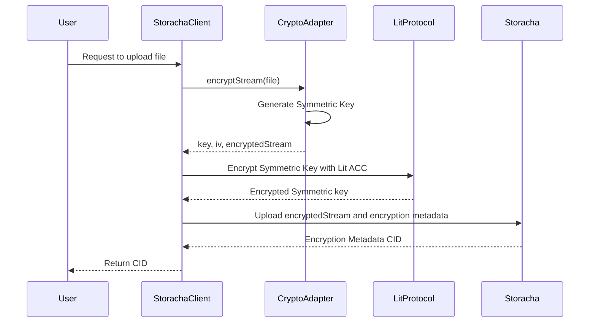
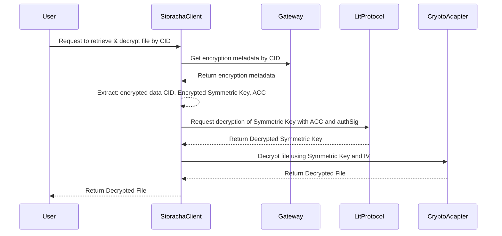
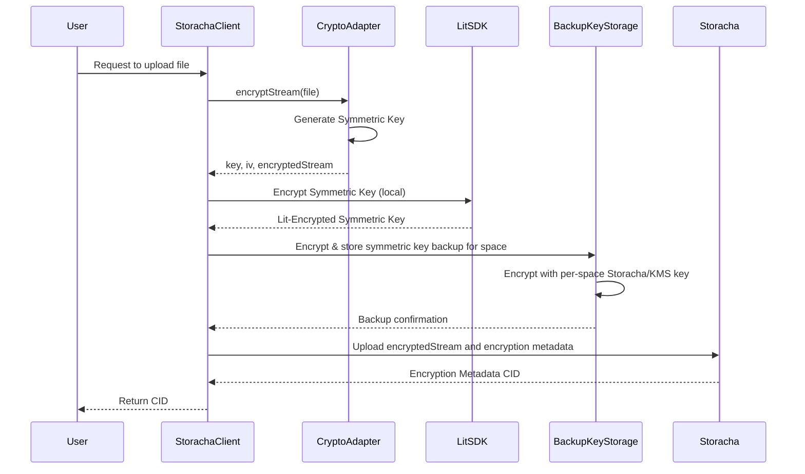
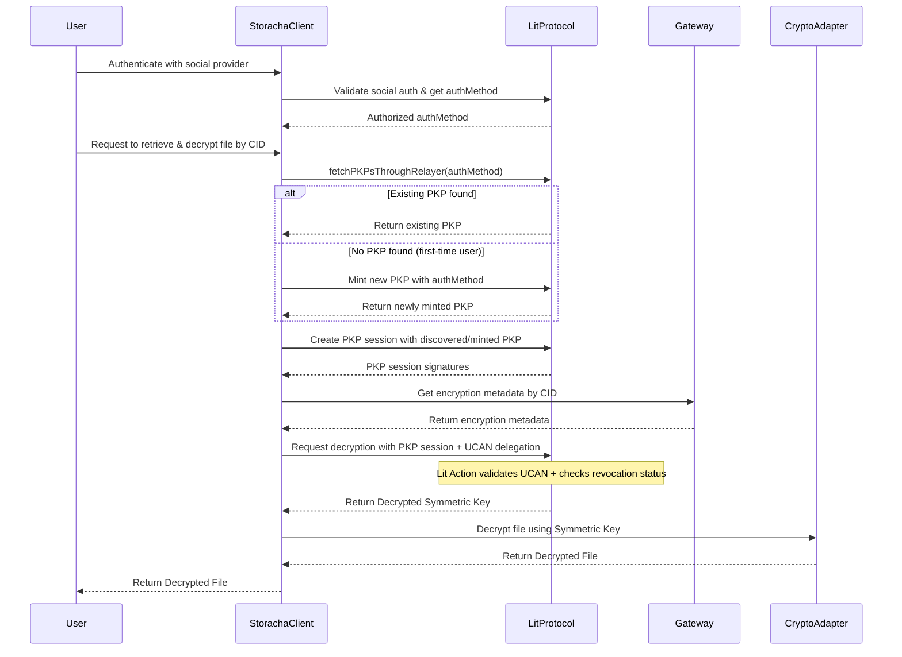
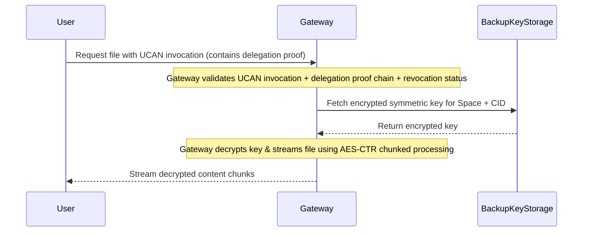

# RFC: Client-Side Encryption Integration for Storacha Stack

## Authors

- [Felipe Forbeck](https://github.com/fforbeck), [Storacha Network](https://storacha.network/)

## Abstract

This RFC proposes enhancements in the client-side encryption library for Storacha uploads using Lit Protocol's Programmable Key Pairs (PKPs) which unlocks social authentication without private key management. The proposal maintains the secure per-file encryption approach while adding improved user experience and backup capabilities. Access control for symmetric key decryption continues to rely on Lit Actions that validate UCAN delegations, ensuring only authorized users can decrypt specific keys within their designated Storacha Spaces.

It also proposes a fallback strategy to decrypt content in case the Lit Protocol becomes prohibitively expensive, experiences network issues or suffers service outages. The proposal covers Lit Protocol's Payment Delegation Database API for streamlined cost management.

The goal is to establish the foundational encryption system for Storacha, prioritizing security through proven cryptographic practices while removing adoption barriers for mainstream users and enterprise customers.

> **Note**: This RFC assumes familiarity with the Storacha upload-client architecture and the existing encrypt-upload-client package. It builds upon the current encryption capabilities.

## 1. Introduction

The Storacha stack currently provides client-side encryption through the encrypt-upload-client package, which uses symmetric encryption with Lit Protocol for key management. The existing system employs Lit Actions to validate UCAN (User Controlled Authorization Network) delegations for access control, ensuring users can only decrypt symmetric keys within their authorized Storacha Spaces. Currently, users must manage Ethereum wallets to authenticate with Lit Protocol and individually pay for transaction costs using [capacity credits](<https://developer.litprotocol.com/paying-for-lit/capacity-credits#:~:text=Capacity%20Credits%20are%20a%20key,period%20(e.g.%20one%20week)>).

This RFC proposes extending the encryption system to provide a user-friendly approach using Lit PKPs for social authentication, while maintaining the same security model through client-side encryption and UCAN-based access control. The proposal introduces Lit Protocol's Payment Delegation Database API, enabling Storacha to act as the payer for all user Lit transactions, eliminating the need for users to manage cryptocurrency wallets or capacity credits. Additionally, the RFC introduces flexible backup strategies including Cloud KMS integration and gateway-based fallback decryption.

### 1.1 Current System Overview

The existing encryption system requires users to manage Ethereum wallets for Lit Protocol authentication and generates new symmetric keys for each file upload. This per-file key generation follows established cryptographic principles similar to TLS/HTTPS protocols, where each connection uses a fresh symmetric key to minimize cryptanalytic attack surfaces.

The one-symmetric-key-per-file approach provides several critical security properties:

- **Limited Ciphertext Exposure**: Each key encrypts only a single file, making frequency analysis and pattern detection significantly harder for attackers
- **Minimal Blast Radius**: If one key is compromised, only that specific upload is affected, preventing cascading exposure across multiple files
- **Cryptanalytic Resistance**: Reduced material per key makes statistical attacks and key recovery attempts much more difficult
- **Principle of Least Access**: Following the principle of least access, per-file keys prevent privilege escalation attacks. If malicious JavaScript code saves/caches a decrypted symmetric key, the attacker can only re-decrypt a file they already had legitimate access to (minimal harm since they already possess the plaintext). With key reuse, cached keys could allow access to other files even after the user's access has been revoked, creating a significant security breach.
- **Optimal Encryption Efficiency**: Symmetric encryption handles entire files efficiently with constant-size metadata overhead plus payload matching the original file size.

This approach establishes a strong security foundation that MUST be preserved as the core primitive for Storacha's encryption system.

### 1.1.1 Encryption Flow

### 1.1.2 Decryption Flow

### 1.1.3 Access Control

The current access control system relies on Lit Actions to validate UCAN delegations before decrypting symmetric keys. When a user requests file decryption, the Lit Action performs the following validation steps:

1. **Capability Verification**: Validates that the delegation contains the `space/content/decrypt` capability for the specific space
2. **Issuer-Audience Matching**: Ensures the issuer of the decryption request matches the audience specified in the delegation proof
3. **Space Authorization**: Confirms the delegation proof matches the allowed SpaceDID action parameter

### 1.1.4 :warning: Current Limitations :warning:

- **External Network Dependency**

  - Fully dependent on Lit Protocol availability and performance
  - No backup or fallback strategy if Lit becomes expensive, slow, or unavailable
  - Users lose access to their encrypted content during Lit Protocol outages
  - Creates vendor lock-in and reduces system resilience

- **Revocation Checking Gap**

  - Revoked delegations continue to grant access to encrypted content
  - Users cannot effectively revoke access once granted
  - Lit Actions do not query revocation status during decryption attempts
  - Creates a security vulnerability where previously authorized users retain access indefinitely

- **Browser Incompatibility**

  - The encryption library only supports Node.js environments and cannot be used in web browsers
  - Limits integration possibilities for web applications and client-side implementations

- **Wallet and Payment Dependencies**

  - Users must manage Ethereum wallets with funds and private keys
  - Each user needs individual Lit Protocol capacity credits for transactions
  - Creates adoption barriers for mainstream users unfamiliar with cryptocurrency
  - Adds complexity and cost management overhead for developers and end users

## 2. Proposed Enhancements

This RFC addresses the identified limitations through a set of enhancements that maintain the security properties of the existing system while improving usability, reliability, and accessibility. The proposal introduces five key improvements:

### 2.1 Lit PKP Integration with Social Authentication

Add support for Lit Protocol's Programmable Key Pairs (PKPs) alongside existing wallet-based authentication. PKPs enable social login providers (Google, Discord, WebAuthn, Stytch, etc) for users who prefer not to manage Ethereum wallets and private keys, while maintaining backward compatibility with existing wallet-based workflows.

### 2.2 Payment Delegation System

Implement Lit Protocol's Payment Delegation Database API to enable Storacha to act as the payer for all user Lit transactions. This removes the burden of capacity credit management from individual users and simplifies onboarding.

#### 2.2.1 Payment Delegation Database Architecture

The [Lit Protocol Payment Delegation Database](https://developer.litprotocol.com/paying-for-lit/payment-delegation-db) enables applications to pay for user operations without requiring users to hold capacity credits. The system works through a allowlist-based approach:

- **Storacha as Payer**

  - Storacha registers as a payer with its own PKP wallet and capacity credits
  - Maintains a master payer secret key for delegation database operations
  - Funds capacity credits for all user operations through a single account

- **User Registration Process**

  - When users create PKPs through social authentication, their PKP addresses are automatically added to Storacha's allowlist
  - Uses `addUsersAsPayees(payerSecret, userPKPAddresses)` API to batch register users
  - No user interaction required - completely transparent to end users

- **Operation Flow**
  1. User performs PKP-based operation (decryption, signing, etc.)
  2. Lit Protocol checks if user's PKP address is in Storacha's allowlist
  3. If authorized, operation proceeds and costs are charged to Storacha's capacity credits
  4. User receives service without managing cryptocurrency or credits

### 2.3 Revocation System Implementation

Implement a new endpoint for revocation checking that validates delegation status during both Lit Action execution and gateway-based decryption. This closes the security gap where revoked delegations continue to grant access.

### 2.4 Browser Compatibility Support

Extend the encryption library to support browser environments by replacing Node.js-specific crypto implementations with Web Crypto API. This enables web application integration and broader platform adoption.

### 2.5 Gateway Fallback Strategy

Implement a backup decryption system through the Storacha IPFS Gateway that can validate UCAN delegations and decrypt content when Lit Protocol is unavailable, expensive, or experiencing performance issues. This reduces external network dependency while maintaining the same security model.

### 2.6 Symmetric Key Backup Strategies

Provide multiple backup options for symmetric keys to ensure content remains accessible regardless of external dependencies. Each space maintains its own backup encryption key, providing security isolation between user spaces. Users can choose between Storacha infrastructure storage (encrypted with per-space master keys) or Google Cloud KMS integration for enterprise-grade key management. This enables the gateway fallback system and provides recovery options for encrypted content.

#### 2.6.1 Per-Space Key Architecture

- **Security Benefits**

  - **Isolation**: Compromising one space's backup key doesn't affect other spaces
  - **Principle of Least Access**: Each space key only decrypts content within that space
  - **Key Rotation**: Space keys can be rotated independently without affecting other spaces

- **Implementation**
  - **Storage Schema**: `{space_did}:{file_cid} → encrypted_symmetric_key`

#### 2.6.2 Relationship to Lit Protocol Network Backup

It's important to note that Lit Protocol itself implements [backup and recovery mechanisms](https://developer.litprotocol.com/security/backup-and-recover) at the network level using verifiable encryption, Recovery Party coordination, and Blinder protection. These network-level backups ensure the Lit Protocol itself can be restored in case of catastrophic node failures.

Our proposed application-level backup strategy complements Lit Protocol's network backup by addressing different failure scenarios:

- **Lit Protocol Backup**: Network-wide disaster recovery (nodes permanently offline)
- **Storacha Backup**: Application-level availability (network unreachable, expensive, or slow)
  
This layered approach provides comprehensive resilience across both network infrastructure and application access patterns.

## 3. Enhanced System Flows

The following sequence diagrams illustrate how the proposed enhancements integrate with the existing encryption system to provide improved user experience and reliability.

### 3.1 Enhanced Encryption Flow

### 3.2 Enhanced Decryption Flow - Primary Path (Lit Protocol)

### 3.3 Enhanced Decryption Flow - Fallback Path (Gateway)

## 4. Conclusion

The proposed enhancements transform client-side encryption from a developer-only feature into a mainstream-ready privacy solution.

### 4.1 Key Benefits

- **For End Users**

  - **Zero Crypto Complexity**: Social authentication eliminates the need to manage wallets, private keys, or cryptocurrency
  - **Familiar Login Experience**: Use existing Google, Discord, or other social accounts for secure file encryption
  - **No Payment Hassles**: Storacha handles all transaction costs transparently through payment delegation
  - **Reliable Access**: Files remain accessible even during external service outages through gateway fallback
  - **True Privacy Control**: Maintain the ability to revoke access and permanently delete encrypted content

- **For Developers**

  - **Browser Compatibility**: Web Crypto API support enables encryption in any modern browser environment
  - **Simplified Integration**: PKP social authentication reduces onboarding complexity for user applications
  - **Robust Architecture**: Fallback systems prevent single points of failure in production applications

- **For Enterprises**
  - **Compliance Ready**: Client-side encryption meets strict regulatory requirements (GDPR, HIPAA)
  - **Flexible Key Management**: Choose between Storacha infrastructure or Google Cloud KMS based on security policies
  - **Audit Capabilities**: Complete delegation and revocation tracking for enterprise security requirements
  - **Scalable Costs**: Predictable pricing without per-user cryptocurrency management overhead

### 4.2 What This Unlocks

Beyond usability, this proposal significantly strengthens Storacha's security posture:

- **Closes Revocation Gap**: Implements missing revocation checking that currently allows indefinite access after delegation revocation
- **Reduces Single Points of Failure**: Gateway fallback ensures access continuity independent of external service availability
- **Preserves Zero-Knowledge for Primary Path**: The Lit Protocol path maintains zero-knowledge architecture where Storacha never accesses user decrypted data, while the fallback path trades ephemeral server-side access for availability when external services are unavailable
- **Implements Per-Space Isolation**: Each space maintains independent backup keys, preventing cross-space data exposure during key compromise scenarios
- **Implements Fallback Strategies**: Multiple backup strategies provide redundant protection against key loss scenarios
