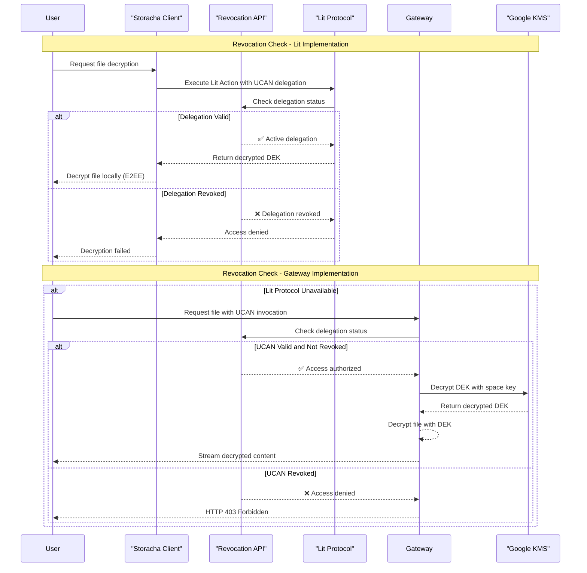
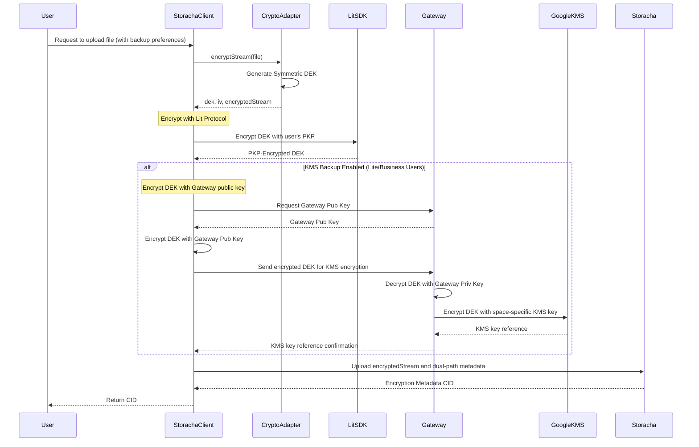
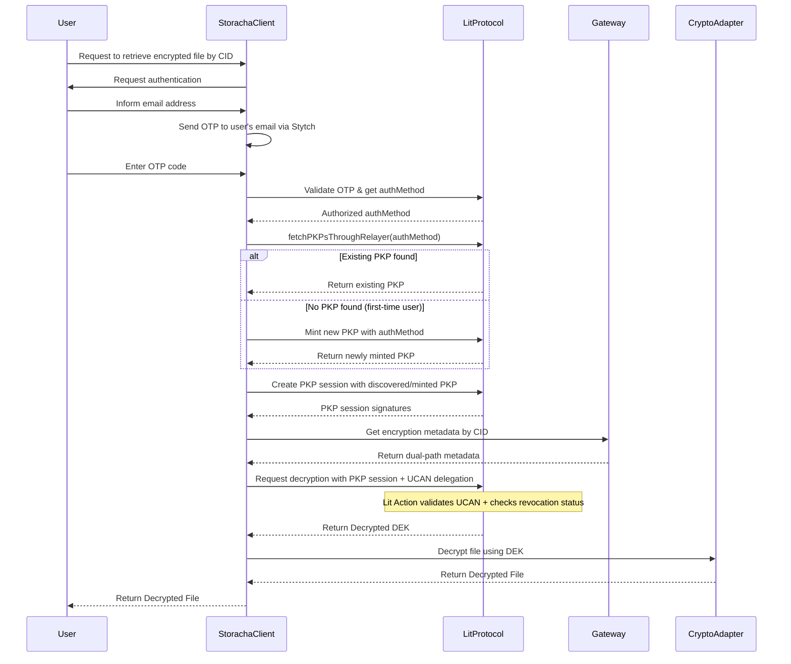
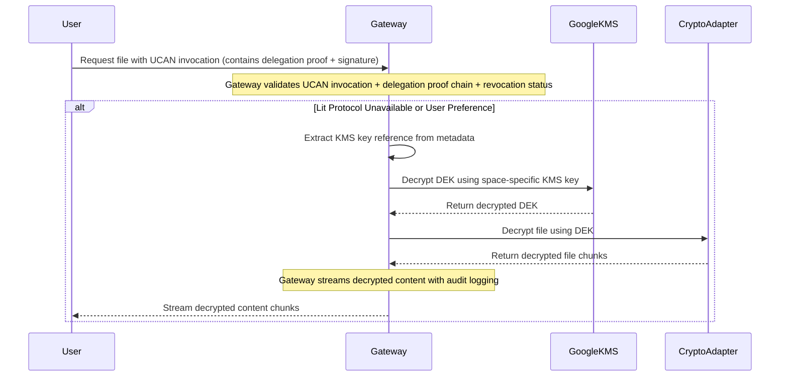
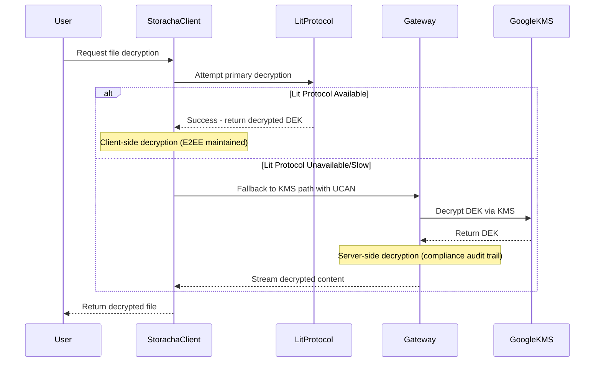

# RFC: Client-Side Encryption Integration for Storacha Stack

## Authors

- [Felipe Forbeck](https://github.com/fforbeck), [Storacha Network](https://storacha.network/)

## TLDR

**Starter (Free) Users:**

- **Default**: Standard public storage only
- **Encryption**: Not available - must upgrade to paid plan to access encryption features
- **Rationale**: Encryption is a premium feature that requires paid subscription to access
- **Upgrade Path**: Clear incentive to subscribe for privacy-conscious users

**Lite & Business Users:**

- **Default**: Standard public storage
- **Optional**: Encryption as premium feature with multiple tiers:
  - **Privacy Tier**: Lit Protocol end-to-end encryption
  - **Compliance Tier**: Google KMS with compliance certifications
  - **Hybrid Tier**: Lit Protocol + KMS backup
- **Rationale**: Paid users get access to encryption options while preserving existing workflows. Encryption becomes value-add feature.

**Key Benefits:**

- **Clear value proposition**: Encryption is a premium feature that incentivizes paid subscriptions
- **Zero encryption costs for free tier**: No Lit Protocol or KMS costs for free users
- **Paid users preserve existing workflows**: No forced encryption disruption for current customers
- **Encryption as premium feature**: Multiple encryption tiers available as paid add-ons
- **Public sharing preserved**: Unencrypted files can be shared publicly without decryption barriers
- **Sustainable economics**: Encryption costs only apply to users who pay for privacy features

**Business Impact:**

- **No disruption to existing customers**: All existing users continue with current public unencrypted content
- **New revenue streams**: Encryption becomes premium feature with tiered pricing (e.g: +$5-20/month per user)
- **Dramatic cost reduction**: Encryption costs only for paying customers who opt-in (reduces from 63% to ~1-3% of revenue)
- **Conversion incentive**: Privacy-conscious free users must upgrade to access encryption

## Abstract

This RFC proposes a strategy for Storacha to transform the privacy solution into a revenue-generating feature. The strategy establishes **encryption as a paid premium feature** available to Lite and Business users, while maintaining standard public storage for free Starter users.

**Hybrid Architecture**: Paid users can choose from multiple encryption tiers:

- **Privacy Tier**: Lit Protocol end-to-end encryption for maximum privacy
- **Compliance Tier**: Google KMS with enterprise certifications (SOC 2, FIPS 140-2, ISO 27001)
- **Hybrid Tier**: Lit Protocol + KMS backup for redundancy

**Business Benefits**:

- **No customer disruption**: All existing users continue with current public storage workflows
- **Revenue generation**: Encryption tiers create new revenue streams (for example: +$5-20/month per user)
- **Conversion incentive**: Privacy-conscious free users must upgrade to access encryption
- **Sustainable economics**: Only users who value encryption pay for it

**Technical Changes**: The implementation leverages Lit Protocol's Programmable Key Pairs (PKPs) with social authentication (email OTP, social logins, passkeys) and payment delegation to eliminate crypto wallet complexity, while providing enterprise-grade backup through Google KMS integration.

> **For detailed cost modeling and rationale behind this architecture, see:**
>
> - [Decryption Cost Analysis](./decryption-cost-analysis.md)
> - [KMS Cost & Storacha Revenue Analysis](./kms-revenue-analysis-integrated.md)

The goal is to establish **encryption-as-premium-feature** for Storacha, creating a sustainable business model where privacy becomes a competitive advantage and revenue driver rather than a cost center. Additionally, the strategy prioritizes rapid implementation by leveraging existing Lit Protocol work, while providing room for future improvements including fallback solutions and compliance features.

## 1. Introduction

The Storacha stack currently provides client-side encryption through the encrypt-upload-client package, which uses symmetric encryption with Lit Protocol for key management. The existing system employs Lit Actions to validate UCAN (User Controlled Authorization Network) delegations for access control, ensuring users can only decrypt symmetric keys within their authorized Storacha Spaces. However, the current implementation faces significant adoption barriers: users must manage Ethereum wallets to authenticate with Lit Protocol and individually pay for transaction costs.

Additionally, the current system lacks recovery methods and fallback solutions in case of Lit Network failures or unavailability, creating single points of failure for encrypted content access.

It is also not suitable for Enterprise customers due to the lack of compliance security certifications, because Lit is a decentralized protocol it’s not structured as a traditional "vendor" or "service provider" under most compliance frameworks.

This RFC proposes to enhance the existing encryption tooling to support browser-based encryption, implement recovery methods, provide fallback solutions, add compliance options, and generate revenue by offering privacy as a premium add-on feature for paid plans.

**Strategic Business Model**:

- **Free Users**: Standard public storage only (no encryption available)
- **Paid Users**: Access to premium encryption tiers with multiple options
- **Cost Impact**: Reduces encryption costs from 63% to just 0.2-0.3% of revenue
- **Revenue Generation**: Creates new revenue streams (for example: +$5-20/month per user who opts in)

**Key Strategic Benefits**:

- **Sustainable Economics**: Only users who value encryption pay for it, eliminating cost burden
- **Customer Retention**: No disruption to existing workflows - all users continue with current storage patterns
- **Conversion Driver**: Privacy-conscious free users must upgrade to access encryption features
- **Mainstream Accessibility**: Email OTP and social authentication eliminate crypto wallet barriers when encryption is chosen
- **Enterprise Ready**: Multiple compliance tiers capture enterprise market requirements
- **Revenue Growth**: Encryption becomes profitable feature rather than cost center

## 2. Proposed Enhancements

This RFC addresses the identified limitations through a strategy that maintains the security properties of the existing system while improving usability, reliability, and enterprise sales opportunities. The proposal introduces **seven key improvements**:

### 2.1 Hybrid Architecture: Lit Protocol + Google KMS

Implement a flexible dual-path encryption system that provides **multiple tiers of security and backup options**:

#### 2.1.1 Starter (Free) Users: No Encryption

- **Default**: Standard unencrypted storage only
- **Encryption**: Not available - requires paid plan upgrade
- **Rationale**: Encryption is a premium feature that drives subscription conversions
- **Use Case**: Basic storage needs without privacy requirements
- **Upgrade Incentive**: Privacy-conscious users must subscribe to access encryption features

#### 2.1.2 Paid Users (Lite/Business/Enterprise): Encryption-as-Premium-Feature

- **Default**: Standard unencrypted storage (preserves existing customer workflows)
- **Optional Encryption Tiers**:
  - **Privacy Tier**: Lit Protocol end-to-end encryption
  - **Compliance Tier**: Google KMS with certifications
- **Use Case**: Paid users who need specific privacy/compliance requirements without disrupting standard workflows
- **Public Sharing**: Unencrypted files remain easily shareable and collaborative

### 2.2 Lit PKP Integration

Add support for Lit Protocol's Programmable Key Pairs (PKPs) alongside existing wallet-based authentication. PKPs enable social login providers (Google, Discord, WebAuthn, Stytch, etc) for users who prefer not to manage Ethereum wallets and private keys, while maintaining backward compatibility with existing wallet-based workflows.

> Programmable Key Pairs (PKPs) are ECDSA public/private key pairs created by the Lit network using Distributed Key Generation (DKG). Each Lit node holds a share of the private key, and more than two-thirds of these shares must be collected to execute a given action (i.e. signing a transaction).
> ref: https://developer.litprotocol.com/user-wallets/pkps/overview

#### 2.2.1 Email Authentication via Stytch Integration

Email and SMS authentication provides users with a convenient way to verify their identity using one-time passwords (OTP) sent to their registered email address or phone number.

Since all Storacha users already have email addresses, we can generate PKPs using [Stytch](https://stytch.com/docs/api/send-otp-by-email) with email authentication.

The Lit Protocol supports minting [PKPs via Stytch's email OTP](https://developer.litprotocol.com/user-wallets/pkps/advanced-topics/auth-methods/email-sms) (one-time password) flow:

1. **Send OTP to User's Email**: Stytch sends a one-time password to the user's registered Storacha email address
2. **Authenticate the OTP Code**: User enters the OTP code received in their email
3. **Get the Session Token**: Stytch validates the OTP and returns a session token
4. **Use LitAuthClient to Mint a PKP**: The session token is used with LitAuthClient to mint a new PKP or authenticate an existing one

**Obtain a Stytch session:**

```ts
import * as stytch from 'stytch'

const client = new stytch.Client({
  project_id: STYTCH_PROJECT_ID,
  secret: STYTCH_SECRET,
})

const emailResponse = await prompts({
  type: 'text',
  name: 'email',
  message: 'Enter your email address',
})

const stytchResponse = await client.otps.email.loginOrCreate({
  email: emailResponse.email,
})

const otpResponse = await prompts({
  type: 'text',
  name: 'code',
  message: 'Enter the code sent to your email:',
})

const authResponse = await client.otps.authenticate({
  method_id: stytchResponse.email_id,
  code: otpResponse.code,
  session_duration_minutes: 60 * 24 * 7,
})

let sessionResp = await client.sessions.get({
  user_id: authResponse.user_id,
})

// Mint PKPs via Lit Relay
const litRelay = new LitRelay({
  relayUrl: LitRelay.getRelayUrl(LIT_NETWORK.DatilDev),
  relayApiKey,
})

// Create the auth method
const authMethod = {
  authMethodType: AuthMethodType.StytchEmailFactorOtp,
  accessToken: sessionResp.session_token,
}

const mintResult = await litRelay.mintPKPWithAuthMethods([authMethod], {
  pkpPermissionScopes: [[1]], // This scope allows signing any data
})

console.log('PKP minting successful:', {
  tokenId: mintResult.pkpTokenId,
  publicKey: mintResult.pkpPublicKey,
  ethAddress: mintResult.pkpEthAddress,
})
```

### 2.3 Payment Delegation System

Implement Lit Protocol's Payment Delegation Database API to enable Storacha to act as the payer for all user Lit transactions. This removes the burden of capacity credit management from individual users and simplifies onboarding.

#### 2.3.1 Payment Delegation Database Architecture

The [Lit Protocol Payment Delegation Database](https://developer.litprotocol.com/paying-for-lit/payment-delegation-db) enables applications to pay for user operations without requiring users to hold capacity credits.

> The Payment Delegation Database is a smart contract deployed on Lit's rollup, Chronicle Yellowstone. Lit's Relayer server has been updated to provide two new API routes to interface with the Payment Delegation Database contract:

> **POST /register-payer**: This route is used to register a new payer and will have a Capacity Credit minted for it which can be delegated to payees to pay for their usage of Lit

> **POST /add-users**: This route is used to add users (as Ethereum addresses) as payees for a specific payer. This allows the payer to pay for the usage of Lit for each user, without each user having to own a Capacity Credit

> Reference: https://developer.litprotocol.com/paying-for-lit/payment-delegation-db#the-payment-delegation-database

The system works through a allowlist-based approach:

- **Storacha as Payer**

  - **Registration**: Storacha registers as a payer with its own PKP wallet and capacity credits
  - **Key Management**: Maintains a secure master payer secret key for delegation database operations
  - **Centralized Funding**: Funds capacity credits for all user operations through a single account, eliminating individual user payment complexity
  - **Monitoring & Auto-Replenishment**:
    - Implements automated monitoring of capacity credit balance
    - Triggers alerts when balance falls below configurable thresholds (e.g., 20% remaining)
    - Supports automatic top-up functionality to prevent service interruption
    - Maintains audit logs of all funding operations for financial tracking
    - :warning: This automation would be implemented in another iteration and won't be covered in detail in this RFC

- **User Registration Process**

  - When users create PKPs through social authentication, their PKP addresses are automatically added to Storacha's allowlist
  - Uses `addUsersAsPayees(payerSecret, userPKPAddresses)` API to batch register users
  - No user interaction required - completely transparent to end users

- **Operation Flow**
  1. User performs PKP-based operation (decryption, signing, etc.)
  2. Lit Protocol checks if the user's PKP address is in Storacha's allowlist
  3. If authorized, operation proceeds, and costs are charged to Storacha's capacity credits
  4. User receives service without managing cryptocurrency or credits

### 2.4 Revocation System Implementation

Implement a new endpoint for revocation checking that validates delegation status during both Lit Action execution and gateway-based decryption. This closes the security gap where revoked delegations continue to grant access.

The specification for this new endpoint is detailed in the following ticket https://github.com/storacha/upload-service/issues/177


```mermaid
sequenceDiagram
    participant User
    participant Client as "Storacha Client"
    participant RevocationAPI as "Revocation API"
    participant LitProtocol as "Lit Protocol"
    participant Gateway
    participant GoogleKMS as "Google KMS"

    Note over User, GoogleKMS: Revocation Check - Lit Implementation

    User->>Client: Request file decryption
    Client->>LitProtocol: Execute Lit Action with UCAN delegation

    LitProtocol->>RevocationAPI: Check delegation status

    alt Delegation Valid
        RevocationAPI-->>LitProtocol: ✅ Active delegation
        LitProtocol-->>Client: Return decrypted DEK
        Client-->>User: Decrypt file locally (E2EE)
    else Delegation Revoked
        RevocationAPI-->>LitProtocol: ❌ Delegation revoked
        LitProtocol-->>Client: Access denied
        Client-->>User: Decryption failed
    end

    Note over User, GoogleKMS: Revocation Check - Gateway Implementation

    alt Lit Protocol Unavailable
        User->>Gateway: Request file with UCAN invocation
        Gateway->>RevocationAPI: Check delegation status

        alt UCAN Valid and Not Revoked
            RevocationAPI-->>Gateway: ✅ Access authorized
            Gateway->>GoogleKMS: Decrypt DEK with space key
            GoogleKMS-->>Gateway: Return decrypted DEK
            Gateway-->>Gateway: Decrypt file with DEK
            Gateway-->>User: Stream decrypted content
        else UCAN Revoked
            RevocationAPI-->>Gateway: ❌ Access denied
            Gateway-->>User: HTTP 403 Forbidden
        end
    end
```

### 2.5 Browser Compatibility Support

Extend the encryption library to support browser environments by adding a Browser specific crypto implementations with Web Crypto API. This enables web application integration and broader platform adoption.

An initial implementation of the Browser crypto adapter can be found in the following pull request: https://github.com/storacha/upload-service/pull/262

The proposal is to use `AES-CTR` algorithm for encryption/decryption.

Why AES-CTR?

- We can use AES-CTR with pseudo-streaming (buffering chunks before emitting) for simplicity and streaming support.
- AES-CTR allows chunked processing without padding, making it suitable for large files and browser environments.
- The Web Crypto API supports AES-CTR natively in all modern browsers and in Node.js 19+ as globalThis.crypto.
- For Node.js <19, we must polyfill globalThis.crypto (e.g., with `node --experimental-global-webcrypto` or a package like @peculiar/webcrypto).
- This allows for processing large files in chunks with no padding issues found in other libraries such as node-forge.

Note: The [existing implementation](https://github.com/storacha/upload-service/blob/0d7a771d77d0433934901878684123a5e733a4f3/packages/encrypt-upload-client/src/crypto-adapters/browser-crypto-adapter.js) is currently pseudo-streaming - it buffers all encrypted/decrypted chunks before emitting them as a stream. For true streaming (lower memory usage), we need to refactor it to emit each chunk as soon as it is processed.

### 2.6 Gateway Fallback Strategy

Implement a backup decryption system through the Storacha IPFS Gateway that can validate UCAN delegations and decrypt content when the Lit Protocol is unavailable, expensive, or experiencing performance issues. This reduces external network dependency while maintaining the same security level through Google KMS integration.

**Key Architectural Decision**: The decryption happens server-side (gateway-based) as opposed to the client-side Lit Protocol model. This trade-off provides several benefits:

- **Compliance Audit Trails**: Server-side decryption enables comprehensive access logging required for enterprise compliance
- **Performance Consistency**: Gateway-based decryption eliminates variable Lit Protocol network latency
- **Cost Predictability**: Fixed KMS costs vs variable Lit Protocol gas fees
- **Regulatory Compliance**: Google KMS provides SOC 2, FIPS 140-2, and ISO 27001 certifications

**User Choice Model**:

- **Starter & Lite Users**: Optional gateway fallback (can choose privacy-first Lit Protocol only)
- **Business & Enterprise Users**: Gateway fallback included for compliance and business continuity requirements

The IPFS Gateway requires updates to interact with Google KMS, validate UCAN decryption requests, and manage symmetric key operations.

#### 2.6.1 Gateway-Based KMS Integration

The Google KMS integration provides a streamlined backup path with simplified key management:

**Encryption Flow** (KMS Backup Path):

1. Client generates symmetric DEK for file encryption
2. Client encrypts file content with the symmetric DEK
3. Client sends DEK to Gateway over secure connection (TLS)
4. Gateway encrypts DEK with space-specific Google KMS key
5. Gateway returns KMS key reference to be stored in encryption metadata
6. Client stores both Lit Protocol and KMS metadata for dual-path access

**Decryption Flow** (Gateway Fallback):

1. Client requests file via IPFS Gateway with signed UCAN invocation containing `space/content/decrypt` delegation
2. Gateway validates UCAN invocation and delegation chain
3. Gateway verifies delegation is not revoked via revocation API
4. Gateway retrieves encrypted DEK and KMS key reference from metadata
5. Gateway decrypts DEK using space-specific Google KMS key
6. Gateway decrypts file content using DEK and streams to client

**Security Architecture Note**:

The gateway fallback maintains security through UCAN-based access control rather than simple HTTP requests. This means:

- **Secure Access**: Users must use the `encrypt-upload-client` package or equivalent UCAN-capable client
- **No Direct HTTP**: Raw HTTP requests to `gateway.storacha.network/ipfs/{CID}` will **not** return decrypted content
- **UCAN Required**: All decryption requests must include valid UCAN invocations with proper signature and delegation proofs
- **Audit Trail**: Every decryption operation is logged with the user identity and delegation chain for compliance

This design prevents unauthorized access while enabling legitimate users to retrieve their encrypted content through proper authentication channels.

#### 2.6.2 Metadata Schema Updates

The encryption metadata must be extended to support dual-path encryption storage:

```json
{
  "encryptedDataCID": "bafybeiabc123...",
  "iv": "initialization_vector",
  "algorithm": "AES-256-CTR",
  "litProtocol": {
    "identityBoundCiphertext": "pkp_encrypted_dek_ciphertext",
    "plaintextKeyHash": "hash_of_plaintext_dek",
    "accessControlConditions": [...],
    "chain": "ethereum"
  },
  "googleKMS": {
    "keyName": "projects/PROJECT/locations/LOCATION/keyRings/RING/cryptoKeys/SPACE_ID",
    "encryptedDEK": "kms_encrypted_dek"
  }
}
```

### 2.7 Key Backup Strategies

Provide multiple backup options for symmetric keys to ensure content remains accessible regardless of external dependencies. Each space maintains its own backup encryption key, providing security isolation between user spaces.

**Three-Tier Backup Architecture**:

1. **Recovery PKP Backup**: Privacy-preserving backup using multiple Lit Protocol PKPs (paid tiers)
2. **Google KMS Integration**: Enterprise-grade backup with compliance certifications (paid tiers - per space backup key)
3. **Multi-Region Backup**: Disaster recovery with geographic redundancy (enterprise tiers - per space backup key)

This layered approach ensures users can always access their encrypted content while maintaining appropriate security and compliance levels for their use case.

#### 2.7.0 Recovery PKP Backup

For Lite & Business users, implement a privacy-preserving backup system using multiple Programmable Key Pairs (PKPs) connected to different authentication methods. This provides robust recovery options while maintaining zero infrastructure costs and preserving the privacy-first approach.

**Key Benefits**:

- **Zero Infrastructure Cost**: No Google KMS charges - backup operates entirely within Lit Protocol
- **Privacy Preserved**: All recovery methods maintain client-side encryption without server-side key exposure
- **User Controlled**: Users manage their own recovery methods independently without vendor dependency
- **Account-Level Efficiency**: One-time setup per user account, not per file, eliminating encryption overhead

**Recovery Authentication Options**:

- **Multi-Email Recovery**: Primary work email + personal email for cross-recovery scenarios
- **Social Account Recovery**: Google account + Discord account for platform redundancy
- **SMS Backup**: Phone number verification as additional recovery method

While this system still relies on Lit Protocol infrastructure, Lite & Business users can optionally upgrade to include Google KMS backup for enterprise-grade redundancy at additional cost.

**Account-Level Recovery Architecture**:

The recovery system operates at the **user account level**, not per file. Users configure recovery methods once, and these methods can then access all their encrypted files. This works because Lit Actions validate the invocation issuer and delegation audience using Agent DID keys (including DID-mailto identifiers), enabling account-level permissions without per-file overhead. This architecture avoids the computational and storage overhead of encrypting each file's DEK with multiple PKPs.

```typescript
// User Recovery Setup (One-Time Configuration)
const setupUserRecovery = async (
  primaryEmail: string,
  recoveryEmail: string
) => {
  // Get primary PKP
  const primaryAuthMethod = await authenticateWithStytch(primaryEmail)
  const primaryPKP = await litClient.getPKPFromAuthMethod(primaryAuthMethod)

  // Create recovery PKP
  const recoveryAuthMethod = await authenticateWithStytch(recoveryEmail)
  const recoveryPKP = await litClient.mintPKP(recoveryAuthMethod)

  // Configure recovery PKP to access primary PKP's capabilities
  await litClient.addPermittedAddress({
    pkpTokenId: primaryPKP.tokenId,
    authMethodType: recoveryAuthMethod.authMethodType,
    userId: recoveryAuthMethod.accessToken,
    permittedAddress: recoveryPKP.ethAddress
  })

  // Store recovery configuration (user account level)
  const recoveryConfig = {
    userDID: primaryPKP.ethAddress,
    primaryPKP: primaryPKP.ethAddress,
    recoveryMethods: [{
      type: "email",
      identifier: recoveryEmail,
      recoveryPKP: recoveryPKP.ethAddress,
      setupDate: new Date().toISOString()
    }]
  }

  await storeUserRecoveryConfig(recoveryConfig)
  return recoveryConfig
}

// File Upload (No Recovery Overhead)
const uploadFileWithEncryption = async (file: File) => {
  // Generate DEK and encrypt file (standard process)
  const dek = generateSymmetricKey()
  const encryptedFile = await encryptFile(file, dek)

  // Encrypt DEK with user's primary PKP only
  const primaryPKP = await getCurrentUserPKP()
  const encryptedDEK = await primaryPKP.encrypt(dek)

  // Store standard metadata
  const metadata = {
    encryptedDataCID: await upload(encryptedFile),
    litProtocol: {
      identityBoundCiphertext: encryptedDEK,
      accessControlConditions: [...],
    }
  }

  return metadata
}

// Recovery Access (Uses Account-Level Configuration)
const recoverFileAccess = async (recoveryEmail: string, fileCID: string) => {
  // Authenticate with recovery method
  const recoveryAuthMethod = await authenticateWithStytch(recoveryEmail)
  const recoveryPKP = await litClient.getPKPFromAuthMethod(recoveryAuthMethod)

  // Recovery PKP can act as primary PKP (due to setup permissions)
  const fileMetadata = await getFileMetadata(fileCID)
  const decryptedDEK = await recoveryPKP.decrypt(fileMetadata.litProtocol.identityBoundCiphertext)

  return decryptFile(fileCID, decryptedDEK)
}
```

**Recovery Options for Lite & Business Users**:

- **Email Recovery**: Connect work email + personal email for cross-recovery
- **Social Recovery**: Connect Google account + Discord account for redundancy

**Benefits of Account-Level Recovery**:

- **Efficiency**: No per-file encryption overhead - recovery setup is one-time configuration during onboarding
- **Scalability**: Users can encrypt unlimited files without recovery performance impact
- **Privacy Preserved**: No server-side key storage - all recovery through Lit Protocol permissions
- **User Control**: Users manage their own recovery methods independently
- **Backward Compatible**: Existing files automatically become recoverable when recovery is configured

#### 2.7.1 Per-Space Master Key Architecture

**Critical Design Decision**: Each space maintains its own independent Google KMS master key (`cryptoKeys/SPACE_ID`) rather than using per-user or per-file keys. This architecture is essential for multi-tenant use cases where Storacha users host data for their own customers, and to reduce KMS costs.

- **Multi-Tenant Security Benefits**

  - **Customer Data Isolation**: SaaS applications built on Storacha can create separate spaces for each of their customers, ensuring complete cryptographic isolation
  - **Compliance Boundaries**: Each customer's data is encrypted with a unique master key, meeting regulatory requirements for data separation
  - **Breach Containment**: If one customer's space is compromised, other customers remain completely protected
  - **Independent Key Management**: Each space can have independent key rotation, access controls, and compliance policies

- **Standard Security Benefits**

  - **Cross-Space Isolation**: Compromising one space's backup key doesn't affect other spaces
  - **Principle of Least Access**: Each space key only decrypts content within that space. File level would better, but more expensive as users tend to create more files than spaces.
  - **Granular Key Rotation**: Space keys can be rotated independently without affecting other spaces
  - **Shared Space Security**: When spaces are shared between users, all authorized users can access the same backup key without exposing other spaces

- **Implementation Architecture**

  - **KMS Key Structure**: `projects/PROJECT/locations/LOCATION/keyRings/RING/cryptoKeys/{space_did}`
  - **Storage Schema**: Each file's KMS metadata references its space-specific master key
  - **Key Hierarchy**: Space master key → File-specific DEKs (envelope encryption pattern)
  - **Access Control**: UCAN delegation system determines which users can access which space keys. For example: if a user is authorized to access files in a given space, then that user is allowed to retrieve the decrypted content from that space

- **Cost Management Strategy**

  **Production Data Analysis**:

  - **Total Spaces**: ~80,000 spaces across current user base (TODO: double-check)
  - **Total Users**: ~14,000 users
  - **Average**: 5.7 spaces per user
  - **Key Insight**: High space-to-user ratio validates multi-tenant architecture design and per-space encryption approach

  **Space Management Approach**:

  - **Per-Space Keys**: Each space gets independent Google KMS master key for cryptographic isolation
  - **Envelope Encryption**: Space master key encrypts file-specific DEKs (Data Encryption Keys)
  - **Access Control**: UCAN delegation system determines which users can access which space keys
  - **Scalability**: Architecture supports both individual users (multiple personal spaces) and multi-tenant SaaS providers (customer isolation)

#### 2.7.2 Relationship to Lit Protocol Network Backup

It's important to note that Lit Protocol itself implements [backup and recovery mechanisms](https://developer.litprotocol.com/security/backup-and-recover) at the network level using verifiable encryption, Recovery Party coordination, and Blinder protection. These network-level backups ensure the Lit Protocol itself can be restored in case of catastrophic node failures.

Our proposed application-level backup strategy complements Lit Protocol's network backup by addressing different failure scenarios:

- **Lit Protocol Backup**: Network-wide disaster recovery (nodes permanently offline)
- **Storacha Backup**: Application-level availability (network unreachable, expensive, or slow)

This layered approach provides comprehensive resilience across both network infrastructure and application access patterns.

### 2.8 Multi-Tenant SaaS Architecture Support

The per-space master key architecture is specifically designed to support SaaS applications that need to provide encrypted storage for their own customers.

#### 2.8.1 SaaS Customer Isolation Pattern

**Architecture Overview**:

Multi-tenant SaaS applications can leverage Storacha's per-space encryption to provide complete customer data isolation. Each customer gets their own cryptographically separate space with independent encryption keys.

**Key Architecture Decision**:

The system uses **per-space KMS keys** rather than per-file keys for optimal cost-efficiency. While per-file KMS keys would provide maximum isolation, they would be prohibitively expensive at scale. The per-space approach provides strong customer isolation while maintaining economic viability.

**Encryption Process**:

1. **File Upload**: Customer files are uploaded to their dedicated space
2. **DEK Generation**: Each file gets a unique symmetric Data Encryption Key (DEK)
3. **DEK Encryption**: The DEK is encrypted using the space-specific Google KMS master key
4. **Metadata Storage**: KMS key reference and encrypted DEK are stored in the file's encryption metadata
5. **Gateway Access**: The Gateway can decrypt the DEK using the space's KMS key for authorized requests

**Key Benefits**:

- **Complete Isolation**: Customer A's data is cryptographically separate from Customer B's data
- **Independent Key Management**: Each customer space has its own master key for rotation and access control
- **Compliance Boundaries**: Regulatory requirements can be met on a per-customer basis
- **Scalable Architecture**: Add unlimited customers without affecting existing encrypted data

#### 2.8.2 Compliance and Audit Benefits

- **Regulatory Boundaries**: Each customer's data encrypted with independent keys, meeting strictest compliance requirements
- **Audit Trails**: Per-customer access logs and key usage tracking
- **Data Residency**: Keys can be placed in customer-specific regions
- **Breach Containment**: Customer A's compromise cannot affect Customer B's data
- **Independent Recovery**: Each customer can have separate backup and recovery procedures

#### 2.8.3 Economic Model for Multi-Tenant Usage

**Value Proposition for SaaS Providers**:

- **Customer Isolation**: Each customer gets cryptographically separate space with independent encryption keys
- **Compliance Benefits**: Meet regulatory requirements for data separation and audit trails
- **Scalable Architecture**: Add new customers without affecting existing encrypted data
- **Transparent Pricing**: Pay only for spaces used, with volume discounts available
- **Risk Management**: Independent key management prevents cross-customer data exposure

This architecture enables SaaS providers to offer enterprise-grade encrypted storage as a premium feature while maintaining operational efficiency and regulatory compliance.

**Cost-Efficiency Analysis**:

- **Per-Space Keys**: Optimal balance of security isolation and cost management
- **Per-File Keys**: Maximum security isolation but prohibitively expensive at scale
- **Per-User Keys**: Lower cost but insufficient for multi-tenant customer isolation
- **Chosen Approach**: Per-space keys provide strong customer boundaries while keeping KMS costs manageable

## 3. Economic Analysis

### 3.1 Cost Structure Analysis

**Lit Protocol Operational Costs**:

- **Gas-Based Pricing**: $0.001 - $0.01 per decryption operation (file size independent - only decrypts the DEK)
- **Usage Pattern Assumptions**:
  - Average files per user per month: ~50 files
  - Average decryption requests per file: ~10 times (initial access + 9 re-accesses)
  - Total decryptions per user per month: ~500 operations

**Lit Protocol Cost Scenarios**:

- **Conservative** ($0.001/op): 500 × $0.001 = $0.50/user/month
- **Moderate** ($0.005/op): 500 × $0.005 = $2.50/user/month
- **High** ($0.01/op): 500 × $0.01 = $5.00/user/month

### 3.2 Revenue Impact Analysis

**Encryption as Premium Feature Model**:

**Current Scale (14,000 users)**:

- **Free users (95% = 13,300)**: No encryption = $0 encryption costs
- **Paid users (5% = 700)**: Opt-in encryption (10% adoption) = 70 × 2.50 = $175/month
- **Total Monthly Cost**: $175
- **Revenue Impact**: 175 on $17,000 revenue = **1.0% of revenue**

**Growth Scale (50,000 users with 15% paid conversion)**:

- **Free users (85% = 42,500)**: No encryption = $0 encryption costs
- **Paid users (15% = 7,500)**: Opt-in encryption (10% adoption) = 750 × $2.50 = $1,875/month
- **Total Monthly Cost**: $1,875
- **Revenue Impact**: 1,875 on $285,000 revenue = **0.7% of revenue**

### 3.3 Business Model Benefits

**Cost Reduction If Encryption is enabled for paid users only**:

- **Current scale**: 0.3% of revenue
- **Growth scale**: 0.2% of revenue
- **Key benefit**: Zero encryption costs for 95% of users (free tier)
- **Sustainable model**: Only paying customers who value encryption bear the costs

**Revenue Generation Opportunities**:

- **Privacy Tier**: Additional revenue from users who opt-in to encryption
- **Compliance Tier**: Premium pricing for enterprise-grade KMS backup
- **Net Effect**: Encryption becomes profitable feature rather than cost center
- **Conversion Driver**: Privacy-conscious free users incentivized to upgrade

## 4. Enhanced System Flows

The following sequence diagrams illustrate how the proposed enhancements integrate with the existing encryption system to provide improved user experience, reliability, and flexible backup options.

### 4.1 Enhanced Encryption Flow (Dual-Path)


```mermaid
sequenceDiagram
    participant User
    participant StorachaClient
    participant CryptoAdapter
    participant LitSDK
    participant Gateway
    participant GoogleKMS
    participant Storacha

    User->>StorachaClient: Request to upload file (with backup preferences)
    StorachaClient->>CryptoAdapter: encryptStream(file)
    CryptoAdapter->>CryptoAdapter: Generate Symmetric DEK
    CryptoAdapter-->>StorachaClient: dek, iv, encryptedStream

    Note over StorachaClient: Encrypt with Lit Protocol
    StorachaClient->>LitSDK: Encrypt DEK with user's PKP
    LitSDK-->>StorachaClient: PKP-Encrypted DEK

    alt KMS Backup Enabled (Lite/Business Users)
        Note over StorachaClient: Encrypt DEK with Gateway public key
        StorachaClient->>Gateway: Request Gateway Pub Key
        Gateway-->>StorachaClient: Gateway Pub Key
        StorachaClient->>StorachaClient: Encrypt DEK with Gateway Pub Key
        StorachaClient->>Gateway: Send encrypted DEK for KMS encryption
        Gateway->>Gateway: Decrypt DEK with Gateway Priv Key
        Gateway->>GoogleKMS: Encrypt DEK with space-specific KMS key
        GoogleKMS-->>Gateway: KMS key reference
        Gateway-->>StorachaClient: KMS key reference confirmation
    end

    StorachaClient->>Storacha: Upload encryptedStream and dual-path metadata
    Storacha-->>StorachaClient: Encryption Metadata CID
    StorachaClient-->>User: Return CID
```

### 4.2 Enhanced Decryption Flow - Primary Path (Lit Protocol)


```mermaid
sequenceDiagram
    participant User
    participant StorachaClient
    participant LitProtocol
    participant Gateway
    participant CryptoAdapter

    User->>StorachaClient: Request to retrieve encrypted file by CID
    StorachaClient->>User: Request authentication
    User->>StorachaClient: Inform email address
    StorachaClient->>StorachaClient: Send OTP to user's email via Stytch
    User->>StorachaClient: Enter OTP code
    StorachaClient->>LitProtocol: Validate OTP & get authMethod
    LitProtocol-->>StorachaClient: Authorized authMethod


    StorachaClient->>LitProtocol: fetchPKPsThroughRelayer(authMethod)

    alt Existing PKP found
        LitProtocol-->>StorachaClient: Return existing PKP
    else No PKP found (first-time user)
        StorachaClient->>LitProtocol: Mint new PKP with authMethod
        LitProtocol-->>StorachaClient: Return newly minted PKP
    end

    StorachaClient->>LitProtocol: Create PKP session with discovered/minted PKP
    LitProtocol-->>StorachaClient: PKP session signatures
    StorachaClient->>Gateway: Get encryption metadata by CID
    Gateway-->>StorachaClient: Return dual-path metadata
    StorachaClient->>LitProtocol: Request decryption with PKP session + UCAN delegation
    Note over LitProtocol: Lit Action validates UCAN + checks revocation status
    LitProtocol-->>StorachaClient: Return Decrypted DEK
    StorachaClient->>CryptoAdapter: Decrypt file using DEK
    CryptoAdapter-->>StorachaClient: Return Decrypted File
    StorachaClient-->>User: Return Decrypted File
```

### 4.3 Enhanced Decryption Flow - Backup Path (Gateway + KMS)


```mermaid
sequenceDiagram
    participant User
    participant Gateway
    participant GoogleKMS
    participant CryptoAdapter

    User->>Gateway: Request file with UCAN invocation (contains delegation proof + signature)
    Note over Gateway: Gateway validates UCAN invocation + delegation proof chain + revocation status

    alt Lit Protocol Unavailable or User Preference
        Gateway->>Gateway: Extract KMS key reference from metadata
        Gateway->>GoogleKMS: Decrypt DEK using space-specific KMS key
        GoogleKMS-->>Gateway: Return decrypted DEK
        Gateway->>CryptoAdapter: Decrypt file using DEK
        CryptoAdapter-->>Gateway: Return decrypted file chunks
        Note over Gateway: Gateway streams decrypted content with audit logging
        Gateway-->>User: Stream decrypted content chunks
    end
```

### 4.4 Fallback Strategy Flow


```mermaid
sequenceDiagram
    participant User
    participant StorachaClient
    participant LitProtocol
    participant Gateway
    participant GoogleKMS

    User->>StorachaClient: Request file decryption
    StorachaClient->>LitProtocol: Attempt primary decryption

    alt Lit Protocol Available
        LitProtocol-->>StorachaClient: Success - return decrypted DEK
        Note over StorachaClient: Client-side decryption (E2EE maintained)
    else Lit Protocol Unavailable/Slow
        StorachaClient->>Gateway: Fallback to KMS path with UCAN
        Gateway->>GoogleKMS: Decrypt DEK via KMS
        GoogleKMS-->>Gateway: Return DEK
        Note over Gateway: Server-side decryption (compliance audit trail)
        Gateway-->>StorachaClient: Stream decrypted content
    end

    StorachaClient-->>User: Return decrypted file
```

## 5. Conclusion

### 5.1 Strategic Positioning

This RFC establishes Storacha's approach to offer **encryption as a sustainable premium feature**. By positioning client-side encryption as a paid add-on rather than a default service, Storacha creates a viable business model where privacy-conscious users fund the encryption infrastructure.

**Key Strategic Advantages**:

- **Sustainable Economics**: Encryption costs (1.0% of revenue) are manageable and paid for by users who value privacy
- **No Customer Disruption**: Existing users continue with current public storage workflows
- **Revenue Generation**: Encryption becomes a profit center rather than a cost burden
- **Market Differentiation**: Unique dual-path approach offering both privacy-first (Lit Protocol) and compliance-first (Google KMS) options

**Tiered Value Proposition**:

- **Free Users**: Standard public storage with clear upgrade path to encryption
- **Paid Users**: Choose between Privacy Tier (Lit Protocol) or Compliance Tier (Google KMS)
- **Enterprise Users**: Full compliance certifications with audit trails and backup
- **SaaS Providers**: Per-customer encryption isolation for multi-tenant applications

### 5.2 Implementation Benefits

**Business Impact**:

- **Revenue Generation**: Encryption becomes a premium feature that drives subscription conversions
- **Cost Management**: Sustainable 1.0% of revenue cost structure for encryption operations
- **Market Positioning**: Differentiated approach with both privacy-first and compliance-first encryption options
- **Customer Retention**: No disruption to existing user workflows or sharing patterns

**Technical Advantages**:

- **Simplified Onboarding**: Email OTP and social authentication eliminate crypto wallet complexity
- **Browser Compatibility**: Web Crypto API support enables encryption in any modern browser
- **Dual-Path Reliability**: Lit Protocol + Google KMS backup ensures access even during service outages
- **Enterprise Compliance**: SOC 2, FIPS 140-2, and ISO 27001 certifications through Google KMS integration

**User Experience**:

- **Familiar Authentication**: Standard email/social login flows for encryption access
- **Transparent Costs**: Storacha handles all blockchain transaction fees through payment delegation
- **Recovery Options**: Multiple backup methods ensure encrypted content remains accessible
- **Granular Control**: Users choose encryption level based on privacy vs compliance needs

### 5.3 Next Steps

**Implementation Priority**:

1. **Revocation System**: Implement new endpoint for delegation status validation during decryption
2. **Payment Delegation System**: Enable Storacha to pay for all user Lit Protocol operations transparently
3. **Browser Support**: Extend encryption library with Web Crypto API for browser environments
4. **Lit Action Update**: Add revocation checking to existing Lit Actions for delegation validation
5. **Lit Protocol PKP Integration**: Implement Stytch email OTP authentication for CLI and Console Apps
6. **Gateway UCAN Validation**: Add UCAN delegation validation and decryption capabilities to IPFS Gateway
7. **KMS Integration**: Implement Google KMS across Gateway, CLI, and Console applications
8. **Fallback System**: Complete gateway fallback implementation with comprehensive audit logging

**Success Metrics**:

- **Conversion Rate**: Percentage of free users upgrading for encryption access
- **Cost Management**: Maintain encryption costs under 2% of revenue
- **User Adoption**: Encryption feature adoption rate among paid users
- **Enterprise Sales**: Google KMS tier enabling previously blocked enterprise deals
