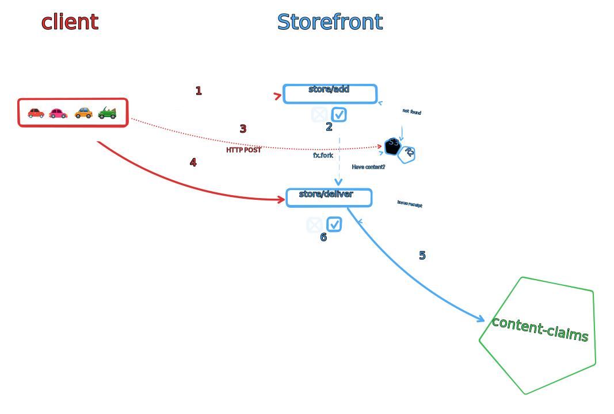
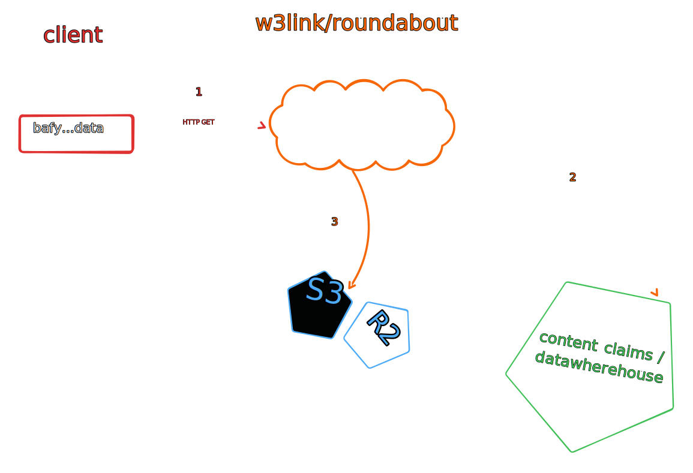

# DATAWHEREHOUSE

> or... where is that file living on?

## Authors

- [Vasco Santos], [Protocol Labs]

## Background

TL;DR

1. We're missing a mapping of Blob CID -> target URI (Bucket, Saturn Node, etc).
2. We don't want clients to create location claims tight with internal bucket URLs because we might change the location in the future (reputation hit for client).
3. We don't have bucket events in Cloudflare, so need the client to tell us when it has uploaded something to the provided write target.
4. We want freeway code to be usable in Saturn nodes, so ideally it uses only content claims to discover locations.
5. We want this information available as soon as content is written so that read interfaces can serve the content right away.

### Extended details

> 1. We're missing a mapping of Blob CID -> target URI (Bucket, Saturn Node, etc).

When facing this problem in the begining, we considered to issue location claim direct to the bytes (i.e. `r2://...`). But when we got closer to put that into practise we realized this was not a good idea. We need this mapping so that w3s Read/Write Interfaces can discover where the bytes are. Where the bytes are stored may actually be private write targets (for instance, a R2 bucket), which location is not public. We consider that location claims MUST be retrievable, have public access and not heavily rate limited. Finally, some read interfaces (for instance Roundabout, Freeway) require some information encoded in the URI (like bucket name), which would not be available in a public URL of R2 bucket. All things considered, Location claims should include URIs like `https://bafy...blob.ipfs.w3s.link`, and we need a mapping of `bafy...blob` to where its bytes are actually stored internally.

> 2. We don't want clients to create location claims for internal bucket URLs because we might change the location in the future (reputation hit for client).

Extending on the first point, making location claims to include "private/unavailable" URIs will make it harder for the service to move blob to other places, given it would need to revoke a bunch of claims and re-write them with new location.

> 3. We don't have bucket events in Cloudflare, so need the client to tell us when it has uploaded something to the provided write target.

Actually we can even extend on this point by saying that today we have no verifiability on data being sent by the user, as well as received by the service. By having the client to sign that bytes were sent, and the service to check and also sign that is true will allow us to achieve that. Moreover, we also open the doors in this interaction for a challengen/proof of delivery.

## High level flow of proposed solution

* Client stores some blob with web3.storage
* Client requests this blob to be published with `store/publish`
* Service handler verifies requested blob was stored on the client space, issues a location claim with encoded information for location and returns it to the client
  * Can be batched with other invocations like `filecoin/offer`

The following diagram presents the described flow, and is illustrated with the following steps:

1. Client requests to store some bytes with the storefront service
2. Service issues a receipt stating the URI of a write target for the client to write those bytes
3. Client writes the bytes into the write target
4. Client requests service to serve written bytes under given stored CID
5. Service verifies that the bytes are stored in the provided write target/space and writes a claim about it.
6. Service issues a receipt stating bytes are being stored by the service on a given location claim.



On the other side of things, the next diagram presents the flow when a client wants to read some blob, and is illustrated with the following steps:

1. Client request to read some bytes by the CID of the blob
2. Service discovers where the requested bytes are stored relying on content claims service to find location claim from the service.
3. Service serves blob stored on the discovered location target.



## `store/publish` capability

After some blob being stored with web3.storage, a client MAY request this blob to be available under given CID. Service MUST verify that it has bytes corresponding to that CID and it was stored on the provided client space. If so, service SHOULD respond with location claim from which read can be performed.

This method enables the service to handle private data in the future, and likely should allow client to specify TTL for the produced read URL, as well as even consider future where this read URI might require permission (e.g. ucan authorization).

This capability can be specified as follows:

```json
{
  "op": "store/publish",
  "rsc": "did:key:abc...",
  "input": {
    "link": { "/": "bafy...BLOBCID" }, // typically a CAR
    "url": "https://..." // write target presignedurl previously provided
  }
}
```

Return on success the following receipt:

```json
{
  "ran": "bafy...storePublish",
  "out": {
    "ok": {
      "link" : { "/": "bafy...BLOBCID" }, // typically a CAR
      "location": "`https://w3s.link/ipfs/bafy...BLOBCID?origin=r2://region/bucketName/key"
    }
  },
  "fx": {},
}
```

## Location claims encoding location hints

Content claims service is currently deployed implementing the [content claims spec](https://github.com/web3-storage/specs/pull/86). Among other claims, it provides [Location Claims](https://hackmd.io/IiKMDqoaSM61TjybSxwHog?view#Location-Claims) which MAY be used to claim that the bytes that hash to a given CID are available in a given URL.

In w3s the service is responsible to deciding the write target, therefore service SHOULD be responsible for claiming the location of the blob on user request to have it published.

While thinking about using location claims to record where bytes are stored by the service, there are a few characteristics we want to have:
- location claim MUST resolve to a public and fetchable URLs
- location in location claim SHOULD (ideally) not change recurrently given it MAY impact negatively the reputation of a party. However, we should consider letting client choose how long the location claim should be valid for.

Read interfaces MAY have some requirements other than the CID to better, such as knowing bucket name, region, etc. 

As a way to store the location of this bytes, we discussed relying on a "private" location claims concept, or even on location claims for a gateway that have hints as encoded params in the URL that the read interface can decide if want to try to use. This would allow us to already have the infra and datastores we have, leaving the decentralization of content claims for a completely different problem.

### _private_ location claims

_private_ location claims would enable us to not expose these claims directly to the user, given their sole purpose at the moment is internal routing. This would enable queries of w3s read/write interfaces to know where the bytes for a CID are stored.

With this building block we can issue claims that MAY not be public and fetchable URLs, as well as not have worries on a potential future data migration.

A _private_ location claim MAY look like:

```json
{
  "op": "assert/location",
  "rsc": "did:web:private.web3.storage",
  "input": {
    "content" : CID /* CAR CID */, 
    "location": "`https://<BUCKET_NAME>.<REGION>.web3.storage/<CID>/<CID>.car`",
    "range"   : [ start, end ] /* Optional: Byte Range in URL
  }
}
```

Note that we could actually make this location URL publicly available in R2 custom domain, if we would like it. Of course this would still not be a good reason to make it public, given moving the data to a different location would lead to invalid claims. But can actually be a good idea for a transition period for decentralized write nodes.

### location claims with encoded params

On the other side, we could also rely on a known resolvable location and encode the needed information as part of the URL. This would allow w3s service to just issue claims point to the gateway with extra hints that they can use for a "fast lane".

A location claim MAY look like:

```json
{
  "op": "assert/location",
  "rsc": "did:web:web3.storage",
  "input": {
    "content" : { "/": "bafy...BLOBCID" }, // typically a CAR
    "location": "`https://w3s.link/ipfs/bafy...BLOBCID?origin=r2://region/bucketName/key",
    "range"   : [ start, end ] /* Optional: Byte Range in URL
  }
}
```

The public IPFS HTTP Gateway could decide if it wants to use the HINTs or any other discovery method. Therefore, this location should be able to still be fetachable on the future when content is somewhere else.

We do not need to have an internal "private" claim for storing this data. Once we move to a decentralized write target approach, likely they will have public locations we can just stick here, which means we could just rely on location claims issued by the service (even though revocation would become a concern on data moving around).

In case we issue further claims with different query parameters, the service can still look at their date and attempt latest first, without real need to revoke them given the URL will still resolve to the data.

Also note that we do not really need to do any change in `dag.w3s.link`. The service can call content claims and see what are the hints. For optimization purpuses we can however check and try them first.

## Proposal

Location claims with encoded params seems to be the simplest solution and also puts us into the future direction where write targets may actually have public URLs. Therefore, relying on `location claims with encoded params` can solve all the requirements while better position us for future. In addition, it is also the easy solution to implement.

---

## Deprecated research on data location URIs

### Bucket data Location URIs

Defining the format of data locations for these target locations is critical to have a mapping of these locations to the buckets to fulfill all requirements of read interfaces (See https://hackmd.io/5qyJwDORTc6B-nqZSmzmWQ#Read-Use-cases). 

#### URIs in well known write targets

Typically, objects in S3 buckets can be located via following URIs:
- S3 URI (e.g. `s3://<BUCKET_NAME>/<CID>/<CID>.car`)
- Object URL (e.g. `https://<BUCKET_NAME>.s3.<AWS_REGION>.amazonaws.com/<CID>/<CID>.car`)
  - can be used to fetch the bytes by any HTTP client if bucket is public

However, R2 object locations have different patterns, instead of following S3 pattern. They can be:
- Public Object URL for Dev (e.g. `https://pub-<INTERNAL_R2_BUCKET_IDENTIFIER>.r2.dev/<CID>/<CID>.car`)
  - can be used to fetch the bytes by any HTTP client, if bucket is public and heavily rate limited 
      - [R2 docs](https://developers.cloudflare.com/r2/buckets/public-buckets/#enable-managed-public-access) state that such URLs should only be used for dev!
- Custom domain object URL (e.g. `https://<CUSTOM_DOMAIN>.web3.storage/<CID>/<CID>.car`)
  - can be used to fetch the bytes by any HTTP client, if custom domain is configured in R2
      - can be rate limited by operator configuration
      - account will need to pay for the egress of reading from the bucket
- Presigned URL (e.g. `https://<ACCOUNT_ID>.r2.cloudflarestorage.com/<BUCKET_NAME>/<CID>/<CID>.car?Signature=...&Expires=...`)
  - can be used to fetch  the bytes by any HTTP client, if has the signature query parameter and is not expired
  - no heavy rate limits in place, together with no egress costs to read data at rest

Note that a data location URI may not be readable from all actors, as some may be behind a given set of permissions/capabilities.

#### URI Patterns

The main pattern that we can identify is to have URLs that can be accessed by any HTTP client. Except for S3 URIs and given the correct setup/keys is available, all other URLs are fetch'able. Therefore, we can assume as an advantage that claim is directly fetchable without any pre-knowledge.

Having a claim that cannot be used by every potential client (i.e. needs some extra permissions) is also a disadvantage that may represent penalties in a reputation system. Moreover, rate limits can have a negative impact on reputation as well.

URIs that include all necessary information to enable derivation for smart clients that could rely on Worker R2 Bindings or to generate Presigned URLs are critical for several use cases. URIs that minimize Egress costs can also be preferred by smart clients.

Per the above, considering S3, it looks like we should rely on S3 Object URL (e.g. `https://<BUCKET_NAME>.s3.<AWS_REGION>.amazonaws.com/<CID>/<CID>.car`).

But with R2, there is no perfect fit. The only good option would be the format used by presigned URLs, but it should only be created on request given their expiration. The custom domain offers better retrievability than the Public Object URL for Dev, but has not enough information encoded for smart clients (i.e. no way to know bucket name). For R2, we will likely need to add 2 location URIs:
- Custom domain object URL (e.g. `https://<CUSTOM_DOMAIN>.web3.storage/<CID>/<CID>.car`)
  - can be used out of the box to fetch content
- Presigned URL like URI without query params (e.g. `https://<ACCOUNT_ID>.r2.cloudflarestorage.com/<BUCKET_NAME>/<CID>/<CID>`)
  - won't really work, but smart clients can see if it is available and rely on its encoded info to use CF Worker Bindings / create presigned URLs, etc.

Alternatively, we can require `<CUSTOM_DOMAIN>` to become bucket name, in order to make it work as a single location URI. Main disadvantage besides the extra requirement, is that there is no url mention of being a R2 bucket, which would mean hard coded assumptions. We could also consider to mimic S3 URL for R2 here as well.

The Public Object URL for Dev should not be adopted, as it is heavily rate limited, we do not know what CF may do with it in the future, and also does not even have information about the Bucket name.

#### Proposal

Nothing prevents us from claiming multiple location URIs for a given content, however we may need to also be careful on having multiple claims for the same location as if it is not fully available it MAY be ranked badly in whatever reputation system we may create. However, some smart clients MAY benefit of cost savings or faster retrievals if they have extra information encoded in the URI.

In conclusion, this document proposes that w3up clients, once they successfully perform an upload, they create location claims within following formats:
- S3
    - `https://<BUCKET_NAME>.s3.<AWS_REGION>.amazonaws.com/<CID>/<CID>.car`
- R2
    - `https://<CUSTOM_DOMAIN>.web3.storage/<CID>/<CID>.car`
    - `https://<ACCOUNT_ID>.r2.cloudflarestorage.com/<BUCKET_NAME>/<CID>/<CID>`
