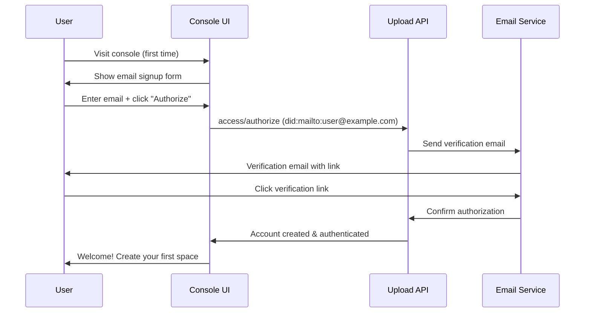
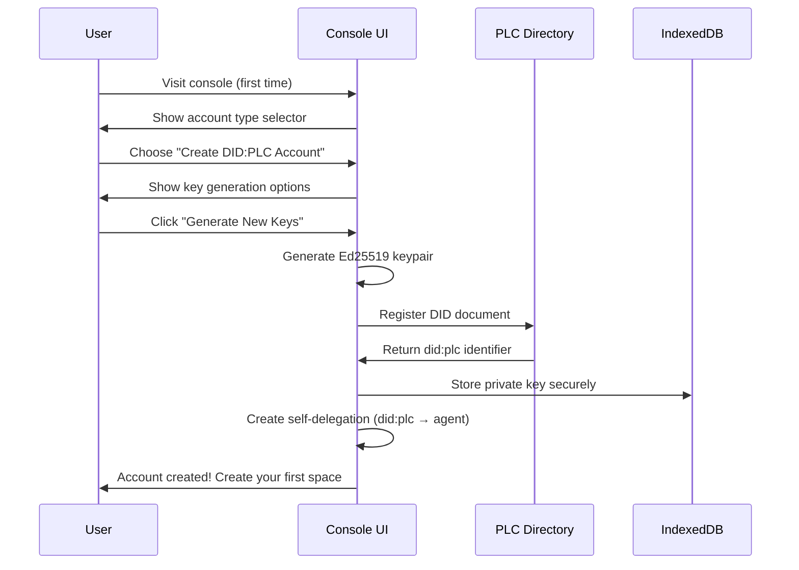
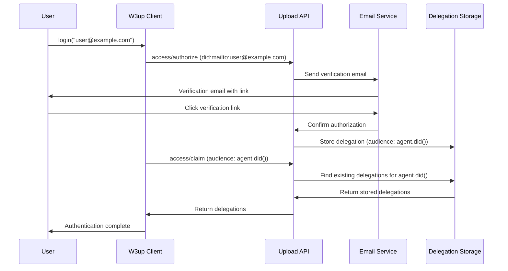
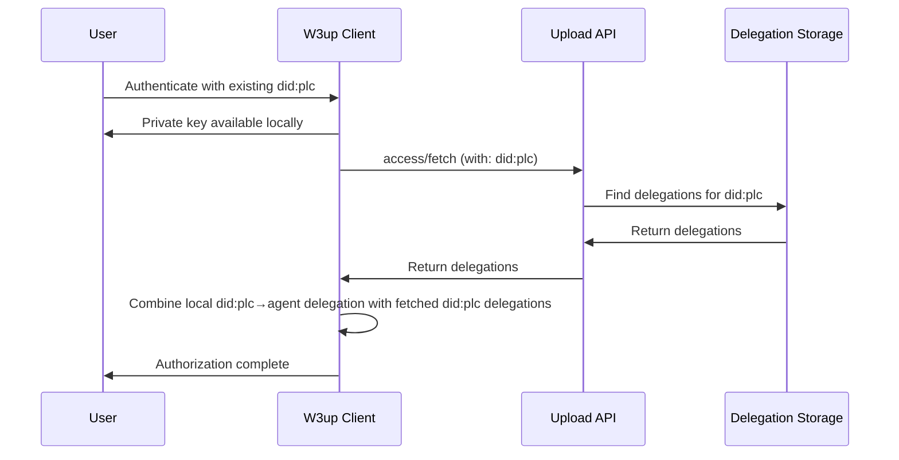
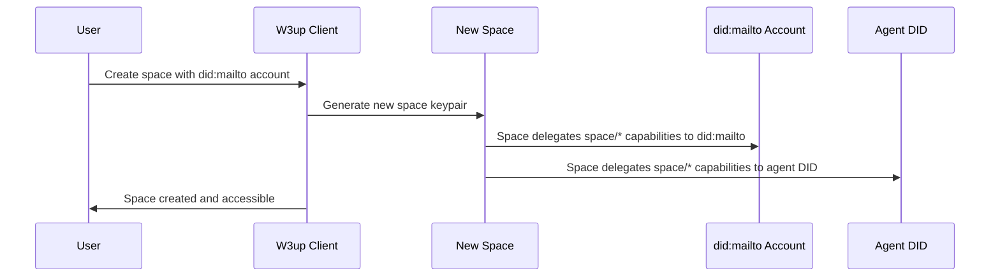
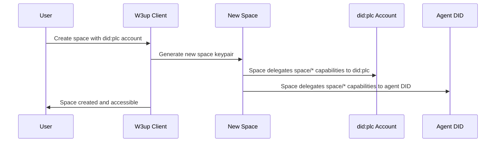
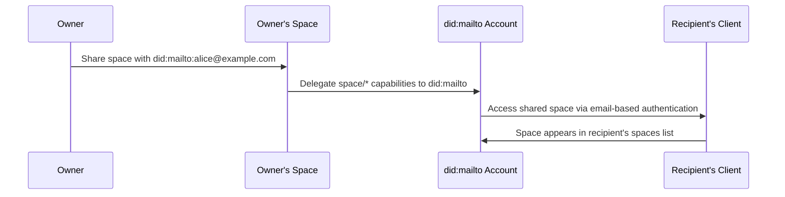
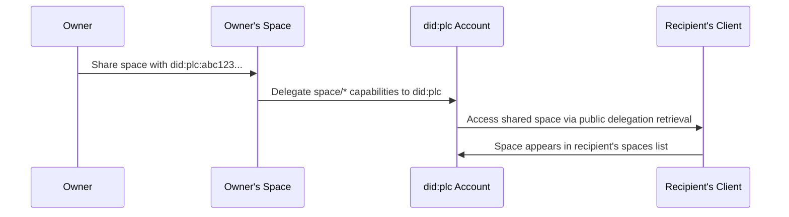

# RFC: DID:PLC Integration for Storacha Stack

## Authors

* [Felipe Forbeck](https://github.com/fforbeck) [Storacha Network](https://storacha.network/)

## Abstract

This RFC specifies the integration of did:plc (Public Ledger of Credentials) decentralized identifiers into the Storacha stack as an authorization method. The specification defines how users are authorized using cryptographically-controlled did:plc identities through public delegation retrieval, enabling decentralized identity management with a simplified, stateless approach.

> **Note**: This RFC assumes that the `AccountDID` type definition has been updated to support `did:plc` identifiers alongside the existing `did:mailto` support. This foundational change is a prerequisite for all the integrations described in this document.

## 1. Introduction

The Storacha stack currently supports email-based authorization using did:mailto identifiers through an OAuth-style verification process. This RFC proposes extending the authorization system to support did:plc identifiers using a public delegation retrieval approach that treats delegations as public configuration rather than secrets.

### 1.1 Current System Overview

The existing system provides email-based account creation and authentication through a verification process that relies on external email providers. Users create accounts by entering their email address, receiving a verification email, and clicking a confirmation link. Once verified, they can authenticate across devices using the same email-based flow.

This RFC introduces did:plc (Public Ledger of Credentials) as an alternative authorization method that provides:

- **Self-sovereign identity** without dependence on email providers
- **Cryptographic account control** through private key ownership
- **Simplified authentication** via public delegation retrieval
- **Enhanced privacy** without requiring personal email addresses

### 1.2 New Account Creation Flows

This section covers how new users create accounts for the first time, supporting both email-based and did:plc account creation.

#### 1.2.1 Email Account Creation (Current)

The existing email-based account creation flow.



#### 1.2.2 DID:PLC Account Creation (Proposed)

The proposed did:plc account creation flow eliminates the need for email verification by using cryptographic key ownership.



### 1.3 Existing Account Authentication Flows

This section covers how users authenticate with existing accounts, supporting both email-based claim flows and did:plc public delegation retrieval.

#### 1.3.1 Email Account Authentication (Current)

The existing email-based authentication flow for returning users or new device authorization:



#### 1.3.2 DID:PLC Account Authentication (Proposed)

The proposed system enables public, stateless delegation retrieval for `did:plc` identities. No claim or login step is required; delegations are fetched using the new `access/fetch` capability.



The client fetches delegations for did:plc using the public access/fetch capability. No authentication or claim step is required; delegations are not secret. Security is enforced when the user actually uses a delegation (by signing with their did:plc key).

## 2. Core Architecture

### 2.1 New access/fetch Capability

The core change is introducing a new `access/fetch` capability that allows public, unauthenticated retrieval of delegations for `did:plc` identifiers. This eliminates the need for authorization flows for did:plc accounts since delegations are not secrets - only the holder of the private key can use them.

**Capability Definition**

```javascript
{
  can: 'access/fetch',
  with: 'did:plc:*'  // Only did:plc method supported
}
```

**Design Principles**

- **Public Access**: Anyone can fetch delegations for any did:plc without authentication
- **Stateless**: No session management or temporary proofs required
- **Security**: Enforced at usage time through signature verification, not at fetch time
- **did:plc Specific**: Designed for the did:plc public delegation model

**Handler Implementation**

```javascript
export const fetch = async ({ invocation }, { delegationsStorage }) => {
  const did = invocation.capabilities[0].with

  // Validate that the DID is a did:plc
  if (!did.startsWith('did:plc:')) {
    return {
      error: {
        name: 'InvalidDID',
        message: 'access/fetch only supports did:plc identifiers',
      },
    }
  }

  // Public operation - no authentication required
  const result = await delegationsStorage.find({ audience: did })

  if (result.error) {
    return {
      error: {
        name: 'AccessFetchFailure',
        message: 'error finding delegations',
        cause: result.error,
      },
    }
  }

  return {
    ok: {
      delegations: result.ok,
    },
  }
}
```

### 2.2 Public Delegation Model

The security model shifts from "authentication at fetch" to "authentication at use":

1. **Fetch**: Public operation returning all delegations for a DID
2. **Use**: When invoking capabilities, signatures are verified against the DID's keys
3. **Trust**: Only valid private key holders can create valid signatures

### 2.3 Performance & Scalability Considerations

The public `access/fetch` capability introduces new performance and scalability requirements that must be carefully managed.

#### 2.3.1 Delegation Storage

**Query Performance**

- `access/fetch` queries scale linearly with delegation count per DID
- We may implement delegation pagination for responses exceeding reasonable size limits

**Caching Strategy**

- Delegations are immutable once created (highly cache-friendly)
- We may consider CDN/edge caching for frequently accessed DIDs

#### 2.3.2 Rate Limiting

**Public Access Controls**

- `access/fetch` calls must be rate-limited by IP/origin to prevent abuse

**Resource Management**

- Set reasonable query timeouts to prevent resource exhaustion

### 2.4 DID:PLC Registry Integration

Integration with the DID:PLC public registry requires specific library dependencies and infrastructure setup for DID document resolution and creation.

#### 2.4.1 Registry Interaction Requirements

**PLC Directory Integration**

- **Registry URL**: https://web.plc.directory/ - public registry for DID:PLC documents
- **DID Resolution**: Fetch DID documents for signature verification during delegation usage
- **DID Registration**: Create new DID documents for console-based account creation
- **Caching Layer**: Cache resolved DID documents to improve performance and reduce registry load

**Existing Implementation Reference**

We have prior experience with DID:PLC integration from our Bluesky backup service:

- **Reference Implementation**: [bluesky-backup-webapp-server/src/lib/plc.ts](https://github.com/storacha/bluesky-backup-webapp-server/blob/a1a0eb5b960afdb0f379bf342fa33d1d7cd1a6e6/src/lib/plc.ts)
- **Proven Approach**: Successfully used in production for Bluesky identity management
- **Code Reusability**: Implementation patterns can be extracted and generalized

#### 2.4.2 Library Dependencies & Browser Compatibility

**Current State & Opportunity**

The standard [@did-plc/lib](https://github.com/did-method-plc/did-method-plc/tree/main/packages/lib) JavaScript library currently has browser compatibility limitations:

- **Server Dependency**: Currently depends on `@atproto/common` which is server-only
- **Browser Incompatibility**: Cannot be used in console/web applications
- **Available Solution**: `@atproto/common-web` provides browser-compatible equivalents

**Open Source Contribution Opportunity**

We have an opportunity to contribute to the broader DID:PLC ecosystem:

1. **Upstream Contribution**: Submit PRs to make `@did-plc/lib` browser-compatible by migrating from `@atproto/common` to `@atproto/common-web`
2. **Code Cleanup**: Remove custom DID:PLC implementation from Bluesky backup service
3. **Community Value**: Enable browser-based DID:PLC applications across the ecosystem
4. **Strategic Positioning**: Build goodwill with AT Protocol development community

**Implementation Options**

- **JavaScript**: Enhanced `@did-plc/lib` (post-browser-compatibility work)
- **Custom Implementation**: Extract and generalize from existing Bluesky backup service

#### 2.4.3 Integration Architecture

**Server-Side (Upload-API)**: DID document resolution with caching.

**Browser-Side (Console)**: DID creation and registration for console.

## 3. Client Integration

### 3.1 Core Functions in w3up-client

The primary integration point is extending `@storacha/w3up-client` with did:plc delegation functions using the new `access/fetch` capability:

**Account Integration (packages/w3up-client/src/account.js)**

```javascript
/**
 * Authenticate using did:plc by creating self-delegation and fetching public delegations
 * @param {object} client - Client with agent
 * @param {Signer} didPlcSigner - User's did:plc signer
 * @param {object} [options] - Login options
 */
export const plcLogin = async ({ agent }, didPlcSigner, options = {}) => {
  const didPlc = didPlcSigner.did()

  // Run self-delegation creation and delegation fetching in parallel
  const [selfDelegation, fetchResult] = await Promise.all([
    // 1. Create self-delegation from did:plc to agent
    createPlcDelegation(didPlcSigner, agent.did(), {
      capabilities: options.capabilities || [{ can: '*', with: 'ucan:*' }],
      expiration: options.expiration || Infinity,
    }),

    // 2. Fetch existing delegations for the did:plc (public operation)
    agent.invokeAndExecute(Access.fetch, {
      with: didPlc,
    }),
  ])

  if (fetchResult.error) {
    throw new Error(`Failed to fetch delegations: ${fetchResult.error.message}`)
  }

  // 3. Combine self-delegation with fetched delegations
  const allProofs = [selfDelegation, ...fetchResult.ok.delegations]

  return new Account({ id: didPlc, proofs: allProofs, agent })
}
```

**Delegation Utilities (packages/w3up-client/src/delegation.js)**

```javascript
/**
 * Create a self-signed delegation from did:plc to agent
 * @param {Signer} didPlcSigner - User's did:plc signer
 * @param {DID} agentDid - Target agent DID
 * @param {object} options - Delegation options
 */
export const createPlcDelegation = async (
  didPlcSigner,
  agentDid,
  options = {}
) => {
  return await delegate({
    issuer: didPlcSigner,
    audience: { did: () => agentDid },
    capabilities: options.capabilities || [{ can: '*', with: 'ucan:*' }],
    expiration: options.expiration || Infinity,
    facts: options.facts || [],
  })
}
```

### 3.2 CLI Integration (packages/cli)

The CLI integration extends existing commands to naturally handle did:plc identities, requiring minimal new syntax:

**Enhanced Login Command**

```bash
# Existing email login
storacha login alice@example.com

# New: DID:PLC login (automatically detected)
storacha login did:plc:abc123... --key-file ./my-key.json

# Existing GitHub login
storacha login --github
```

**Enhanced Delegation Commands**

```bash
# Existing delegation creation
storacha delegation create did:key:agent123... --can store/*

# New: Create delegation signed by did:plc key
storacha delegation create did:key:agent123... --can store/* --issuer-key ./plc-key.json

# Self-delegation (did:plc to agent)
storacha delegation create $(storacha whoami) --issuer-key ./plc-key.json
```

**Implementation Approach**

```javascript
// In packages/cli/login.js - enhance existing login command
export const login = async (identifier, options = {}) => {
  const client = await getClient()

  if (!identifier && options.github) {
    // Existing GitHub flow
    return await Account.oauthLoginWithClient('github', client)
  }

  if (!identifier) {
    // Interactive account selection
    return await setupAccount(client)
  }

  if (identifier.startsWith('did:plc:')) {
    // New: DID:PLC login flow using keyfile
    const didPlcSigner = await loadDidPlcSigner(identifier, options)
    return await plcLogin(client, didPlcSigner, options)
  }

  if (isEmail(identifier)) {
    // Existing email login flow
    return await Account.loginWithClient(identifier, client)
  }

  throw new Error('Invalid login identifier')
}

// Helper function for loading did:plc signer from keyfile
const loadDidPlcSigner = async (didPlc, options) => {
  const keyFile = options.keyFile || (await promptForKeyFile(didPlc))
  const keyData = JSON.parse(await fs.readFile(keyFile, 'utf8'))

  // Validate the key matches the provided DID
  if (keyData.didPlc && keyData.didPlc !== didPlc) {
    throw new Error(
      `Key file DID (${keyData.didPlc}) does not match provided DID (${didPlc})`
    )
  }

  return await ed25519.parse(keyData.privateKey).withDID(didPlc)
}
```

**Key File Format:**

```json
{
  "didPlc": "did:plc:abc123...",
  "privateKey": "base64-encoded-ed25519-private-key",
  "publicKey": "base64-encoded-ed25519-public-key",
  "created": "2024-01-01T00:00:00Z"
}
```

## 4. Feature Integration

### 4.1 Space Creation Integration

Space creation with `did:plc` accounts leverages the existing delegation infrastructure with minimal changes. The key difference is that spaces delegate to `did:plc` identities instead of `did:mailto` identities during the initial space setup process.

#### 4.1.1 Current Space Creation Flow (did:mailto)



#### 4.1.2 Proposed Space Creation Flow (did:plc)



#### 4.1.3 Implementation Requirements

**Space Delegation Updates**

- Extend space creation logic to handle both `did:mailto` and `did:plc` account types
- Update delegation chain validation to support `did:plc` issuers
- Maintain backward compatibility with existing `did:mailto` space management

**CLI Integration**

- Enhanced account selection during space creation for both account types
- Updated space creation messaging and confirmation flows
- Consistent space management commands regardless of account type

### 4.2 Space Sharing Integration

Space sharing with `did:plc` accounts works identically to the existing `did:mailto` sharing infrastructure. The underlying delegation system already supports any DID method, requiring only client-side updates for account discovery and display.

#### 4.2.1 Current Space Sharing Flow (did:mailto)



#### 4.2.2 Proposed Space Sharing Flow (did:plc)



#### 4.2.3 Implementation Requirements

**Client-Side Discovery Updates**

- Update space discovery logic to handle both `did:mailto` and `did:plc` shared spaces
- Enhanced display of account identifiers with appropriate formatting for DIDs
- Consistent space management interface regardless of sharing account type

**Space Management Integration**

- Extend `shareSpace` method to validate and handle `did:plc` account identifiers
- Update space recipient selection and invitation workflows
- Maintain backward compatibility with existing `did:mailto` sharing

### 4.3 Stripe Billing Integration

The existing Storacha billing infrastructure fully supports did:plc accounts with minimal changes. The current system already uses account DIDs (not email addresses) as the primary billing identifier.

**Integration Requirements**

- **Schema Update**: Accept `did:plc` identifiers in customer records alongside existing `did:mailto` support
- **Stripe Integration**: Use account DID as `client-reference-id` for all checkout sessions (both account types)
- **Webhook Processing**: Process did:plc customers using the same DID-based approach as did:mailto accounts
- **CLI Enhancement**: Interactive account selection for billing setup when email is not available

**Implementation Impact**

Minimal - primarily validation and UI updates rather than core billing changes.

### 4.4 Console Integration

The Storacha console requires updates to support did:plc account creation alongside existing email-based signup.

#### 4.4.1 Account Creation Updates

**Enhanced Signup Flow**

- Add account type selection (email vs did:plc) during initial registration
- Implement did:plc account creation with key generation and DID registration
  - Option to generate keys using Lit PKP OAuth Providers for users who prefer not to maintain private keys directly
- Provide secure key backup guidance and account portability features

**Authentication Integration**

- Extend existing `@storacha/ui-react` components to handle both account types
- Update account display and management interfaces for did:plc identifiers
- Maintain consistent user experience across both authentication methods

#### 4.4.2 Implementation Requirements

- PLC directory integration for DID document registration
- Enhanced cryptographic key management in browser storage
- Updated UI components for did:plc account workflows

## 5. Advanced Use Cases

### 5.1 Encrypted Storage with Lit Protocol PKPs

The did:plc integration enables sophisticated encrypted storage patterns when combined with Lit Protocol's Programmable Key Pairs (PKPs). This advanced use case demonstrates how did:plc identities can control access to encrypted content through programmable cryptographic conditions while maintaining user-friendly OAuth-based authentication.

**Key Capabilities**

- **Unlocks Different Authentication Methods**: Google, Stytch, Discord, WebAuthn, etc.
- **No Private Key Management**: Users authenticate via OAuth providers; Lit doesn't store private keys
- **Cryptographic Ownership**: PKPs provide genuine decentralized control
- **Programmable Access Control**: Complex conditions via Lit Actions
- **Recovery Mechanisms**: Multi-PKP setup for account recovery

For detailed specifications on implementing encrypted storage with Lit Protocol PKPs and did:plc identities, see the dedicated [Lit Protocol PKP Integration RFC](./LIT_PROTOCOL_INTEGRATION_RFC.md).

## 6. Implementation Details

### 6.1 Implementation Requirements

#### 6.1.1 Server-Side Dependencies

- New `access/fetch` capability handler for public delegation retrieval
- Resolve and verify did:plcs in UCAN delegations
- No additional DID resolution required for `access/fetch` operations

#### 6.1.2 DID:PLC Registry Integration Tasks

**Library Preparation & Open Source Contribution**

- Contribute to `@did-plc/lib` browser compatibility by migrating from `@atproto/common` to `@atproto/common-web`
- Submit upstream PRs to enable browser-based DID:PLC applications
- Extract and generalize DID:PLC utilities from existing Bluesky backup service

**Registry Integration Implementation**

- Implement DID document resolution from https://web.plc.directory/
- Add caching layer for resolved DID documents (1-hour TTL?)
- Create DID document registration workflow for console-based account creation
- Add error handling and fallback strategies for registry unavailability
- Implement retry logic with exponential backoff for registry requests
- Implement request rate limiting to respect PLC directory policies (if any)

#### 6.1.3 Upload-API Implementation Tasks

**Access/Fetch Capability Handler**

- Implement `access/fetch` capability in upload-api service
- Add handler to capability router for public delegation retrieval
- Integrate with existing delegation storage layer
- Add rate limiting middleware for public access protection

**DID:PLC Verification Integration**

- Update UCAN signature verification to resolve did:plc documents
- Implement did:plc document resolution from PLC directory
- Add caching layer for resolved DID documents to improve performance
- Update delegation validation logic to support did:plc issuers

**Account Provisioning Updates**

- Update account creation flows to support did:plc identifiers
- Modify existing `provider-add.js` validation to accept both `did:mailto` and `did:plc`
- Ensure consistent account ID handling across all account types
- Update account lookup and management endpoints

#### 6.1.4 W3infra Implementation Tasks

**Stripe Billing Integration**

- Update Stripe customer creation to handle did:plc account identifiers
- Modify webhook handlers to process did:plc customer events
- Update billing record schemas to support did:plc account references
- Ensure `client-reference-id` mapping works for both account types

**Account Management Services**

- Update account lookup services to handle did:plc queries
- Modify billing history retrieval for did:plc accounts
- Update usage tracking and reporting for did:plc customers
- Ensure consistent account data across billing and storage systems

**Database Schema Updates**

- Add did:plc support to customer records and billing tables

#### 6.1.5 Console App Integration

**DID:PLC Integration Setup**

1. Integrate browser-compatible `@did-plc/lib` for DID document creation
2. Implement DID registration workflow with https://web.plc.directory/
3. Add proper error handling for registry interactions

**Account Creation & Authentication**

1. Add did:plc account type selection to signup UI
2. Implement did:plc account creation workflow with key generation
3. Integrate PLC directory registration for new accounts
4. Update existing authentication flows to handle did:plc accounts

**UI/UX Updates**

- Update account selector components for did:plc identifiers
- Update space creation and sharing interfaces for both account types
- Update billing integration UI for did:plc accounts

**Security & Key Management**

- Add key backup and import/export functionality
- Update session management for did:plc authentication
- UI/UX to guide users on how to protect their keys

#### 6.1.6 Client-Side Dependencies

- Updated client libraries with `access/fetch` capability support
- UCAN delegation creation and signing capabilities for self-delegations
- User interface for delegation creation and management (nice to have)

#### 6.1.7 Cryptographic Requirements

- Ed25519 signature generation for delegation creation
- Signature verification when delegations are used (not when fetched)
- Warn the user about secure private key management for did:plc signers

> **Note**: For advanced encrypted storage features using Lit Protocol PKPs, refer to the dedicated [Lit Protocol PKP Integration RFC](./LIT_PROTOCOL_INTEGRATION_RFC.md) for separate implementation details .

### 6.2 Security Considerations

#### 6.2.1 Public Delegation Model

Delegations are treated as public configuration objects. Security is enforced when delegations are used through signature verification, not when they are retrieved. This model provides:

- **Transparency**: All delegations for a DID are publicly visible
- **Simplicity**: No authentication required for delegation retrieval
- **Security**: Only private key holders can create valid signatures when using delegations

#### 6.2.2 Signature Verification and DID PLC Resolution at Use

When a client attempts to use a delegation to invoke capabilities, the server verifies:

- The delegation signature matches the issuer's public key by resolving the did:plc document, and iterating over the verification methods to test which one is valid (matches the `did:plc` derived from the signature).

#### 6.2.3 Key Management

Users are responsible for secure private key management. Implementation should provide guidance on secure key storage and backup procedures.
If we decide to use Lit with PKP's we can simplify this flow, or provide it as an alternative.

#### 6.2.4 Operational Security Considerations

**Rate Limiting Implementation**

- Public `access/fetch` calls must implement at least on rate limiting strategy:
  - Per-IP rate limits to prevent individual abuse
  - Per-origin rate limits for web applications

### 6.3 Backward Compatibility

All proposed changes maintain complete backward compatibility.

- Existing did:mailto accounts continue to function unchanged
- Email-based login workflows remain fully operational
- Stored delegation retrieval works identically
- Space delegation and sharing work with both account types
- No breaking changes to existing APIs or interfaces

### 6.4 Implementation Plan

#### 6.4.1 Phase 1: Backend Infrastructure

**DID:PLC Registry Integration**

1. Contribute to `@did-plc/lib` browser compatibility (migrate from `@atproto/common` to `@atproto/common-web`)
2. Implement DID document resolution from https://web.plc.directory/ with caching layer
3. Add error handling, retry logic, and monitoring for PLC directory interactions
4. Extract and generalize DID:PLC utilities from existing Bluesky backup service

**Upload-API Core Changes**

1. Implement `access/fetch` capability handler for public delegation retrieval
2. Add DID:PLC document resolution with caching layer
3. Update UCAN signature verification to support did:plc issuers
4. Add rate limiting middleware for public access protection

**Account Provisioning Updates**

1. Update `provider-add.js` validation to accept did:plc identifiers
2. Modify account creation flows for both account types
3. Update account lookup and management endpoints
4. Ensure consistent account ID handling across services

#### 6.4.2 Phase 2: Billing & W3infra Integration

**Stripe Integration**

1. Update Stripe customer creation for did:plc accounts
2. Modify webhook handlers to process did:plc customer events
3. Update billing record schemas and database migrations
4. Ensure `client-reference-id` mapping works for both account types

**Account Management Services**

1. Update account lookup services for did:plc queries
2. Modify billing history retrieval and usage tracking
3. Update database indexing for efficient queries
4. Add migration scripts for existing data compatibility

#### 6.4.3 Phase 3: Client Integration

1. Update `@storacha/w3up-client` to support `access/fetch` capability
2. Implement `plcLogin` function using public delegation retrieval
3. Create delegation creation utilities for did:plc to agent delegations
4. Add comprehensive client-side validation and error handling

#### 6.4.4 Phase 4: CLI Integration

1. **Enhance existing login command**

   - Update `storacha login` to automatically detect did:plc identifiers
   - Implement plcLogin flow for did:plc authentication
   - Maintain backward compatibility with email and GitHub login

2. **Enhance existing delegation commands**

   - Add `--issuer-key` option to `storacha delegation create`
   - Support signing delegations with external did:plc keys
   - Enable self-delegation creation (did:plc to agent)

3. **Update account management**

   - Enhance `storacha account ls` to display did:plc accounts
   - Update account selection logic in space creation
   - Improve account display formatting for did:plc accounts

4. **Integration with space commands**
   - Update space creation CLI for did:plc account support
   - Modify account selection logic to handle both email and DID matching
   - Update space creation messaging for did:plc accounts

#### 6.4.5 Phase 5: Console App Integration

**DID:PLC Integration Setup**

1. Integrate browser-compatible `@did-plc/lib` for DID document creation
2. Implement DID registration workflow with https://web.plc.directory/
3. Add proper error handling for registry interactions

**Account Creation & Authentication**

1. Add did:plc account type selection to signup UI
2. Implement did:plc account creation workflow with key generation
3. Integrate PLC directory registration for new accounts
4. Update existing authentication flows to handle did:plc accounts

**UI/UX Updates**

- Update account selector components for did:plc identifiers
- Update space creation and sharing interfaces for both account types
- Update billing integration UI for did:plc accounts

**Security & Key Management**

- Add key backup and import/export functionality
- Update session management for did:plc authentication
- UI/UX to guide users on how to protect their keys
