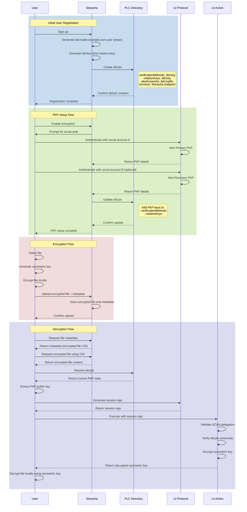

# RFC: DID PLC Adoption

## Authors

* [Felipe Forbeck](https://github.com/fforbeck) [Storacha Network](https://storacha.network/)

## Language

The key words "MUST" "MUST NOT" "REQUIRED" "SHALL" "SHALL NOT" "SHOULD" "SHOULD NOT" "RECOMMENDED" "MAY" and "OPTIONAL" in this document are to be interpreted as described in [RFC2119](https://datatracker.ietf.org/doc/html/rfc2119)

## Introduction

This RFC proposes using the DID PLC method to manage decentralized user identity in Storacha. It supports identity management encryption and access control. It also works with Lit Protocol PKP's.

## Why

This adoption provides a foundation for managing decentralized identities while maintaining security and interoperability with the project's core features of encrypted file storage and access control.

**Core Purpose**
   - Provides decentralized identity management for users
   - Manages Lit Protocol PKPs (Programmable Key Pairs)
   - Enables secure file encryption and access control

**Key Features**
   - Multiple verification methods (Primary PKP, Recovery PKP, ETH wallet)
   - Key rotation capabilities
   - Service endpoint discovery
   - Identity resolution through PLC Directory

**Security Benefits**
   - Client-side encryption
   - Backup access through recovery PKPs
   - Standardized identity management
   - Interoperable with other DID-based systems

**Integration Points**
   - Lit Protocol PKP system
   - Storacha encrypted file storage
   - Google OAuth authentication
   - PLC Directory for identity resolution

## Proposal

Each user gets a DID PLC document. It holds their keys aliases service endpoints, verification methods and supports key rotation and recovery.

Example document

```jsonc
{
  // Required DID contexts that define the document format and key types
  "@context": [
    "https://www.w3.org/ns/did/v1",                    // Base DID context
    "https://w3id.org/security/multikey/v1",           // For Multikey type
    "https://w3id.org/security/suites/secp256k1-2019/v1" // For secp256k1 keys
  ],

  // The unique identifier for this DID
  "id": "did:plc:abc123",

  // Alternative identifiers for this DID
  // Can include email DIDs, other DIDs, or handles
  "alsoKnownAs": [
    "did:mailto:exampe.com:user",         // User's email DID
    "did:key:zStorachaKey..."             // User's Storacha key
  ],

  // List of all verification methods (keys) associated with this DID
  "verificationMethod": [
    {
      // Storacha's primary identity key
      "id": "#storacha",                             // Local reference ID
      "type": "Multikey",                            // Key type as per spec
      "controller": "did:plc:abc123",                // DID that controls this key
      "publicKeyMultibase": "zStorachaKey..."        // Multibase-encoded public key
    },
    {
      // Primary PKP for encryption operations
      "id": "#pkp_primary",                          // Local reference ID
      "type": "Multikey",                            // Key type as per spec
      "controller": "did:plc:abc123",                // DID that controls this key
      "publicKeyMultibase": "zPkpPrimaryKey...",     // Multibase-encoded PKP public key
      "properties": {
        "pkpTokenId": "123",                         // Lit Protocol PKP token ID
        "ethAddress": "0x123..."                     // ETH address associated with this PKP
      }
    },
    {
      // Recovery PKP for backup/emergency access
      "id": "#pkp_recovery",                         // Local reference ID
      "type": "Multikey",                            // Key type as per spec
      "controller": "did:plc:abc123",                // DID that controls this key
      "publicKeyMultibase": "zPkpRecoveryKey...",    // Multibase-encoded recovery PKP key
      "properties": {
        "pkpTokenId": "456",                         // Lit Protocol PKP token ID
        "ethAddress": "0x456..."                     // ETH address associated with this PKP
      }
    }
  ],

  // Keys that can update/rotate this DID document
  // Must be in did:key format
  "rotationKeys": [
    "did:key:zStorachaKey...",    // Primary rotation key (Storacha key)
    "did:key:zPkpRecoveryKey..."  // Recovery rotation key (PKP recovery key)
  ],

  // Service endpoints associated with this DID
  "service": [
    {
      "id": "#storacha",                                  // Local reference ID
      "type": "StorachaService",                          // Service type
      "serviceEndpoint": "https://up.storacha.network"    // Service URL
    }
  ]
}
```

**Key points**

- **Verification Methods**
   - Each key has a unique `id` prefixed with `#`
   - `type` must be one of the supported key types
   - `controller` is the DID that owns the key
   - `publicKeyMultibase` is the standardized key format
   - `properties` can contain additional key-specific data

- **Rotation Keys**
   - Must be in `did:key` format
   - Can be used to update the DID document
   - Recovery key can be used if primary key is lost

- **Services**
   - Define endpoints for this DID
   - Can be used for service discovery
   - Each service has a unique `id` prefixed with `#`

- **Also Known As**
   - Alternative identifiers
   - Can include email DIDs, handles, or other DIDs (we need to track the user `did:mailto` to be able to link it with the user's Stripe account)
   - Useful for identity linking


### Proposted Encryption Flow using Storacha, Lit PKPs and `did:plc`

1. **Initial User Registration (Storacha)**
- User signs up with Storacha
- They get a `did:mailto:example.com:user` and a `did:key:...` (`did:mailto` for Stripe, and `did:key` as rotation key)
- On the client side, the user has the option to use an existing `did:plc` or create a new one with:
  - `verificationMethods`: Contains their Storacha `did:key`
  - `rotationKeys`: Their Storacha `did:key` (so the user can update the `did:plc`)
  - `alsoKnownAs`: Their `did:mailto:example.com:user`
  - `services`: Storacha storage/upload service endpoint

2. **PKP Setup Flow**
- User decides to enable encryption
- We prompt them to set up PKPs using social accounts
- After minting PKPs (primary & recovery PKPs), we update their `did:plc`:
  - Add PKP public keys to `verificationMethods` (convert a secp256k1 public key to a `did:key` identifier as publicKeyMultibase format)
  - Add PKP keys to `rotationKeys` (they can now rotate using PKPs)
  - Keep existing Storacha identity and service

3. **Encryption Flow**
- Select a file
- Generate symmetric key on the client side
- Encrypt the file locally
- Upload it to Storacha with file metadata
  
4. **Decryption Flow**
- Resolve the `did:plc` to get the current PKPs state (we need to track their `did:plc` internally as well)
- Extract the PKP public key from the `did:key` in `verificationMethods`
- Use that to generate session sigs to trigger the Lit Action execution
- Lit Action validates the UCAN delegation. If the issuer is a `did:plc`, then verify `did:plc` ownership (see `verifyDidOwnership` sample function in the next section).
- User uses the decrypted symmetric key to decrypt the file on the client side

**Sequence Diagram**


### How do we look up the user `did:plc` and verify ownership?

We can verify ownership by resolving the user `did:plc`, and checking the different verification methods.

Here is a sample ownership verification function
  1. Takes the DID and user's keys as input
  2. Resolves the DID PLC document
  3. Checks all three ownership methods
  4. Returns detailed ownership status

```javascript
const verifyDidOwnership = async (didPlc, userDidKey, userPkpDidKey) => {
  // 1. Resolve the DID
  const didDoc = await resolveDid(didPlc);
  
  // 2. Check Storacha ownership
  const isStorachaOwner = didDoc.verificationMethod.some(method => 
    method.id === '#storacha' && 
    method.publicKeyMultibase === userDidKey
  );

  // 3. Check PKP ownership
  const isPkpOwner = didDoc.verificationMethod.some(method => 
    (method.id === '#pkp_primary' || method.id === '#pkp_recovery') && 
    method.publicKeyMultibase === userPkpDidKey
  );

  // 4. Check rotation capability
  const canRotate = didDoc.rotationKeys.includes(userDidKey);

  return {
    isStorachaOwner,
    isPkpOwner,
    canRotate,
    // Overall ownership if any method is valid
    isOwner: isStorachaOwner || isPkpOwner || canRotate
  };
};
```

### What is the Rotation Operation and How does it work?

**What is it?**
- A way to update your DID document
- Like updating your ID card or passport
- Must be signed by an authorized key

**Why do we need it?**
1. **Security**
   - Change keys if lost or compromised
   - Add new keys for different purposes
   - Remove old/unused keys

2. **Updates**
   - Change email addresses
   - Update service endpoints
   - Add/remove aliases
   - Update any DID information

3. **Recovery**
   - If you lose your primary key
   - If a key is compromised
   - Need to make emergency changes

**How it works?**
1. Only keys in `rotationKeys` can make changes
2. Each change is signed and recorded
3. Changes can be reversed during recovery window (72h)
4. All changes are tracked and auditable

Think of it like a bank account
- Your DID = bank account
- Rotation keys = authorized signers
- Rotation operations = transactions
- Recovery window = cooling-off period

**Rotation Operation**

```javascript
// Basic structure of a rotation operation
const rotationOperation = {
  type: 'plc_operation',  // Must be 'plc_operation' for updates
  verificationMethods: {
    // All current verification methods
    storacha: "did:key:zStorachaKey...",
    pkp_primary: "did:key:zPkpPrimaryKey...",
    pkp_recovery: "did:key:zPkpRecoveryKey..."
  },
  rotationKeys: [
    // Keys that can make future rotations
    "did:key:zStorachaKey...",
    "did:key:zPkpRecoveryKey..."
  ],
  alsoKnownAs: [
    "did:mailto:storacha.network:felipe"
  ],
  services: {
    storacha: {
      type: "StorachaService",
      endpoint: "https://storacha.network"
    }
  },
  prev: "previous_operation_hash",  // Hash of the last operation
  sig: "signature_from_rotation_key" // Signed by one of the rotation keys
}
```

**Security Flow**
```javascript
// 1. User wants to update their DID
const updateDid = async (didPlc, userKey, changes) => {
  // 2. Check if user can rotate
  const canRotate = didDoc.rotationKeys.includes(userKey);
  if (!canRotate) {
    throw new Error('Not authorized to update DID');
  }

  // 3. Create rotation operation
  const operation = {
    type: 'plc_operation',
    ...changes,
    prev: currentOperationHash,
    sig: await signOperation(changes, userKey)
  };

  // 4. Submit to PLC directory
  await submitOperation(operation);
};
```

**Recovery Window**
```javascript
// If a rotation key is compromised
const handleCompromisedKey = async (didPlc, compromisedKey) => {
  // 1. Use another rotation key to update
  const recoveryOperation = {
    type: 'plc_operation',
    verificationMethods: {
      // Remove compromised key
      storacha: "did:key:zStorachaKey...",
      pkp_primary: "did:key:zPkpPrimaryKey...",
      pkp_recovery: "did:key:zPkpRecoveryKey..."
    },
    rotationKeys: [
      // Remove compromised key from rotation
      "did:key:zPkpRecoveryKey..."
    ],
    prev: currentOperationHash,
    sig: await signOperation(recoveryOperation, recoveryKey)
  };

  // 2. Submit recovery operation
  await submitOperation(recoveryOperation);
};
```

**Why This is Secure**
- **Multiple Keys**: Having multiple rotation keys means:
  - If one key is compromised, others can recover
  - Different keys can have different security levels
  - Keys can be rotated without losing control

- **Recovery Window**
  - Operations can be "undone" during a recovery window
  - Prevents malicious rotations from being permanent
  - Gives time to detect and recover from compromises

- **Operation Chain**
  - Each operation references the previous one
  - Creates an immutable history
  - Makes it impossible to hide changes

**Common Use Cases**
```javascript
// 1. Adding a new verification method
const addNewKey = {
  type: 'plc_operation',
  verificationMethods: {
    ...currentMethods,
    new_key: "did:key:zNewKey..."
  },
  rotationKeys: currentRotationKeys,
  prev: currentOperationHash,
  sig: await signOperation(operation, rotationKey)
};

// 2. Changing rotation keys
const changeRotationKeys = {
  type: 'plc_operation',
  verificationMethods: currentMethods,
  rotationKeys: [
    "did:key:zNewRotationKey..."
  ],
  prev: currentOperationHash,
  sig: await signOperation(operation, currentRotationKey)
};

// 3. Updating services
const updateServices = {
  type: 'plc_operation',
  services: {
    ...currentServices,
    new_service: {
      type: "NewService",
      endpoint: "https://new.service"
    }
  },
  rotationKeys: currentRotationKeys,
  prev: currentOperationHash,
  sig: await signOperation(operation, rotationKey)
};
```

### How can we use the `alsoKnownAs` field?


The `alsoKnownAs` field in the DID document provides a powerful way to link multiple identities together. 
One of the main use-cases is to link the `did:mailto` of the Storacha User with the user's Stripe account.

**Identity Linking**
```json
{
  "alsoKnownAs": [
    "did:mailto:example.com:user",            // Primary Storacha identity created to identify users in Stripe API
    "at://user.bsky.social"                   // Bluesky handle
  ]
}
```

**Use Cases**
   - **Cross-Platform Identity**: Link identities across different platforms
   - **Recovery**: Use alternative identities for recovery
   - **Verification**: Verify ownership across multiple platforms
   - **Discovery**: Find a user's identity across platforms

**Implementation Examples**
```javascript
/**
 * Find a user by any of their linked identities
 **/
const findUserByIdentity = async (identity) => {
  // 1. Find the did:plc through our own index/mapping
  const didPlc = await findDidPlcByLinkedIdentity(identity);
  if (!didPlc) return null;
  
  // 2. Resolve the did:plc
  const didDoc = await resolveDid(didPlc);
  if (!didDoc) return null;

  // 3. Verify the link exists in alsoKnownAs
  const isLinked = didDoc.alsoKnownAs.includes(identity);
  if (!isLinked) return null;

  return didDoc;
};

/**
 * Verify a link between identities
 **/
const verifyIdentityLink = async (didPlc, linkedIdentity) => {
  // 1. Resolve the did:plc
  const didDoc = await resolveDid(didPlc);
  if (!didDoc) return false;
  
  // 2. Check if the identity is in alsoKnownAs
  const isLinked = didDoc.alsoKnownAs.includes(linkedIdentity);
  if (!isLinked) return false;

  // 3. Verify ownership of the did:plc
  const ownership = await verifyDidOwnership(didPlc);
  if (!ownership.isOwner) return false;

  return true;
};
```

**Benefits**
   - **Flexibility**: Users can link multiple identities
   - **Recovery**: Multiple paths for identity recovery
   - **Discovery**: Easier to find users across platforms
   - **Verification**: Stronger identity verification

**Considerations**
   - Verify ownership of all linked identities
   - Keep the list of linked identities up to date
   - Handle identity changes and updates

**Security**
   - Only allow verified identities to be linked
   - Require proof of ownership for each link
   - Allow users to remove links
   - Monitor for suspicious linking activity


### Integration

**New Users Flow**

1. **Initial Signup**
   - User signs up with Storacha (email)
   - On the client side, the user selects to import an existing `did:plc` or create a new one with
     - Storacha identity (did:mailto) as verification method (probably need a did:key for that)
     - The new `did:key` as rotation key
     - The email DID in `alsoKnownAs` to link with Stripe
     - Storacha service endpoint
   - Publish and save a copy of the `did:plc` in their user profile (DynamoDB)

2. **Onboarding Flow**
   - After signup, prompt user to set up encryption
   - Guide them through PKP setup
     - Choose primary auth method (e.g., Google, Stytch, Webauthn, etc.)
     - Mint primary PKP
     - Choose recovery auth method
     - Mint recovery PKP
   - Update their `did:plc` with
     - Both PKPs as verification methods
     - Primary & Recovery PKP as rotation key
     - PKP metadata in properties

**Existing Users Flow**

1. **Encryption Opt-in**
   - User sees option to enable encryption in:
     - Console UI
     - CLI
     - SDK clients
   - When they opt-in
     - Import or create their `did:plc` if they don't have one
     - Use their existing Storacha identity (did:mailto) as `alsoKnownAs`, and set the `did:key` as rotation key
     - Publish and save a copy of the `did:plc` in their user profile (DynamoDB)

2. **PKP Setup**
   - After opt-in, guide them through PKP setup
     - Same flow as new users
     - Choose primary auth method
     - Mint primary PKP
     - Choose recovery auth method
     - Mint recovery PKP
   - Update their `did:plc` with PKP information

**Key Differences**
   - New users: Import or create `did:plc` during signup (client side)
   - Existing users: Import or create `did:plc` after manual encryption opt-in
   - Both flows: Same PKP setup process
   - Both flows: Same `did:plc` structure

**Important Considerations**
   - Need to handle failed PKP setup
   - Need to handle partial setup (e.g., only primary PKP)
   - Need to handle recovery scenarios
   - Need to keep `did:plc` in sync with user profile
   - Need to handle key rotation and updates

### limitations, restrictions, and conventions for `did:plc` documents

**DID Format & Size**
- DID format: `did:plc:<base32-encoded-hash>`
- Maximum size: 7500 bytes when encoded as `DAG-CBOR`
- Hash algorithm: `SHA-256` (currently)

**Key Types & Encoding**
- Supported key types:
  - `secp256k1` ("k256")
  - NIST P-256 ("p256")
- Keys must be in `did:key` format
- `publicKeyMultibase` must be in multibase format
- No other key types are supported

**Rotation Keys**
- Minimum: 1 key
- Maximum: 5 keys
- No duplicate keys allowed
- Must be in `did:key` format
- Priority-ordered list

**Verification Methods**
- Keys should not include `#` prefix in map keys
- `#` prefix is added when rendering DID document
- Each method needs:
  - Unique `id`
  - Valid `type`
  - `controller` field
  - `publicKeyMultibase`

**Also Known As**
- Priority-ordered list
- Can include multiple identifiers
- Should be valid URIs
- No size limit specified

**Services**
- Keys should not include `#` prefix
- Each service needs:
  - Unique `id`
  - `type` field
  - `serviceEndpoint` field
- No size limit specified

**Operation Limits**
- HTTP request rate limits apply
- Recovery window: 72 hours
- Operations must be signed
- Operations must reference previous operation

**Context Requirements**
```json
"@context": [
  "https://www.w3.org/ns/did/v1",
  "https://w3id.org/security/multikey/v1",
  "https://w3id.org/security/suites/secp256k1-2019/v1"
]
```

**Naming Conventions**
- Use lowercase for method IDs
- Use underscores for multi-word IDs
- Be consistent with ID naming
- Use descriptive service types

**Security Considerations**
- Keep rotation keys secure
- Maintain proper key hierarchy
- Handle key rotation properly
- Monitor for suspicious activity

**Future Limitations**
- Longer DIDs might be supported
- Different hash algorithms might be allowed
- The recovery window might become configurable
- Additional key types might be supported
- The size of the `verificationMethods`, `alsoKnownAs`, and `service` mappings/arrays may be specifically constrained. And the maximum DAG-CBOR size may be constrained.

**Best Practices**
- Keep the DID document minimal
- Use meaningful IDs
- Document all changes
- Maintain proper backups
- Monitor for updates


**TODO**
- How can we support `did:plc` in the UCAN delegations?
