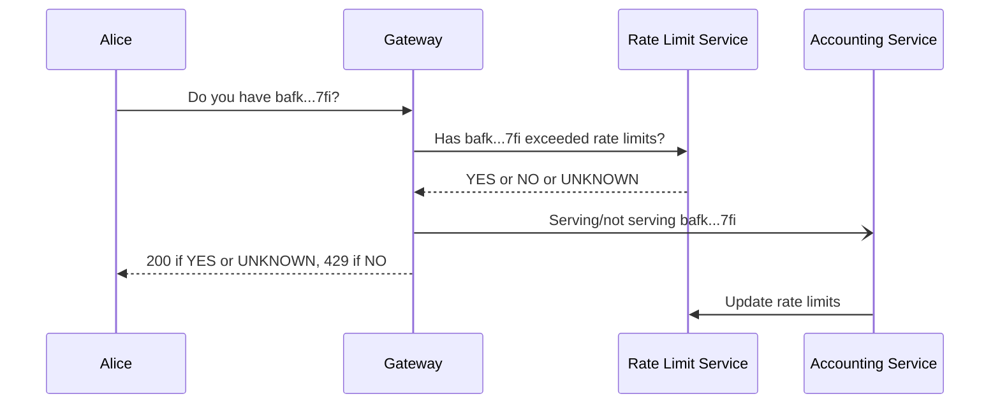
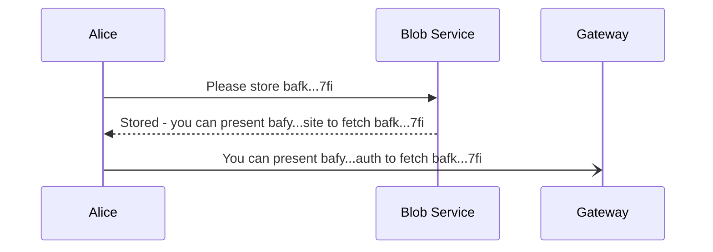
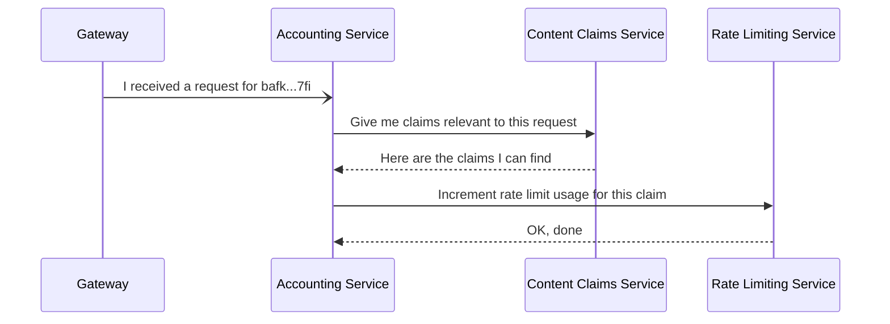
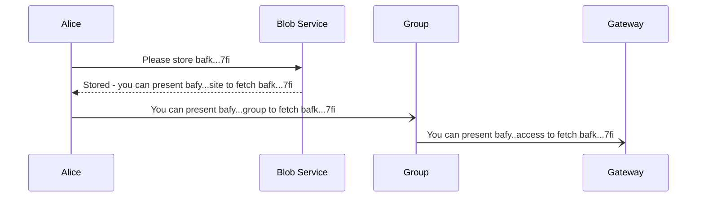

# w3s.link gateway egress billing 

## Authors

- [Travis Vachon](https://github.com/travis)
- [Irakli Gozalishvili](https://github.com/gozala)

## Goals

We need to start charging for data served by our gateway ("gateway egress"). Users who upload data using `w3up` should
be charged when we serve that data through the gateway that is currently hosted at https://w3s.link. Importantly, if 
two users upload the same data, we need to ensure the correct party is billed when we serve that data through
the gateway - for instance, if I upload a file that a massive NFT platform also uploaded, I should not be charged
when that platform serves that data to millions of their customers through their website.

Charging for *all* reads is a non-goal - we believe there is a tradeoff between strict accounting and read performance
and we generally want to err on the side of performant reads.

## Abstract

The business has the capacity to pay for some number of reads - we'll call this _R_. We will
first implement a global per-CID rate-limit that is expected to account for N%
of _R_. This rate limit will be used for all content that has not been configured with another
rate limit, and for content that has been configured with other rate limits that have already
been reached.

In order to allow our users to guarantee consistent read performance in their applications, we
will allow them to configure rate limits using the “content commitments“ returned from blob uploads. 
These content commitments can be delegated to the gateway and parameterized to set rate limits
in a flexible and extensible way - essentially, a user will authorize the gateway to serve their content
with some restrictions. At read time, if the gateway can find a valid content commitment it will serve the content,
and if not it will fall back to the behavior described above.

Finally, in order to give ourselves maximum flexibility to optimize read performance, we propose
a high performance rate-limit tracking system based on industry-standard tools for this purpose. After
the request is served it will be passed to a backend job processing system which will update the rate limit caching
system. We expect this to result in some amount of "unauthorized" read request service - for example, if two requests for
the same content arrive at nearly the same time they will always both be served even if the second request
goes over all established rate limits, since the rate limits will only be updated some time after a request is served. 
This pattern is similar in some ways to the "stale while revalidate"  pattern that is popular on the web today - stale
rate limits will be used while they are revalidated in the background. Requests served this way despite being over all
available rate limits will account for the remaining (100 - N)% of _R_.

Taken together, this should allow us to keep reads extremely performant - ideally we will need only a single network
request to the rate limits service and a small amount of computation to decide whether to serve content. It will also give users an
extremely flexible and extensible mechanism to control how and when their content is served, including support for
`Origin`-gating and other CDN-esque tools to control their egress costs.



## Introduction

We currently operate the IPFS gateway at https://w3s.link as a free service. As a result, it is an unbound source of "cost"
for our business. Covering some amount of the costs associated with this service make sense as a marketing and community
building expense, but operating it for free makes it prohibitively expensive to give our customers acceptable read performance
for their applications through our gateway.

In order to fix this, we propose a design for billing our customers for data egress related to their applications. The suggested
design allows us to maintain extremely fast read performance by allowing us to configure the "acceptable level" of "unpaid"
data egress and giving our customers a way to authorize paid data egress using the "content claims" returned by the 
[blob upload service].

## Rate Limits

Business realities (runway, need for marketing and community growth, etc) will determine an acceptable level of data egress
through our gateway that can be paid for by the business. We will call this _R_, the "number of requests we're willing to pay for."

We will use a tool like Redis to implement this rate limit, because it has a long history of being used for this and
the right set of primitives to support it well: https://redis.io/glossary/rate-limiting/ - we will use Redis as an example
in this document but recommend researching other tools like memcached and Caddy before making a final implementation decision.

When the gateway receives a request for some content, it will make a request to Redis for the relevant rate limit data and decide to
serve the request based on the response. In order to maintain acceptable read performance, we recommend avoiding any other network
IO in making the decision to serve a piece of content. In the event that content is served as a result of the rate limit caching service
being out of date, we count that request against _R_. 

The following TypeScript pseudocode illustrates the rate limiting algorithm:


```ts
enum RateLimited {
  Yes,
  No,
  Maybe,
}

async function handle(request){
  const rateLimited = checkRedisToDetermineIfRateLimited(request)
  const cid = getCidFromRequest(request)
  switch (rateLimited) {
    case Yes: 
      return { status: 429, message: `${cid} is currently rate limited, please try again later` }
    case No:
      return { status: 200, body: readContentFromW3up(cid) }
    case Maybe:
      return { status: 200, body: readContentFromW3up(cid) }
  }
}
```

### User Configuration

In order to allow our users to use uploaded content in their applications and guarantee acceptable read performance,
we propose use the "[content commitments]" generated by the w3up [blob upload service].

```js
{ // Content commitment with CID bafy...site
  // Storage node authorizes access to the stored resource
  "iss": "did:web:asia.web3.storage",
  // To Alice
  "aud": "did:key:zAlice",
  // Indefinitely
  "exp": null,
  "cmd": "/assert/location",
  // Subject is storage node because they own that resource
  "sub": "did:web:asia.web3.storage",
  "pol": [
    // multihash must match an uploaded blob
    ["==", ".content", { "/": { "bytes": "mEi...sfKg" } }],
    // must be available from this url
    ["==", ".url", "https://asia.w3s.link/ipfs/bafk...7fi"],
  ]
}
```

[TODO: should I translate this into UCAN.current too?]

The "content commitment" above, with CID `bafy...site`, represents a claim that content will be available from
the URL `https://asia.w3s.link/ipfs/bafk...7fi` indefinitely. Alice can use it to create and sign the following
delegation to the w3s.link gateway:

```js
{ // bafy..auth
  "iss": "did:key:zAlice",
  "aud": "did:web:w3s.link",
  "exp": 1716235987 // restrict to a month
  "cmd": "/assert/location",
  // Subject is storage node because they own that resource
  "sub": "did:web:asia.web3.storage",
  "pol": [
    // Request origin header must be example.com
    ["==", ".headers['origin']", "example.com"],
    // Request URL must have a query string that includes "token=zrptvx"
    ["==", ".query.token", "zrptvx"]
  ],
  "meta": { "proof": { "/": "bafy...site" } }
}
```

This delegation authorizes the gateway to serve this content when the HTTP request's `Origin` header has a
value of `example.com` and the request URL has a query string that includes `token=zrptvx`. This functions
as an "unlimited" rate limit and can be used to authorize, for example, unlimited egress billing for requests.

Additional `pol` entries can be added to set more stringent rate limits,
for example specifying that a particular content commitment may
only be used 100 times per minute or 1000 total. The syntax and
specifics of these rate limits will be defined in a formal specification.



#### Rate Limit Accounting

When the gateway receives a request, it will query the [content claims service] for claims about the requested
CID [TODO: and also other information like origin and token?]. If multiple claims establishing different rate limits
are found, one is chosen randomly and its request count is incremented, resulting in billing to the 
party that authorized the rate limit. If no claims are found, the public rate limit request count is incremented.

These queries and the updates to rate limits they are used to create should not be done in the hot-path of reads - instead
this should be done in background jobs and the read logic should read from whatever data store these tasks are using to manage
rate limits.



#### Bulk Configuration

NOTE: The following requires support for "delegations without inline proofs" as specified in UCAN 1.0

If users would like to set rate limits on a set of CIDs in a single operation, they can create an intermediary "principle"
to which they can address delegations - in this example we will call this principle `did:key:zGroup`. 

We first create a content commitment addressed to the group:

```js
{ // bafy..group
  "iss": "did:key:zAlice",
  "aud": "did:key:zGroup",
  "exp": 1716235987 // restrict to a month
  "cmd": "/assert/location",
  // Subject is storage node because they own that resource
  "sub": "did:web:asia.web3.storage",
  "pol": [
    // Request origin header must be example.com
    ["==", ".headers['origin']", "example.com"],
    ["==", ".query.token", "zrptvx"]
  ],  
  "meta": { "proof": { "/": "bafy...site" } }
}
```

and then create an open-ended delegation from the group to the gateway, with the same `pol` (TODO: or more restrictive?) fields:

```js
{ // bafy..access
  "iss": "did:key:zGroup",
  "aud": "did:web:w3s.link",
  "exp": 1716235987 // restrict to a month
  "cmd": "/assert/location",
  // Subject is storage node because they own that resource
  "sub": "did:web:asia.web3.storage",
  "pol": [
    // Request origin header must be example.com
    ["==", ".headers['origin']", "example.com"],
    ["==", ".query.token", "zrptvx"]
  ]
}
```

For any given CID, the gateway will be able to look up the CID-specific content commitment as well as the
group-to-gateway content commitment and combine them to create a chain rooted in the original content commitment
provided by the w3up service on content upload. The gateway should take care to check that each link in the 
chain is valid (though this will hopefully be handled by the UCAN tooling).



Note that `bafy..access` alone will not be enough to authorize retrieval
of the content - the accounting system will need to combine it with
a CID-specific content commitment that has been delegated to `Group` like `bafy..group`.

## Implementation Considerations

As stated above, a core design goal is to keep reads extremely performant. This generally implies
that we should try to make a decision about whether or not to serve a request with as little IO (and to
a lesser extent compute) as possible. As we suggest above, a service like Redis is designed to serve
this use-case (https://redis.io/glossary/rate-limiting/) well, and ideally will be the only service
consulted when making a decision about whether or not to serve content.

This implies that the first time we are asked to serve a piece of content, we will serve it. This is
totally acceptable because we propose a global rate limit greater than 0. After serving the content, we will
further process the request using a background job-execution framework. This background job will determine 
whether a particular CID should be rate limited. In some cases, especially cases where the same CID is being
requested many times, this may result in content being served despite being over all applicable rate limits - this
is acceptable since Redis will eventually be updated and the amount of reads that fall into this category are
expected to be within the bounds of the read capacity the business is willing to serve.

On the topic of Redis, it's worth noting that it is no longer open source:

https://redis.io/blog/redis-adopts-dual-source-available-licensing/

We may want to consider using an open source alternative like https://github.com/nalgeon/redka if we
are concerned about using "source available" products - my inclination is to use Redis but consider products like
Redka as a fallback in case Redis no longer meets our needs. We may also want to consider using AWS or Cloudflare products with Redis-compatible APIs:

https://aws.amazon.com/memorydb/
https://aws.amazon.com/elasticache/
https://developers.cloudflare.com/workers/databases/native-integrations/upstash/

Using one of these services is probably the most expedient way to prototype this - since the gateway currently runs on Cloudflare, Upstash is perhaps the most promising.

## TODO

- [ ] quick prototype spike - (in hoverboard?)
  - just the single-CID flow for now
  - nail down details of:
    - what is a delegation vs invocation
    - how this integrates with our billing service
- [ ] design and specify the first version of the gateway configuration
- [ ] research Redis and alternatives
- [ ] design the rate limits service
- [ ] build the rate limits service
- [ ] design the accounting service
- [ ] build the accounting service
- [ ] update hoverboard (?) to use the rate limits and accounting services
- [ ] update other pieces of infrastructure to use rate limits and accounting services (what are these?)


## Resources

[capability design sketch](https://hackmd.io/trUTYf90TjaCyzft2aIFdg)
[content commitments](https://hackmd.io/@gozala/content-claims)
[content claims service](https://github.com/web3-storage/content-claims)
[blob upload service](https://github.com/w3s-project/specs/blob/main/w3-blob.md)
[Redis](https://redis.io/)