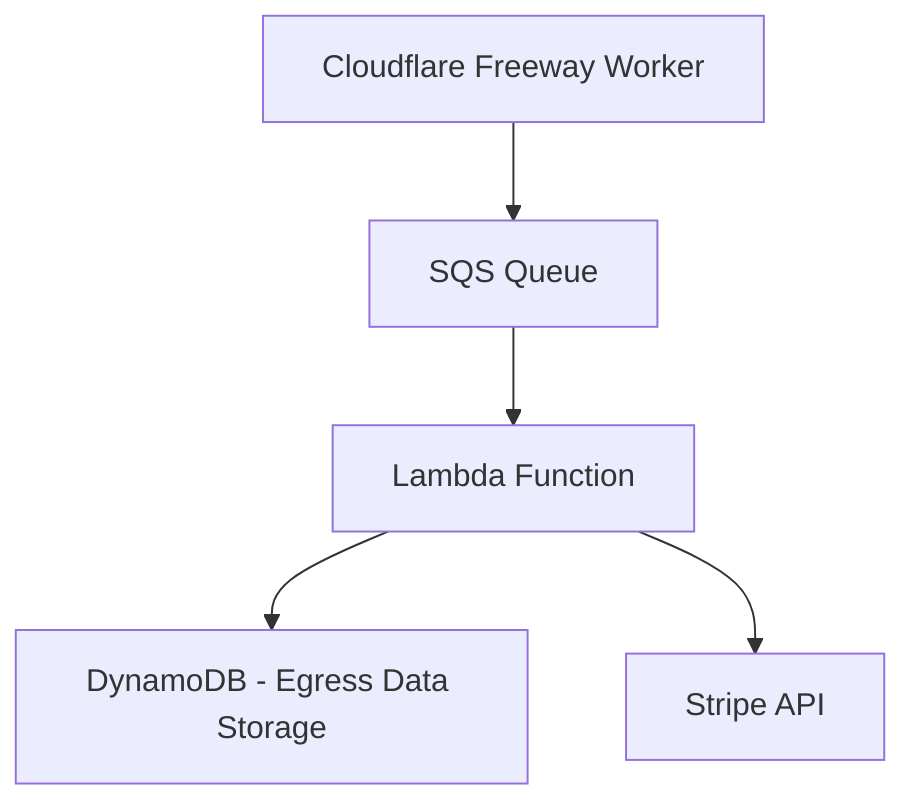
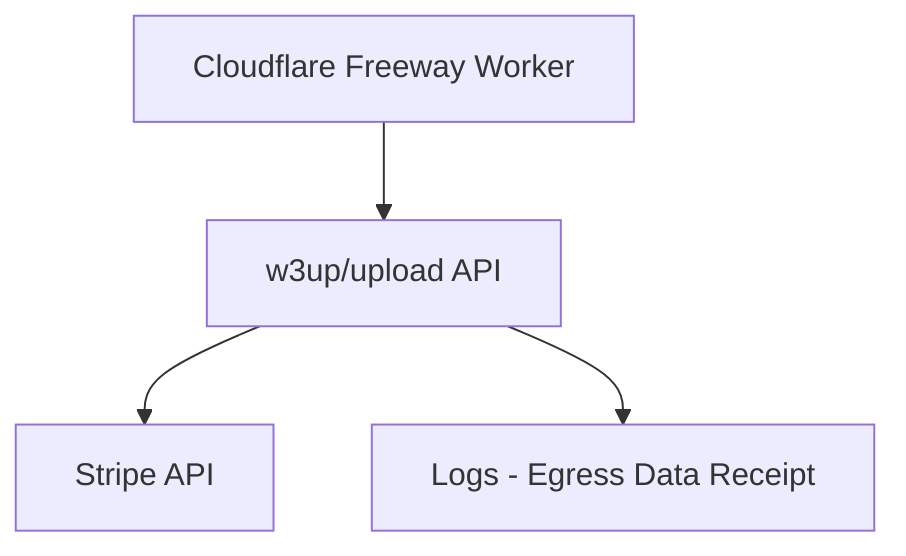
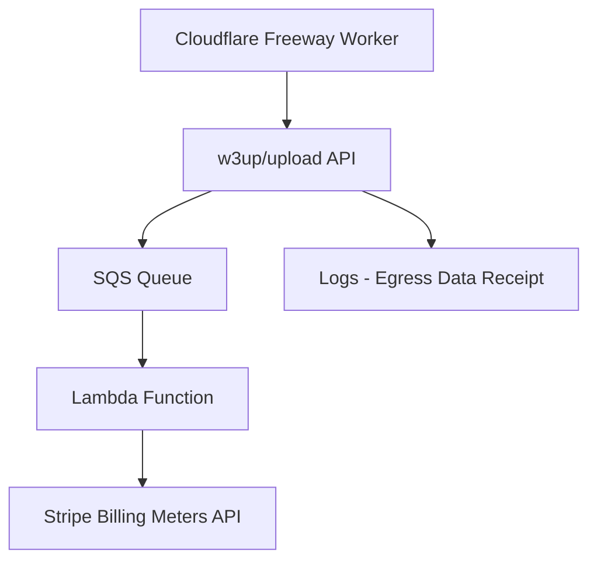

# RFC: Egress Traffic Tracking

## Authors

- Felipe Forbeck

## Status

- Proposed

## Versions

- v2 - 2024-10-26
- ~~v1 - 2024-10-25~~

## Context

Storacha Network aims to implement a scalable and automated mechanism to track egress traffic for customer billing purposes. The objective is to update Stripe’s API with relevant egress data for each customer, ensuring accurate billing. This RFC outlines three potential approaches to achieve this goal, each with its own set of trade-offs.

## Problem

Currently, there is no established automated process to track and associate egress traffic per customer and report this usage to Stripe for billing. A solution is required to automate this process for seamless, scalable, and accurate billing based on egress traffic.

## Proposal

We propose three alternatives for tracking and updating egress billing traffic:

### Alternative 1: SQS, Lambda, DynamoDB, and Stripe Integration

1. Introduce an SQS queue to receive egress event data from the Cloudflare Freeway Worker.
2. Use a Lambda function to process these events and store the egress data in a DynamoDB table, mapping the data to the respective customer.
3. The Lambda function will then update Stripe’s API with the corresponding egress data size for the customer.



**Advantages:**

- Decoupled, event-driven architecture using SQS and Lambda, providing clear separation of responsibilities.
- Fine-grained control over event handling and processing.

**Disadvantages:**

- Requires managing additional infrastructure (SQS queue, Lambda function, DynamoDB table) solely for this purpose.
- Cloudflare Freeway Worker must be authorized to publish events to the SQS queue, adding complexity to authentication and authorization mechanisms.
- Increased operational overhead due to the need to monitor and maintain new infrastructure components.

### Alternative 2: Extend `w3up/upload-api` with `usage/record` Capability

1. Add a new capability, `usage/record`, to the `w3up/upload-api`.
2. Implement this capability in the `w3infra` repository to directly update Stripe’s API with the egress data size for each customer.
3. The Cloudflare Freeway Worker would invoke the `w3up/upload-api` every time a resource is served, passing the egress data size and customer details to trigger the Stripe update.
4. Ensure the Cloudflare Freeway Worker is authorized to invoke this API via delegation.
5. Each invocation will be logged, providing signed receipts of egress traffic.



**Advantages:**

- No need to maintain additional infrastructure components such as SQS queues, Lambdas, or DynamoDB tables, as existing infrastructure already handles similar UCAN invocations.
- Simplified architecture by relying on current logs and receipts to record traffic data.
- Reduces operational complexity with fewer components to manage.

**Disadvantages:**

- Cloudflare Freeway Worker will need to be updated to interact with the `w3up/upload-api` for each served resource.
- Delegation mechanisms need to be set up and secured to ensure the worker is authorized to invoke the new API.

### Alternative 3: Freeway Worker invoking `usage/record`, SQS, Lambda with Stripe Integration

1. The Freeway worker will invoke the `usage/record` capability using `ctx.waitUntil` to avoid blocking.
2. The `usage/record` handler in the `w3infra/upload-api` will receive the request and place the egress data into an SQS queue.
3. A new Lambda function will consume events from the SQS queue and publish the data to the Stripe Billing Meters API.



**Advantages:**

- **Asynchronous execution** using `ctx.waitUntil` ensures that the Freeway worker won’t block while handling egress data.
- Maintains **clear separation of concerns** by utilizing SQS and Lambda for processing and publishing egress data to Stripe.
- **Decoupled architecture** similar to Alternative 1, with the added benefit of a **buffer** (SQS queue) to mitigate rate limit issues when publishing events to Stripe.
- **Generates signed receipts** like Alternative 2, ensuring auditability and traceability of egress data transactions.

**Disadvantages:**

- Similar to Alternative 1, requires additional infrastructure components (SQS, Lambda) to be set up and maintained.
- Involves updating the Freeway worker to consume the `w3up` client, and has an additional step in the pipeline.

**Deferred Tasks for Future Iterations:**

- Handling transform streams for closed connections.
- Tailing worker logs due to potential changes in the Cloudflare log structure, which could complicate issue detection. This could be addressed in future iterations by using log annotations as suggested by Alan.

## Stripe Integration

To implement usage-based billing for Storacha Network, we have two options for integrating with Stripe: **Usage Records (Legacy)** and **Billing Meters (Recommended)**.

### 1. Usage Records (Legacy)

**Usage Records** allow manual tracking of customer usage and submitting it to Stripe for billing. However, Stripe is deprecating this feature, meaning it will soon be unsupported. Additionally, **it requires customers to have an active subscription** to start tracking their usage, adding complexity when handling pre-subscription events.

### 2. Billing Meters (Recommended)

**Billing Meters** are Stripe's modern solution for usage-based billing, designed to handle high-throughput event reporting and provide more flexibility. Key advantages include:

- **No Subscription Requirement:** Billing Meters allow usage tracking for customers without needing an active subscription, simplifying pre-subscription billing.
- **Real-Time Reporting:** Automatically tracks and aggregates usage events, ensuring accurate and timely reporting.
- **Scalability:** Optimized for high-volume usage reporting, making it ideal for Storacha Network’s needs.
- **No Need for Immediate Migration:** Start tracking egress traffic with the Billing Meter and create new usage-based prices later.
- **Adding New Prices for Each Product:** Create new prices for each of the three products (**Starter, Lite, and Business**), based on tiers of egress data usage. Once associated with the Billing Meter, Stripe will automatically track usage for billing.

### Example Pricing Tiers:

1. **Egress Starter:**

   - **0 to 5 GB:** Free
   - **5 GB to 20 GB:** $0.10 per GB
   - **20 GB+:** $0.07 per GB

2. **Egress Lite:**

   - **0 to 10 GB:** Free
   - **10 GB to 50 GB:** $0.08 per GB
   - **50 GB+:** $0.06 per GB

3. **Egress Business:**
   - **0 to 20 GB:** Free
   - **20 GB to 100 GB:** $0.05 per GB
   - **100 GB+:** $0.03 per GB

### Possible Solution

Since **Usage Records** are being deprecated by Stripe and **Billing Meters** offer greater flexibility and scalability, adopting **Billing Meters** for Storacha Network’s usage-based billing is recommended.

### Benefits of Billing Meters:

- **No Customer Disruption:** Existing billing remains intact while usage is tracked in the background through the Billing Meter.
- **Flexible Tiers:** New prices can be created for each product tier and associated with the Billing Meter for automated usage tracking.
- **Scalability:** This approach ensures that billing for egress traffic is accurate and scalable with minimal operational overhead.

## Questions & Answers

### 1. **Operational Complexity:**

- **Question:** Which approach requires less effort to maintain in the long run? Can the additional infrastructure of Alternative 1 or 3 be justified given their decoupled architecture?
- **Answer:** Alternative 2 requires less effort to maintain in the long run since it leverages existing infrastructure (`w3up/upload-api`), avoiding the need to set up new infrastructure components (SQS, Lambda, DynamoDB).

### 2. **Security:**

- **Question:** How should delegation and authentication mechanisms be handled, particularly in Alternative 2? What security implications arise from allowing the Cloudflare Freeway Worker to directly interact with the `w3up/upload-api`?
- **Answer:** Delegation can be handled by granting the Cloudflare Freeway Worker permission to invoke the required capabilities. The Gateway will need to become a `w3up` client to claim the delegation and execute the invocation securely.
- **Question:** Who will create the delegation to the Cloudflare Freeway Worker?
- **Answer:** ???

### 3. **Performance Impact:**

- **Question:** Will the real-time nature of API updates in Alternative 2 introduce latency concerns for the Cloudflare Freeway Worker? How does this compare to the event-driven model in Alternatives 1 and 3?
- **Answer:** By using Cloudflare’s "fire and forget" context calls, the Freeway Worker can avoid blocking while serving the resource. This minimizes latency, allowing the request to complete without waiting for the billing events, making the performance impact negligible.

### 4. **Logging and Monitoring:**

- **Question:** How can logs and monitoring be effectively implemented in both alternatives? Does Alternative 2’s reliance on signed receipts offer sufficient logging capabilities? Do we really need these signed receipts?

- **Answer:** ???

### 5. **Stripe Integration:**

- **Question:** How does the Stripe integration impact our current billing if we migrate prices?
- **Answer:** It won't disrupt current customer billing since we are adding a new price flow for egress traffic, separate from existing services. The existing customers will continue using their current plans without changes.
- **Question:** What are the downsides of integrating with the Billing Meters API?
- **Answer:** Billing Meters don’t support certain aggregations (`max`, `last_ever`, and `last_during_period`) and lack reporting capabilities directly in the Stripe Dashboard. However, these limitations can be managed through external monitoring tools.
- **Question:** How can customer egress usage be seen in Stripe if there is no reporting/dashboard for that customer?
- **Answer:** Query the API and filter by Meter Id, Customer, and Date Range, e.g:

  ```js
  const meterEventSummaries = await stripe.billing.meters.listEventSummaries(
  '{{METER_ID}}',
  {
      customer: '{{CUSTOMER_ID}}',
      start_time: 1729083600,
      end_time: 1729080000,
      value_group_window='{{day|hour}}'
  })
  ```

  Sample response:

  ```json
  {
    "object": "list",
    "data": [
      {
        "id": "...",
        "object": "billing.meter_event_summary",
        // The sum of egress data in bytes for the given group_window
        "aggregated_value": 5014,
        "end_time": 1729083600,
        "livemode": false,
        "meter": "{{METER_ID}}",
        "start_time": 1729080000
      }
    ],
    "has_more": false,
    "url": "/v1/billing/meters/:id/event_summaries"
  }
  ```

  Retrieve the upcoming invoice to find the total egress usage for the current subscription period:

  ```js
  const upcomingInvoice = await stripe.invoices.retrieveUpcoming({
    customer: "{{CUSTOMER_ID}}",
  });
  ```

  Stripe processes meter events asynchronously, so upcoming invoices might not immediately reflect recently received meter events.

## Recommendation

**Alternative 3** offers a more streamlined architecture by leveraging the existing `w3up/upload-api` and adds minimal infrastructure components like SQS, Lambda to prevent rate limiting issues on Stripe API.
While it requires updates to the Freeway Worker and additional delegation controls, the reduced operational overhead makes this approach more sustainable and easier to extend in the future.
