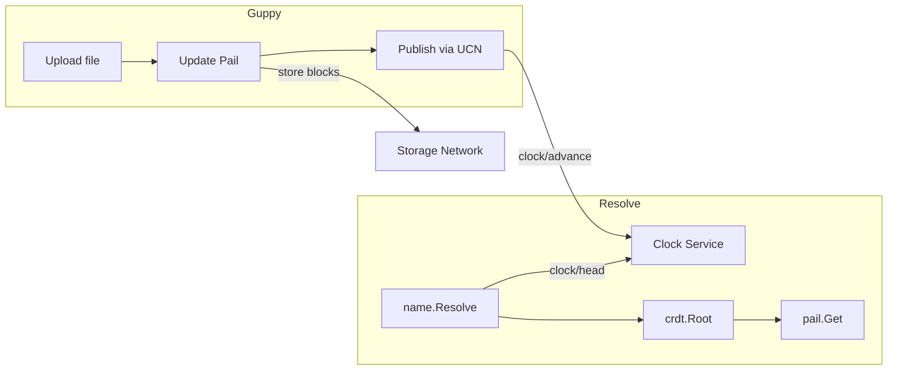
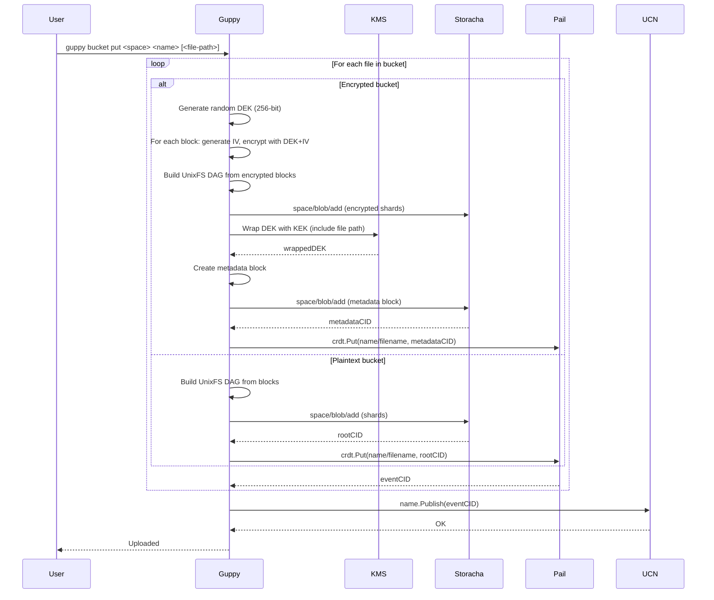
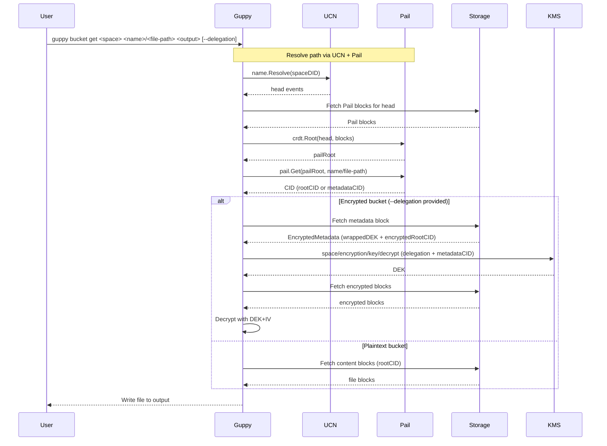

# RFC: Mutability for Forge (Guppy/Piri)

**Status: Draft - Pending Alignment**

## Authors

- [Felipe Forbeck](https://github.com/fforbeck), [Storacha Network](https://storacha.network/)

## Editors
- [Alan Shaw](https://github.com/alanshaw), [Storacha Network](https://storacha.network/)
- [Hannah Howard](https://github.com/hannahhoward), [Storacha Network](https://storacha.network/)
- [Alex Kinstler](https://github.com/prodalex), [Storacha Network](https://storacha.network/)


## Language

The key words "MUST", "MUST NOT", "REQUIRED", "SHALL", "SHALL NOT", "SHOULD", "SHOULD NOT", "RECOMMENDED", "MAY", and "OPTIONAL" in this document are to be interpreted as described in [RFC2119](https://datatracker.ietf.org/doc/html/rfc2119).

## Introduction

This RFC proposes the implementation of mutability features for Forge enterprise customers using the Guppy client. These features enable:

1. **Mutable References**: Stable pointers that update to the latest version of uploaded content
2. **Content Catalog**: Track uploaded content (path to CID mappings) across clients

**Related:** [forge-encryption.md](./forge-encryption.md) - Encryption key rotation depends on mutability to track metadata CID changes.

## Motivation

Enterprise Forge customers need:

- **Mutable references**: Backup workflows need stable names that update to point to the latest backup version
- **Cross-client sync**: Multiple Guppy instances should be able to resolve the same reference
- **On-network state**: Track what has been uploaded without relying on local-only databases

## Out of Scope

- **All-file-paths indexing**: Storing every individual file path in Pail (e.g., `/backups/mydir/file1.txt`, `/backups/mydir/subdir/file2.txt`). This RFC only tracks the source root path to root CID mapping. Internal file structure remains in UnixFS.

## Approach: UCN + Pail

Forge will use **UCN** + **Pail** for mutable content tracking:

- **UCN**: Lightweight wrapper around `clock/head` and `clock/advance` for publishing/resolving names
- **Pail**: Sharded Merkle trie for `path -> CID` mappings (scales to millions of files)
- **Clock service**: Already exists at `clock.web3.storage`

### Why Pail?

Forge directories can contain thousands to millions of files. Pail's sharded structure means only changed shards are uploaded when a file is added or updated.

**Note:** Guppy continues to upload content as UnixFS (for traditional retrieval patterns). Pail stores the mapping from source path to the UnixFS root CID, enabling path-based lookups without changing the upload format.

### Architecture



### What to Build

| Component | Status |
|-----------|--------|
| UCN wrapper (`clock/head`, `clock/advance`) | Needs Go impl (~few hundred lines) |
| Pail integration | Library exists: `github.com/storacha/go-pail` |
| Guppy commands | New `bucket` subcommand (`create`, `put`, `get`, `ls`) |

## CLI Command Reference

The `bucket` subcommand provides a **mutable storage interface** using Pail + UCN. It tracks `path → CID` mappings and enables path-based content resolution. Encryption is **optional** and controlled via the `--encrypt` flag.

**Reference:** [w3cli-plugin-bucket](https://github.com/alanshaw/w3cli-plugin-bucket) - Alan's CLI extension that inspired this design.

### `guppy bucket create`

Create a bucket by linking a local folder to a space.

```
guppy bucket create <space> <name> <local-folder> [--encrypt] [--local-key <path>]
```

**Arguments:**
| Argument | Description |
|----------|-------------|
| `<space>` | Space DID (e.g., `did:key:z6Mk...`) |
| `<name>` | Bucket name in Pail (e.g., `backups`, `db-snapshots`) |
| `<local-folder>` | Local filesystem folder to track |

**Flags:**
| Flag | Description |
|------|-------------|
| `--encrypt` | Enable encryption using KMS (requires KMS config in `config.yaml`) |
| `--local-key <path>` | Enable encryption using a standalone key file (dev/testing, no access control) |

**Example:**
```bash
# Create plaintext bucket (mutability only)
guppy bucket create did:key:z6MkExample backups /Users/alice/my-backups

# Create encrypted bucket with KMS (production)
guppy bucket create did:key:z6MkExample secrets /Users/alice/secrets --encrypt

# Create encrypted bucket with local key (dev/testing)
guppy bucket create did:key:z6MkExample dev-secrets /Users/alice/test-data --local-key ./dev-key.bin
```

**Behavior:**
1. Links bucket `<name>` to `<local-folder>` in local config
2. If `--encrypt`: reads KMS config from `~/.storacha/guppy/config.yaml` and calls `space/encryption/setup` to get/create KEK (see [forge-encryption.md](./forge-encryption.md#key-management))
3. If `--local-key`: uses the provided key file directly (no KMS, no access control - see [guppy#376](https://github.com/storacha/guppy/pull/376))
4. Stores bucket settings locally (including encryption mode)

### `guppy bucket put`

Upload files to the bucket. If the bucket has encryption enabled, each file is encrypted individually.

```
guppy bucket put <space> <name> [<file-path>]
```

**Arguments:**
| Argument | Description |
|----------|-------------|
| `<space>` | Space DID |
| `<name>` | Bucket name (from `bucket create`) |
| `<file-path>` | Optional. Specific file to upload. If omitted, uploads all files in bucket folder. |

**Example:**
```bash
# Upload a single file
guppy bucket put did:key:z6MkExample backups ./db.tar

# Upload all files in bucket folder
guppy bucket put did:key:z6MkExample backups
```

**Behavior (per file):**

*Plaintext bucket:*
1. Build UnixFS DAG from file blocks
2. Upload via `space/blob/add`
3. Store `<name>/<filename>` → `rootCID` in Pail
4. Publish updated Pail head via UCN (`clock/advance`)

*Encrypted bucket:*
1. Generate random DEK (256-bit AES key)
2. For each block: generate IV, encrypt with DEK+IV (AES-256-CTR)
3. Build UnixFS DAG from encrypted blocks
4. Wrap DEK with KEK (RSA-OAEP), include file path in wrapped blob
5. Create encrypted metadata block → `metadataCID`
6. Upload encrypted blocks + metadata via `space/blob/add`
7. Store `<name>/<filename>` → `metadataCID` in Pail
8. Publish updated Pail head via UCN (`clock/advance`)

### `guppy bucket get`

Retrieve a file from the bucket. For encrypted buckets, decryption requires a delegation.

```
guppy bucket get <space> <name>/<file-path> <output> [--delegation <file>]
```

**Arguments:**
| Argument | Description |
|----------|-------------|
| `<space>` | Space DID |
| `<name>/<file-path>` | Full path in bucket (e.g., `backups/db.tar`) |
| `<output>` | Local filesystem path to write output |

**Flags:**
| Flag | Description |
|------|-------------|
| `--delegation <file>` | Path to delegation file authorizing decryption (required for encrypted buckets) |

**Example:**
```bash
# Retrieve from plaintext bucket
guppy bucket get did:key:z6MkExample backups/db.tar ./restored-db.tar

# Retrieve and decrypt from encrypted bucket
guppy bucket get did:key:z6MkExample secrets/config.tar ./config.tar --delegation ./my-delegation.ucan
```

**Behavior:**

*Plaintext bucket:*
1. Resolve `<name>/<file-path>` via UCN + Pail → get `rootCID`
2. Fetch content blocks
3. Write file to `<output>`

*Encrypted bucket:*
1. Resolve `<name>/<file-path>` via UCN + Pail → get `metadataCID`
2. Fetch encrypted metadata block
3. Send delegation + `metadataCID` to KMS (`space/encryption/key/decrypt`)
4. KMS validates delegation, unwraps DEK
5. Fetch encrypted blocks, decrypt with DEK+IV
6. Write decrypted file to `<output>`

### `guppy bucket ls`

List files in the bucket.

```
guppy bucket ls <space> <name>
```

**Arguments:**
| Argument | Description |
|----------|-------------|
| `<space>` | Space DID |
| `<name>` | Bucket name |

**Example:**
```bash
guppy bucket ls did:key:z6MkExample backups
```

**Output:**
```
FILE                    CID                                          UPDATED
backups/db.tar          bafyMeta1...                                 2026-03-19T10:00:00Z
backups/config.json     bafyMeta2...                                 2026-03-19T09:30:00Z
```

## Multi-Writer Behavior

When multiple Guppy clients write to the same space concurrently:

- **Source-level granularity**: Pail tracks `sourcePath -> CID` mappings. Concurrent updates to *different* source paths merge cleanly via CRDT.
- **Same source path**: If two clients update the same source path simultaneously, **last-writer-wins** applies to the CID value. The directory structure within each UnixFS root is not merged.

This is acceptable for Forge's backup use case where each client typically owns distinct source paths.

## Integration with Guppy Flows

### Current Guppy Upload Pipeline

Guppy's `ExecuteUpload` runs a pipeline of workers:

1. **Scan Worker** - Walks filesystem, creates FSEntry records
2. **DAG Scan Worker** - Creates DAG nodes from files, sets rootCID
3. **Sharding Worker** - Packs nodes into CAR shards
4. **Indexing Worker** - Creates indexes for shards
5. **Shard Upload Worker** - Uploads shards via `space/blob/add`
6. **Index Upload Worker** - Uploads indexes via `space/blob/add`
7. **Post-Process Workers** - Finalizes shards/indexes, calls `upload/add`

Returns: `rootCID` (the content root)

### Bucket Put Flow



### Bucket Get Flow



## References

- [Mutability & Privacy in Storacha — Strategy Document](https://www.notion.so/storacha/Mutability-Privacy-in-Storacha-Strategy-Document-3125305b5524807fb4a1ce6a3c9201e8) (internal)
- [Storacha UCN Package](https://github.com/storacha/upload-service/tree/main/packages/ucn)
- [Storacha Pail Package](https://github.com/storacha/pail)
- [UCAN Specification](https://github.com/ucan-wg/spec)
- [w3cli-plugin-bucket](https://github.com/alanshaw/w3cli-plugin-bucket/blob/main/index.js)