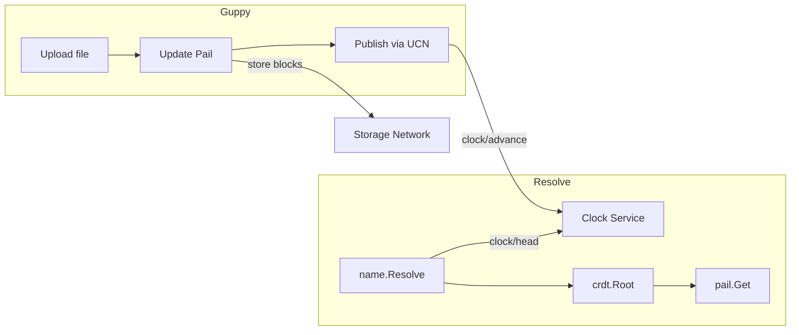
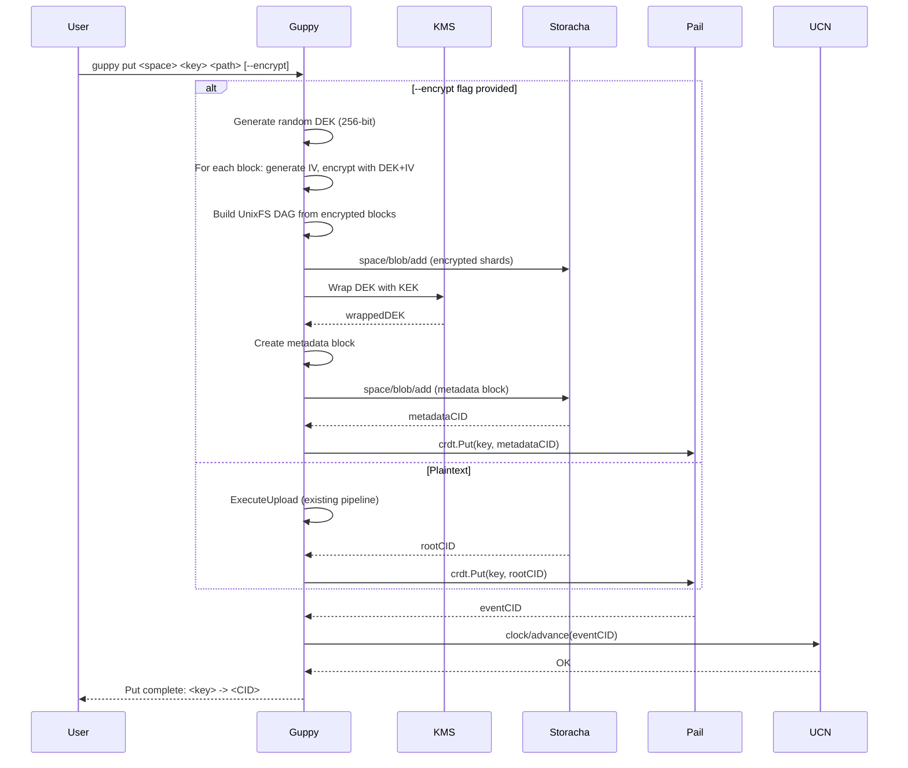
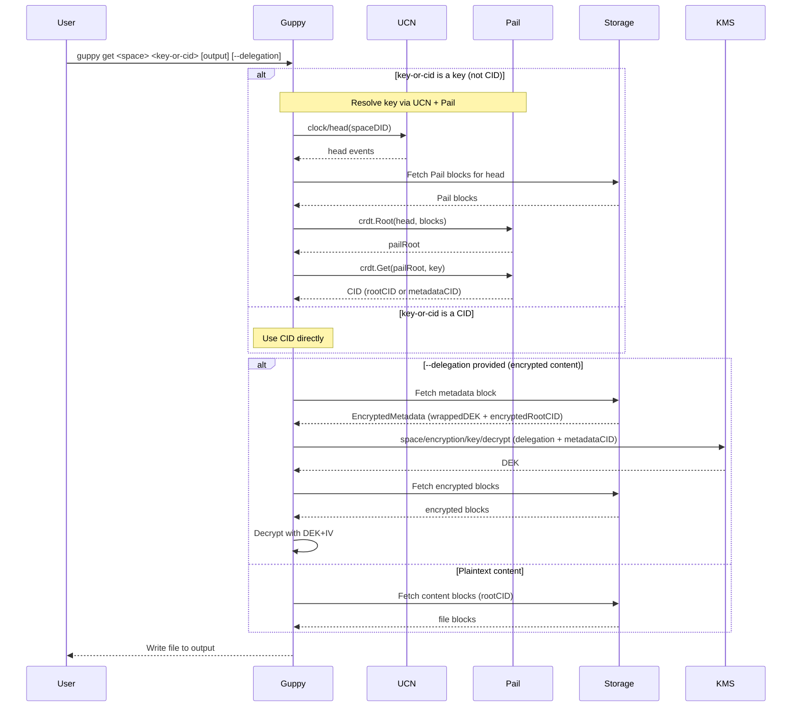

# RFC: Mutability for Forge (Guppy/Piri)

**Status: Draft - Pending Alignment**

## Authors

- [Felipe Forbeck](https://github.com/fforbeck), [Storacha Network](https://storacha.network/)

## Editors
- [Alan Shaw](https://github.com/alanshaw), [Storacha Network](https://storacha.network/)
- [Hannah Howard](https://github.com/hannahhoward), [Storacha Network](https://storacha.network/)
- [Alex Kinstler](https://github.com/prodalex), [Storacha Network](https://storacha.network/)


## Language

The key words "MUST", "MUST NOT", "REQUIRED", "SHALL", "SHALL NOT", "SHOULD", "SHOULD NOT", "RECOMMENDED", "MAY", and "OPTIONAL" in this document are to be interpreted as described in [RFC2119](https://datatracker.ietf.org/doc/html/rfc2119).

## Introduction

This RFC proposes the implementation of mutability features for Forge enterprise customers using the Guppy client. These features enable:

1. **Mutable References**: Stable pointers that update to the latest version of uploaded content
2. **Content Catalog**: Track uploaded content (path to CID mappings) across clients

**Related:** [forge-encryption.md](./forge-encryption.md) - Encryption key rotation depends on mutability to track metadata CID changes.

## Motivation

Enterprise Forge customers need:

- **Mutable references**: Backup workflows need stable names that update to point to the latest backup version
- **Cross-client sync**: Multiple Guppy instances should be able to resolve the same reference
- **On-network state**: Track what has been uploaded without relying on local-only databases

## Out of Scope

- **All-file-paths indexing**: Storing every individual file path in Pail (e.g., `/backups/mydir/file1.txt`, `/backups/mydir/subdir/file2.txt`). This RFC only tracks the source root path to root CID mapping. Internal file structure remains in UnixFS.

## Approach: UCN + Pail

Forge will use **UCN** + **Pail** for mutable content tracking:

- **UCN**: Lightweight wrapper around `clock/head` and `clock/advance` for publishing/resolving names
- **Pail**: Sharded Merkle trie for `path -> CID` mappings (scales to millions of files)
- **Clock service**: Already exists at `clock.web3.storage`

### Why Pail?

Forge directories can contain thousands to millions of files. Pail's sharded structure means only changed shards are uploaded when a file is added or updated.

**Note:** Guppy continues to upload content as UnixFS (for traditional retrieval patterns). Pail stores the mapping from source path to the UnixFS root CID, enabling path-based lookups without changing the upload format.

### Architecture



### What to Build

| Component | Status |
|-----------|--------|
| UCN wrapper (`clock/head`, `clock/advance`) | Needs Go impl (~few hundred lines) |
| Pail integration | Library exists: `github.com/storacha/go-pail` |
| Guppy changes | New bucket commands: `put`, `get`, `ls`, `rm` |

## CLI Command Reference

This RFC adopts **bucket semantics** for mutable content, inspired by [Alan Shaw's proposal](https://github.com/storacha/RFC/pull/84#issuecomment-4097051650) and [w3cli-plugin-bucket](https://github.com/alanshaw/w3cli-plugin-bucket).

### Design Rationale

The bucket model (`put`/`get`/`ls`/`rm`) is preferred over extending `upload`/`retrieve` because:

1. **Clear semantics**: "put" implies key-value storage with overwrite behavior
2. **Single command**: `put` combines source registration + upload + Pail update in one action
3. **Key not name**: The key is an explicit identifier, not a passive attribute
4. **Familiar pattern**: Matches AWS S3, GCS, and other object storage CLIs
5. **Mutability first-class**: Every `put` creates/updates a mutable reference

### `guppy put`

Upload content and store a mutable reference (key → CID) in Pail.

```
guppy put <space> <key> <path> [--encrypt] [--local-key <file>]
```

**Arguments:**
| Argument | Description |
|----------|-------------|
| `<space>` | Space DID (e.g., `did:key:z6Mk...`) |
| `<key>` | Mutable reference key (e.g., `backups`, `photos/2026`) |
| `<path>` | Local filesystem path to upload |

**Flags:**
| Flag | Description |
|------|-------------|
| `--encrypt` | Enable encryption using KMS (requires KMS config in `config.yaml`) |
| `--local-key <file>` | Enable encryption using a standalone key file (dev/testing, no access control) |

**Example:**
```bash
# Upload and create mutable reference (plaintext)
guppy put did:key:z6MkExample backups /Users/alice/my-backups

# Upload with encryption (KMS)
guppy put did:key:z6MkExample secrets /Users/alice/secrets --encrypt

# Upload with encryption (local key, dev/testing)
guppy put did:key:z6MkExample dev-data /Users/alice/test-data --local-key ./dev-key.bin

# Hierarchical keys are supported
guppy put did:key:z6MkExample backups/daily/2026-03-25 /Users/alice/daily-backup
```

**Behavior:**
1. If `<path>` is not already a registered source, create one automatically
2. Upload content via existing pipeline → `rootCID`
3. If `--encrypt`:
   - Generate DEK, encrypt blocks, wrap DEK with KEK
   - Create metadata block → `metadataCID`
   - Store `<key>` → `metadataCID` in Pail
4. Else (plaintext):
   - Store `<key>` → `rootCID` in Pail
5. Publish updated Pail head via UCN (`clock/advance`)

**Note:** If the key already exists, its value is **overwritten** with the new CID.

### `guppy get`

Retrieve content by key (resolves via Pail) or by CID.

```
guppy get <space> <key-or-cid> [output] [--delegation <file>]
```

**Arguments:**
| Argument | Description |
|----------|-------------|
| `<space>` | Space DID |
| `<key-or-cid>` | Pail key (e.g., `backups`) or CID (e.g., `bafyRootCID`) |
| `[output]` | Local filesystem path to write output (optional, defaults to current dir) |

**Flags:**
| Flag | Description |
|------|-------------|
| `--delegation <file>` | Path to delegation file authorizing decryption (required for encrypted content) |

**Example:**
```bash
# Retrieve by key (resolves via Pail)
guppy get did:key:z6MkExample backups ./restored-backups

# Retrieve by CID (direct, no Pail lookup)
guppy get did:key:z6MkExample bafyRootCID ./output

# Retrieve and decrypt encrypted content
guppy get did:key:z6MkExample secrets ./decrypted-secrets --delegation ./my-delegation.ucan
```

**Behavior:**

*If `<key-or-cid>` is a key:*
1. Resolve via UCN (`clock/head`) + Pail (`crdt.Get`) → get CID
2. Fetch and write content

*If `<key-or-cid>` is a CID:*
1. Fetch content directly by CID

*If `--delegation` provided (encrypted content):*
1. Fetch encrypted metadata block
2. Send delegation + metadataCID to KMS (`space/encryption/key/decrypt`)
3. KMS validates delegation, unwraps DEK
4. Fetch encrypted blocks, decrypt with DEK+IV
5. Write to output

### `guppy ls`

List all keys and their current CIDs from Pail.

```
guppy ls <space> [prefix]
```

**Arguments:**
| Argument | Description |
|----------|-------------|
| `<space>` | Space DID |
| `[prefix]` | Optional key prefix to filter results |

**Example:**
```bash
# List all keys
guppy ls did:key:z6MkExample

# List keys with prefix
guppy ls did:key:z6MkExample backups/
```

**Output:**
```
KEY                     CID                                          ENCRYPTED
backups                 bafyRoot1...                                 no
backups/daily/2026-03-25 bafyRoot2...                                no
secrets                 bafyMeta3...                                 yes
```

### `guppy rm`

Remove a key from Pail (does not delete the underlying content from storage).

```
guppy rm <space> <key>
```

**Arguments:**
| Argument | Description |
|----------|-------------|
| `<space>` | Space DID |
| `<key>` | Key to remove |

**Example:**
```bash
guppy rm did:key:z6MkExample backups/daily/2026-03-25
```

**Behavior:**
1. Remove `<key>` from Pail (`crdt.Del`)
2. Publish updated Pail head via UCN (`clock/advance`)

**Note:** This only removes the mutable reference. The content remains in storage and can still be accessed by CID.

### Source Management (Optional)

Sources are created automatically by `guppy put`. For power users who want to manage sources explicitly:

```bash
# List local sources
guppy source ls

# Remove a local source (cleanup)
guppy source rm <path>
```

### Legacy Commands

The following commands remain available for backward compatibility and direct CID-based operations:

| Command | Use Case |
|---------|----------|
| `guppy upload <space> <path>` | Upload without mutable reference |
| `guppy retrieve <space> <cid> <output>` | Retrieve by CID directly |

## Multi-Writer Behavior

When multiple Guppy clients write to the same space concurrently:

- **Key-level granularity**: Pail tracks `key -> CID` mappings. Concurrent updates to *different* keys merge cleanly via CRDT.
- **Same key**: If two clients update the same key simultaneously, **last-writer-wins** applies to the CID value. The directory structure within each UnixFS root is not merged.

This is acceptable for Forge's backup use case where each client typically owns distinct keys.

## Integration with Guppy Flows

### Current Guppy Upload Pipeline

Guppy's `ExecuteUpload` runs a pipeline of workers:

1. **Scan Worker** - Walks filesystem, creates FSEntry records
2. **DAG Scan Worker** - Creates DAG nodes from files, sets rootCID
3. **Sharding Worker** - Packs nodes into CAR shards
4. **Indexing Worker** - Creates indexes for shards
5. **Shard Upload Worker** - Uploads shards via `space/blob/add`
6. **Index Upload Worker** - Uploads indexes via `space/blob/add`
7. **Post-Process Workers** - Finalizes shards/indexes, calls `upload/add`

Returns: `rootCID` (the content root)

### Put Flow (with Optional Encryption)



### Get Flow (with Key Resolution + Optional Decryption)



## References

- [Alan Shaw's Bucket Semantics Proposal](https://github.com/storacha/RFC/pull/84#issuecomment-4097051650) - Design rationale for `put`/`get`/`ls`/`rm` commands
- [Mutability & Privacy in Storacha — Strategy Document](https://www.notion.so/storacha/Mutability-Privacy-in-Storacha-Strategy-Document-3125305b5524807fb4a1ce6a3c9201e8) (internal)
- [Storacha UCN Package](https://github.com/storacha/upload-service/tree/main/packages/ucn)
- [Storacha Pail Package](https://github.com/storacha/pail)
- [UCAN Specification](https://github.com/ucan-wg/spec)
- [w3cli-plugin-bucket](https://github.com/alanshaw/w3cli-plugin-bucket/blob/main/index.js)