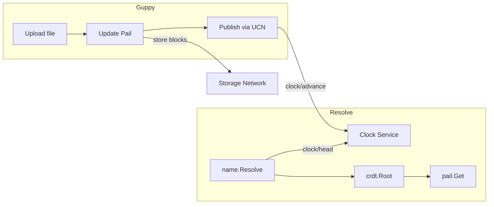
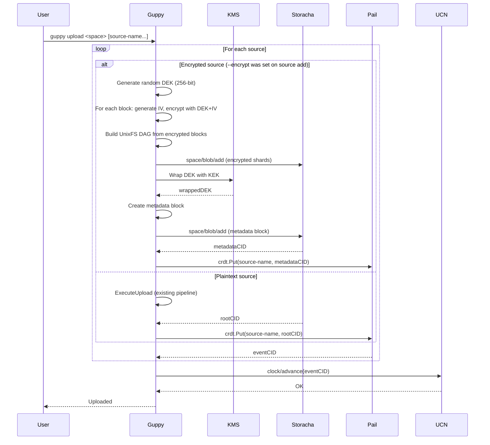
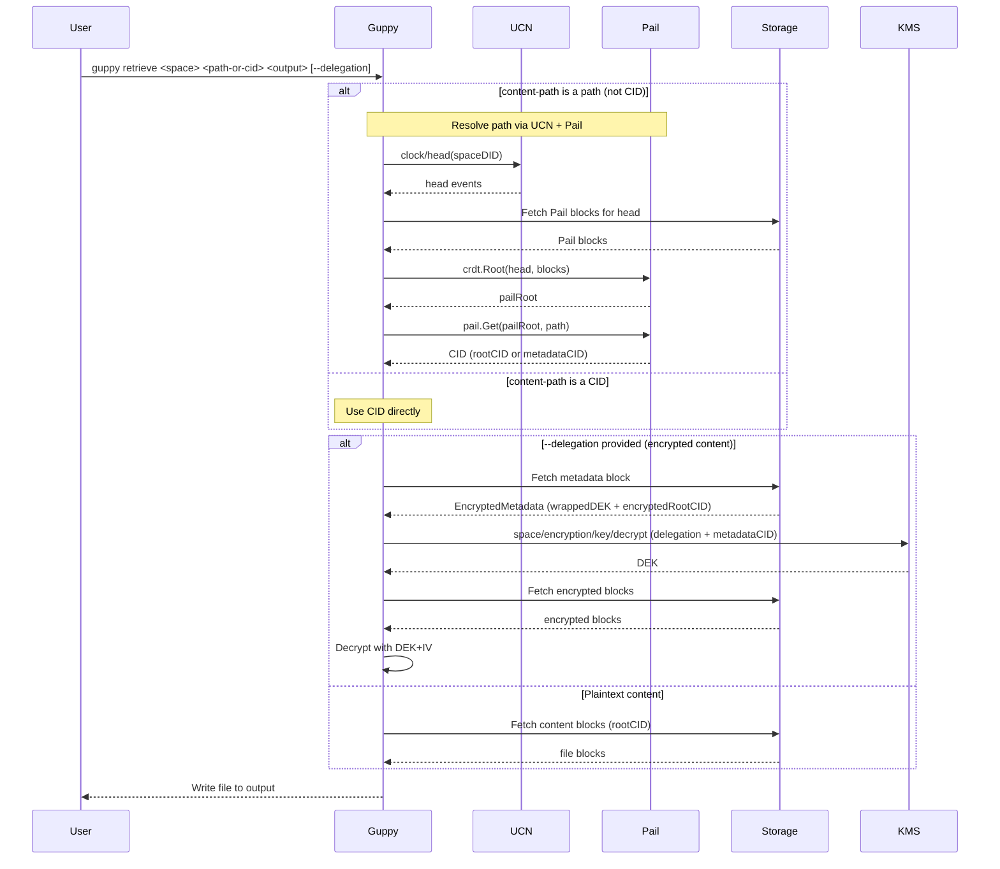

# RFC: Mutability for Forge (Guppy/Piri)

**Status: Draft - Pending Alignment**

## Authors

- [Felipe Forbeck](https://github.com/fforbeck), [Storacha Network](https://storacha.network/)

## Editors
- [Alan Shaw](https://github.com/alanshaw), [Storacha Network](https://storacha.network/)
- [Hannah Howard](https://github.com/hannahhoward), [Storacha Network](https://storacha.network/)
- [Alex Kinstler](https://github.com/prodalex), [Storacha Network](https://storacha.network/)


## Language

The key words "MUST", "MUST NOT", "REQUIRED", "SHALL", "SHALL NOT", "SHOULD", "SHOULD NOT", "RECOMMENDED", "MAY", and "OPTIONAL" in this document are to be interpreted as described in [RFC2119](https://datatracker.ietf.org/doc/html/rfc2119).

## Introduction

This RFC proposes the implementation of mutability features for Forge enterprise customers using the Guppy client. These features enable:

1. **Mutable References**: Stable pointers that update to the latest version of uploaded content
2. **Content Catalog**: Track uploaded content (path to CID mappings) across clients

**Related:** [forge-encryption.md](./forge-encryption.md) - Encryption key rotation depends on mutability to track metadata CID changes.

## Motivation

Enterprise Forge customers need:

- **Mutable references**: Backup workflows need stable names that update to point to the latest backup version
- **Cross-client sync**: Multiple Guppy instances should be able to resolve the same reference
- **On-network state**: Track what has been uploaded without relying on local-only databases

## Out of Scope

- **All-file-paths indexing**: Storing every individual file path in Pail (e.g., `/backups/mydir/file1.txt`, `/backups/mydir/subdir/file2.txt`). This RFC only tracks the source root path to root CID mapping. Internal file structure remains in UnixFS.

## Approach: UCN + Pail

Forge will use **UCN** + **Pail** for mutable content tracking:

- **UCN**: Lightweight wrapper around `clock/head` and `clock/advance` for publishing/resolving names
- **Pail**: Sharded Merkle trie for `path -> CID` mappings (scales to millions of files)
- **Clock service**: Already exists at `clock.web3.storage`

### Why Pail?

Forge directories can contain thousands to millions of files. Pail's sharded structure means only changed shards are uploaded when a file is added or updated.

**Note:** Guppy continues to upload content as UnixFS (for traditional retrieval patterns). Pail stores the mapping from source path to the UnixFS root CID, enabling path-based lookups without changing the upload format.

### Architecture



### What to Build

| Component | Status |
|-----------|--------|
| UCN wrapper (`clock/head`, `clock/advance`) | Needs Go impl (~few hundred lines) |
| Pail integration | Library exists: `github.com/storacha/go-pail` |
| Guppy changes | Extend existing `upload source add`, `upload`, `retrieve` commands |

## CLI Command Reference

Mutability and encryption are integrated into existing Guppy commands with minimal changes. This approach leverages the existing `upload source add` → `upload` → `retrieve` flow.

**Reference:** [w3cli-plugin-bucket](https://github.com/alanshaw/w3cli-plugin-bucket) - Alan's CLI extension that inspired this design.

### `guppy upload source add` (Extended)

Register a source and initialize a Pail bucket. The `--name` flag becomes the bucket name in Pail.

```
guppy upload source add <space> <path> [--name <alias>] [--encrypt] [--local-key <path>]
```

**Arguments:**
| Argument | Description |
|----------|-------------|
| `<space>` | Space DID (e.g., `did:key:z6Mk...`) |
| `<path>` | Local filesystem folder to track |

**Flags:**
| Flag | Description |
|------|-------------|
| `--name <alias>` | Bucket name in Pail (defaults to folder basename) |
| `--encrypt` | Enable encryption using KMS (requires KMS config in `config.yaml`) |
| `--local-key <path>` | Enable encryption using a standalone key file (dev/testing, no access control) |

**Example:**
```bash
# Register source with mutability (plaintext)
guppy upload source add did:key:z6MkExample /Users/alice/my-backups --name backups

# Register source with mutability + encryption (KMS)
guppy upload source add did:key:z6MkExample /Users/alice/secrets --name secrets --encrypt

# Register source with mutability + encryption (local key, dev/testing)
guppy upload source add did:key:z6MkExample /Users/alice/test-data --name dev-secrets --local-key ./dev-key.bin
```

**Behavior:**
1. Register source locally (existing behavior)
2. Initialize Pail bucket using `--name` (or folder basename)
3. If `--encrypt`: read KMS config from `~/.storacha/guppy/config.yaml` and call `space/encryption/setup` to get/create KEK (see [forge-encryption.md](./forge-encryption.md#key-management))
4. If `--local-key`: use the provided key file directly (no KMS, no access control - see [guppy#376](https://github.com/storacha/guppy/pull/376))
5. Store source settings locally (including encryption mode)

### `guppy upload` (Extended)

Upload sources and store path→CID mappings in Pail.

```
guppy upload <space> [source-path-or-name...]
```

**Existing behavior preserved.** After upload completes, adds:

**Post-upload behavior (per source):**

*Plaintext source:*
1. After `ExecuteUpload()` returns `rootCID`
2. Store `<name>` → `rootCID` in Pail
3. Publish updated Pail head via UCN (`clock/advance`)

*Encrypted source:*
1. During upload: generate DEK, encrypt blocks, wrap DEK with KEK
2. Create encrypted metadata block → `metadataCID`
3. Store `<name>` → `metadataCID` in Pail
4. Publish updated Pail head via UCN (`clock/advance`)

### `guppy retrieve` (Extended)

Retrieve content by CID or by path (via Pail resolution).

```
guppy retrieve <space> <content-path> <output-path> [--delegation <file>]
```

**Arguments:**
| Argument | Description |
|----------|-------------|
| `<space>` | Space DID |
| `<content-path>` | CID or path (e.g., `backups` or `bafyRootCID`) |
| `<output-path>` | Local filesystem path to write output |

**Flags:**
| Flag | Description |
|------|-------------|
| `--delegation <file>` | Path to delegation file authorizing decryption (required for encrypted content) |

**Example:**
```bash
# Retrieve by CID (existing behavior)
guppy retrieve did:key:z6MkExample bafyRootCID ./output

# Retrieve by path (new - resolves via Pail)
guppy retrieve did:key:z6MkExample backups ./restored-backups

# Retrieve and decrypt encrypted content
guppy retrieve did:key:z6MkExample secrets ./decrypted-secrets --delegation ./my-delegation.ucan
```

**Behavior:**

*If `<content-path>` is a CID:*
1. Existing behavior (fetch by CID)

*If `<content-path>` is a path:*
1. Resolve via UCN + Pail → get CID (rootCID or metadataCID)
2. If `--delegation` provided (encrypted content):
   - Fetch encrypted metadata block
   - Send delegation + metadataCID to KMS (`space/encryption/key/decrypt`)
   - KMS validates delegation, unwraps DEK
   - Fetch encrypted blocks, decrypt with DEK+IV
3. Else (plaintext):
   - Fetch content blocks directly
4. Write to `<output-path>`

### `guppy upload source ls` (New)

List sources and their current CIDs from Pail.

```
guppy upload source ls <space>
```

**Example:**
```bash
guppy upload source ls did:key:z6MkExample
```

**Output:**
```
NAME                    CID                                          ENCRYPTED
backups                 bafyRoot1...                                 no
secrets                 bafyMeta2...                                 yes
```

## Multi-Writer Behavior

When multiple Guppy clients write to the same space concurrently:

- **Source-level granularity**: Pail tracks `sourcePath -> CID` mappings. Concurrent updates to *different* source paths merge cleanly via CRDT.
- **Same source path**: If two clients update the same source path simultaneously, **last-writer-wins** applies to the CID value. The directory structure within each UnixFS root is not merged.

This is acceptable for Forge's backup use case where each client typically owns distinct source paths.

## Integration with Guppy Flows

### Current Guppy Upload Pipeline

Guppy's `ExecuteUpload` runs a pipeline of workers:

1. **Scan Worker** - Walks filesystem, creates FSEntry records
2. **DAG Scan Worker** - Creates DAG nodes from files, sets rootCID
3. **Sharding Worker** - Packs nodes into CAR shards
4. **Indexing Worker** - Creates indexes for shards
5. **Shard Upload Worker** - Uploads shards via `space/blob/add`
6. **Index Upload Worker** - Uploads indexes via `space/blob/add`
7. **Post-Process Workers** - Finalizes shards/indexes, calls `upload/add`

Returns: `rootCID` (the content root)

### Upload Flow (with Mutability + Optional Encryption)



### Retrieve Flow (with Path Resolution + Optional Decryption)



## References

- [Mutability & Privacy in Storacha — Strategy Document](https://www.notion.so/storacha/Mutability-Privacy-in-Storacha-Strategy-Document-3125305b5524807fb4a1ce6a3c9201e8) (internal)
- [Storacha UCN Package](https://github.com/storacha/upload-service/tree/main/packages/ucn)
- [Storacha Pail Package](https://github.com/storacha/pail)
- [UCAN Specification](https://github.com/ucan-wg/spec)
- [w3cli-plugin-bucket](https://github.com/alanshaw/w3cli-plugin-bucket/blob/main/index.js)