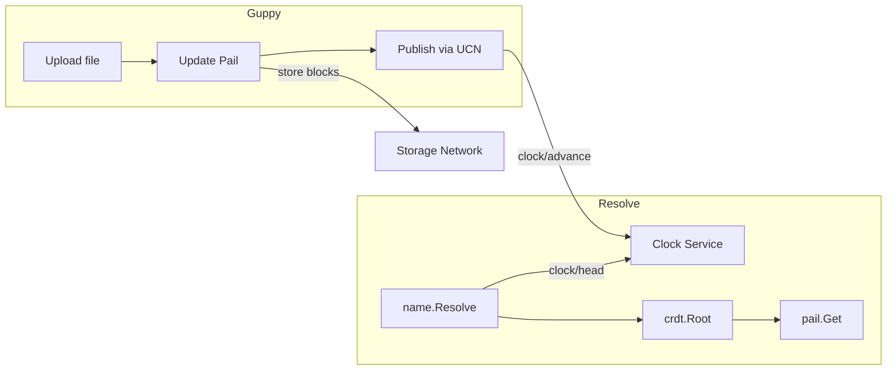
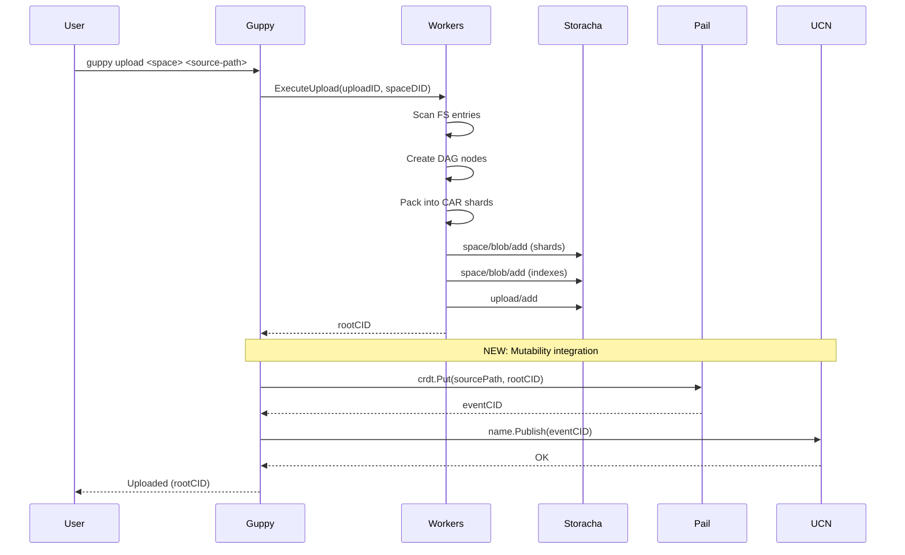
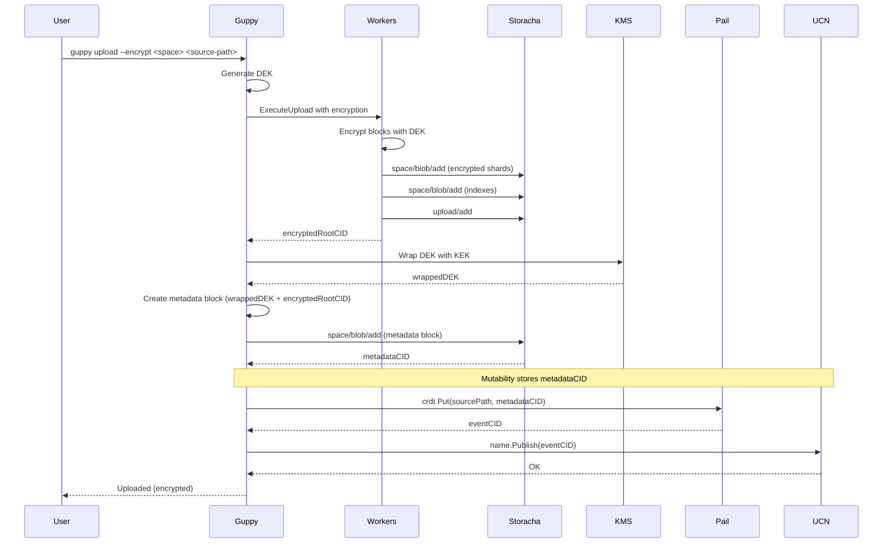
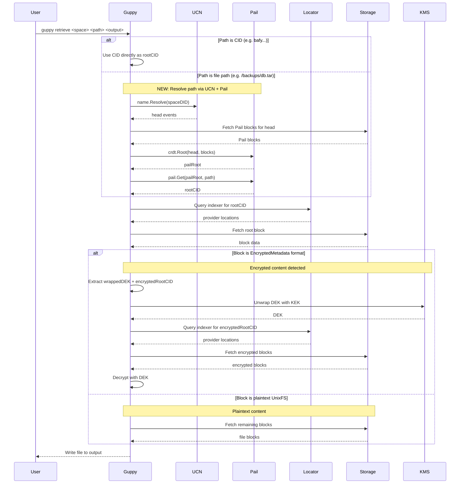

# RFC: Mutability for Forge (Guppy/Piri)

**Status: Draft - Pending Alignment**

## Authors

- [Felipe Forbeck](https://github.com/fforbeck), [Storacha Network](https://storacha.network/)

## Editors
- [Alan Shaw](https://github.com/alanshaw), [Storacha Network](https://storacha.network/)
- [Hannah Howard](https://github.com/hannahhoward), [Storacha Network](https://storacha.network/)
- [Alex Kinstler](https://github.com/prodalex), [Storacha Network](https://storacha.network/)

## Language

The key words "MUST", "MUST NOT", "REQUIRED", "SHALL", "SHALL NOT", "SHOULD", "SHOULD NOT", "RECOMMENDED", "MAY", and "OPTIONAL" in this document are to be interpreted as described in [RFC2119](https://datatracker.ietf.org/doc/html/rfc2119).

## Introduction

This RFC proposes the implementation of mutability features for Forge enterprise customers using the Guppy client. These features enable:

1. **Mutable References**: Stable pointers that update to the latest version of uploaded content
2. **Content Catalog**: Track uploaded content (path to CID mappings) across clients

**Related:** [forge-encryption.md](./forge-encryption.md) - Encryption key rotation depends on mutability to track metadata CID changes.

## Motivation

Enterprise Forge customers need:

- **Mutable references**: Backup workflows need stable names that update to point to the latest backup version
- **Cross-client sync**: Multiple Guppy instances should be able to resolve the same reference
- **On-network state**: Track what has been uploaded without relying on local-only databases

## Out of Scope

- **All-file-paths indexing**: Storing every individual file path in Pail (e.g., `/backups/mydir/file1.txt`, `/backups/mydir/subdir/file2.txt`). This RFC only tracks the source root path to root CID mapping. Internal file structure remains in UnixFS.

## Approach: UCN + Pail

Forge will use **UCN** + **Pail** for mutable content tracking:

- **UCN**: Lightweight wrapper around `clock/head` and `clock/advance` for publishing/resolving names
- **Pail**: Sharded Merkle trie for `path -> CID` mappings (scales to millions of files)
- **Clock service**: Already exists at `clock.web3.storage`

### Why Pail?

Forge directories can contain thousands to millions of files. Pail's sharded structure means only changed shards are uploaded when a file is added or updated.

**Note:** Guppy continues to upload content as UnixFS (for traditional retrieval patterns). Pail stores the mapping from source path to the UnixFS root CID, enabling path-based lookups without changing the upload format.

### Architecture

### What to Build

| Component | Status |
|-----------|--------|
| UCN wrapper (`clock/head`, `clock/advance`) | Needs Go impl (~few hundred lines) |
| Pail integration | Library exists: `github.com/storacha/go-pail` |
| Guppy commands | Update `upload`, `ls`, `retrieve` |

## Integration with Guppy Flows

### Current Guppy Upload Pipeline

Guppy's `ExecuteUpload` runs a pipeline of workers:

1. **Scan Worker** - Walks filesystem, creates FSEntry records
2. **DAG Scan Worker** - Creates DAG nodes from files, sets rootCID
3. **Sharding Worker** - Packs nodes into CAR shards
4. **Indexing Worker** - Creates indexes for shards
5. **Shard Upload Worker** - Uploads shards via `space/blob/add`
6. **Index Upload Worker** - Uploads indexes via `space/blob/add`
7. **Post-Process Workers** - Finalizes shards/indexes, calls `upload/add`

Returns: `rootCID` (the content root)

### Upload with Mutability (Proposed)

### Encrypted Upload with Mutability (Proposed)

### Retrieve with Mutability - Unified Flow (Proposed)

## References

- [Mutability & Privacy in Storacha — Strategy Document](https://www.notion.so/storacha/Mutability-Privacy-in-Storacha-Strategy-Document-3125305b5524807fb4a1ce6a3c9201e8) (internal)
- [Storacha UCN Package](https://github.com/storacha/upload-service/tree/main/packages/ucn)
- [Storacha Pail Package](https://github.com/storacha/pail)
- [UCAN Specification](https://github.com/ucan-wg/spec)
