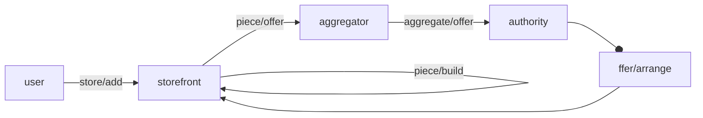
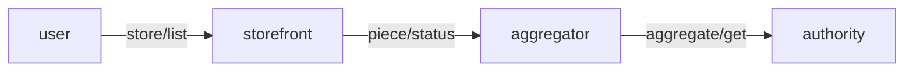

# Group by provider / sign by tenant

by: @vasco-santos

 https://filecoinproject.slack.com/archives/C02BZPRS9HP/p1689950046118329?thread_ts=1689873032.504899&cid=C02BZPRS9HP

building a bit on top of this, and thinking about the flow of producers send us pieces, looks like this would fit as part of the w3-aggregation spec as a UCAN capability.
I think later on (after migration) it can be done as an effect of `store/add` together with `piece/build` (or similar).
So here, I was thinking about having a `piece/offer` invocation where w3up after building the piece CID, as well as CF hosted APIs would invoke `piece/offer` that wouldbe handled by w3filecoin either responding queued or done if actually we already have it in an aggregate.
What I still fail to capture is how would we tie this with a provider to set message group id. Probably this needs to be a `nb` field? I guess on older CF hosted APIs, it would just be hardcoded with the free provider for each product.
w3up could be more intelligent and check which space `store/add` used for that CAR cid and then get registered provider for the space.
Therefore, thinking about

```json
{
  "iss": "did:web:web3.storage",
  "aud": "did:web:web3.storage",
  "att": [{
    "with": "did:web:web3.storage",
    "can": "piece/offer",
    "nb": {
      // Piece CID
      "piece": { "/": "commitment...proof" },
      // Car CID
      "link": { "/": "bag..." },
      "provider": "did:web:free.web3.storage"
    }
  }],
  "prf": [],
  "sig": "..."
}
```

or perhaps we want to clearly create a w3filecoin key pair, and all the aggregation spec should not be as storefront, but as the aggregator (as we actually already talked)

so w3filecoin would be aggregator, w3s/nft would be storefront, and:






