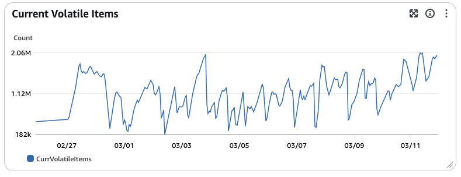
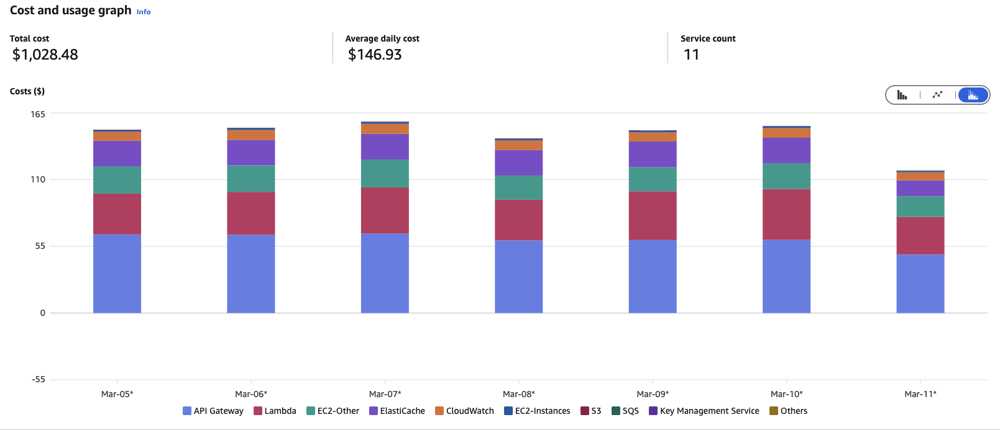

# Indexer Deployment Next Steps

## Author

[hannahhoward]

## Goals

Propose a short and long term mechanism for getting the Storacha indexer to 100% on production

## Current status

1. The indexer was at 50% of production traffic until 3/11/2025, when it was reduced to 10% traffic
1. The indexer is currently underperforming the content claims service on TTFB
1. Production indexer costs are currently about $1000/wk
1. At 50% concurrent usage of the indexer lambdas actually caused several outages of services as we hit our overall unreserved concurrency limits for us-west-2 (this is why we reduced back to 10%)
1. About two weeks ago ipfs.io began to use our http gateway to serve traffic. This has approximately DOUBLED the number of requests to w3s.link gateways and downstream services

## Performance Analysis

Currently, the indexer is underperforming the content claims service. We can attribute this gap to two performance issues:

1. The primary reason the indexing service underperforms is that the content claims service is fronted with a cloudfront cache.

For most existing uploads, which were done with the store protocol, retrieval is done block by block with lookups to the content claims or indexer service on each block. In this context, results are usually cached on cloudfront for content claims. This leads to RTTs in the neighborhood of 20-40ms.

Comparitively, the indexer's RTTs from Europe can go >1s.

2. Seperately, the indexer is struggling to achieve good cache hit rates for the providers cache. This cache, set to about 10GB in size initially, can hold about 2 million records. So far, what we have seen is this cache fills almost immediately, and eviction policies leave us with a hit rate around 10%. We tried increasing cache size to 20GB and while this appeared to cause a slight improvement it was minimal.

Why cache eviction behaves how it does remains somewhat unclear. Total volitile keys in the cache appears to swing wildly... 

Meanwhile, parameters for valkey are clearly set to use the expiration policy `volitile-lru`. Redis's [LRU algorithm](https://redis.io/docs/latest/develop/reference/eviction/) is an approximation and possibly poorly suited for our access pattern (not a power law distribution) especially since the `maxmemory-samples` is set to a low value of 3 on valkey serverless caches as well.

Regardless due to the low cache hit rate on the providers cache, the indexer's total time to process p50 is around 300ms, which doesn't include RTT with the cloudflare worker.

Of note, we don't cache anything for not found responses, so it's possible we're also paying a price for 404's, which constitute the majority of head responses.

Ultimately the penalty for slow performance is dwarfed by the RTT latency penalty of not having Cloudfront

## Cost Analysis

The indexer is costing about $1000 per week to run. Much of this cost is due to requests going through an API Gateway service, with secondary costs to run the lambda itself, compute associated with Elasticcache, and memory associated with Elasticache.

# Meta-issue: Low Cache Hit Rate on w3s.link

Cache hit rates appear to be very low for many URLs on w3s.link -- our cache behavior is all over the place, but ultimately it looks like 80-90% of requests are sent through

# Meta-issue: Triple request rates from ipfs.io, all RAW format

It appears ipfs.io's initial HTTP retrieval strategy is to just send RAW single block requests to our gateway (no CAR requests). This has nearly tripled our traffic. Also, our sharded DAG indexes flow is poorly suited to this access pattern.

# Recommended next steps

# Short Term: Put the indexer behind Cloudfront

It seems like an easy short term fix is to just put the indexer behind cloudfront. It's not clear costs would be much higher than API gateway, especially if we tied the labmda to a function URL.

It would be worth testing this at 10% just to see how it behaves.

# more tbd...

