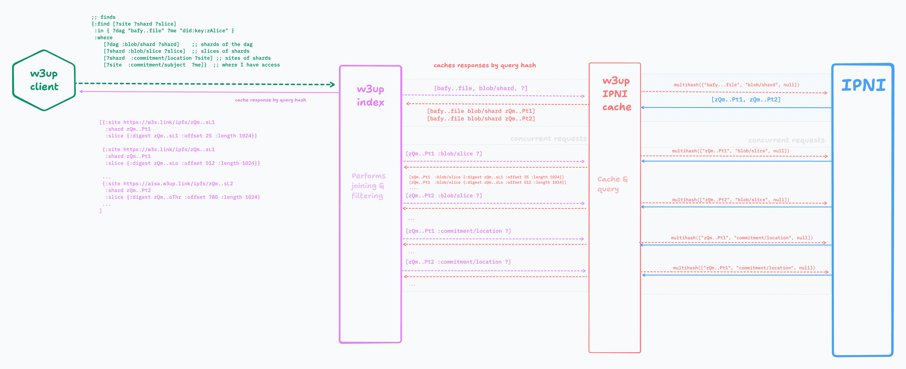
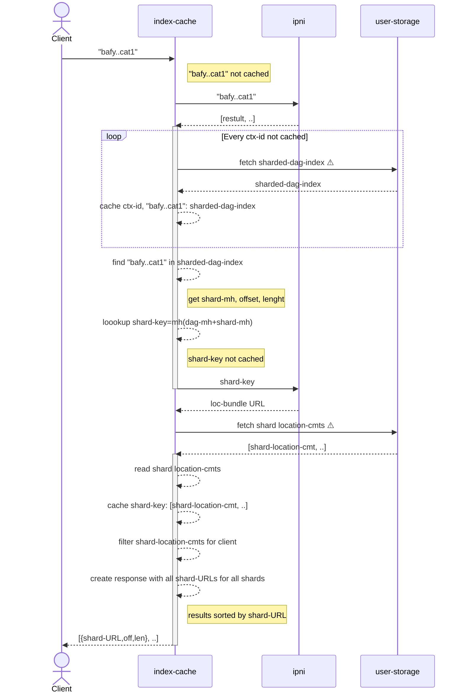
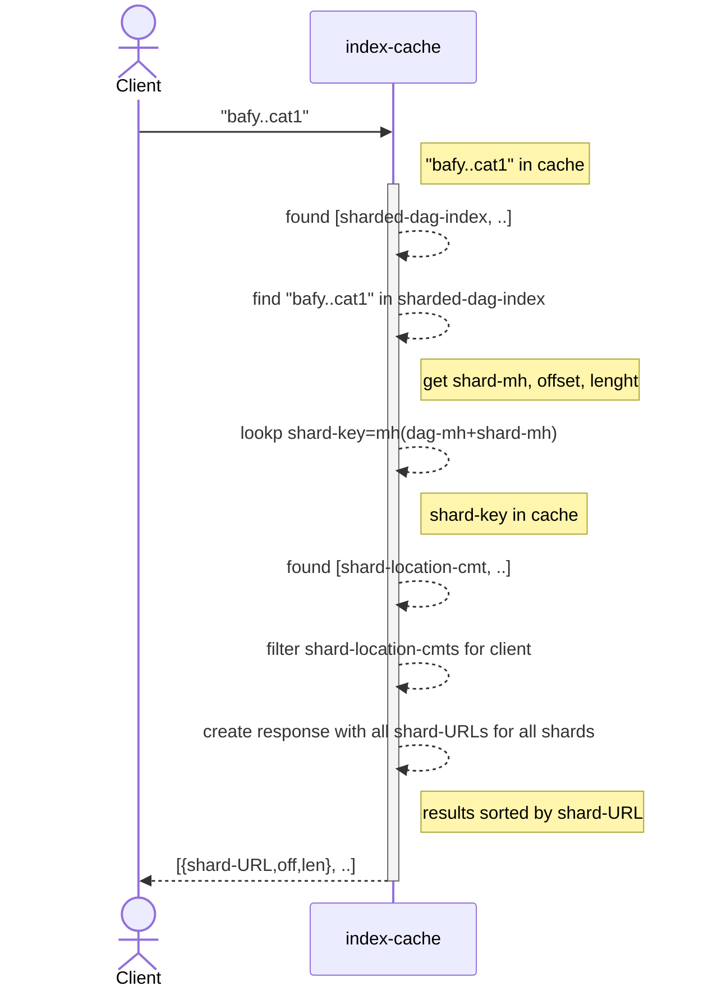
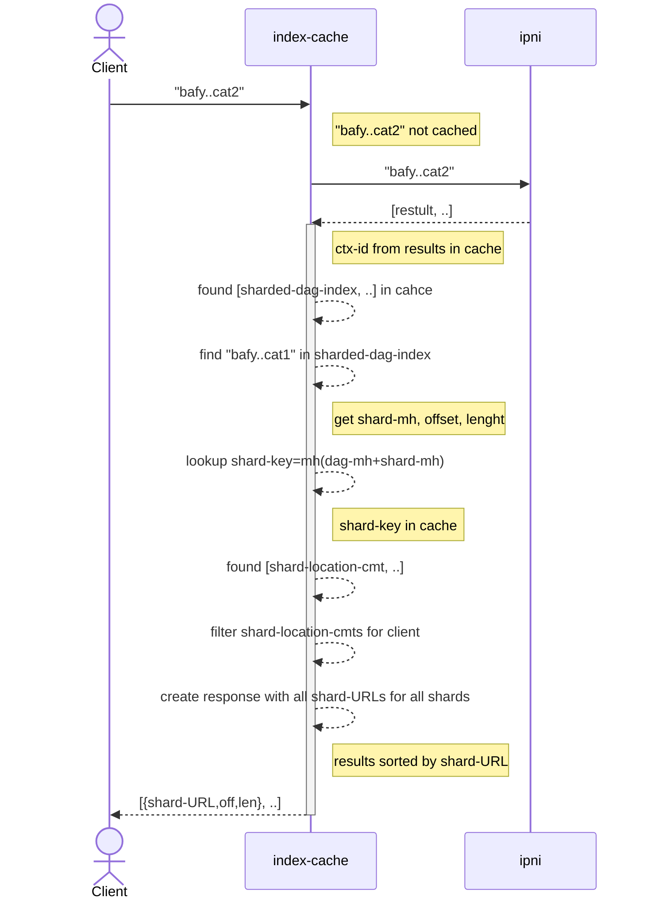

# W3 Indexing Design
> Replaces [W3 IPNI Indexing RFC](https://github.com/w3s-project/RFC/blob/main/rfc/ipni-w3c.md)

## Authors

- [gammazero]
- [gozala]

## Goals

A user can use a multihash, that identifies data stored on w3s, to lookup all the information necessary to retrieve and delegate access to that data.

Location commitments that describe where content is stored can change over time as w3s moves data to a more favorable location, re-aggregates data storage, or replicates stored data. Location commitments are updated without having to index all multihashes.

A REST API will allow a user to request indexed content from a w3up index-cache, and how to filter results. The index-cache retrieves previously cached responses or composes new IPNI queries to get new responses to filter and cache.

## Overview

A user stores content in shards of opaque blobs. They are typically a series of blocks addressed by multihashes in CAR file format (although they could use different format in the future) and are stored at a location designated for a particular user's data.

The agent uploading user content builds an IPLD DAG and encodes it into one or more CAR files (blobs). It also derives a ([sharded-dag-index](https://github.com/w3s-project/specs/blob/main/w3-index.md#sharded-dag-index-example)) that describe the blobs in terms of (multihash, offset, length) tuples for all the blocks. This enables the user to make choices about which blocks should be make discoverable and retrievable over the network. For example, they may want only the DAG root to be indexed.

The sharded-dag-index is stored in the user's space along with the CAR file(s) containing the blob data. This is done in the [w3 add-blob operation](https://github.com/w3s-project/specs/blob/main/w3-blob.md#add-blob). The w3s service creates [location commitments](https://github.com/w3s-project/specs/blob/main/w3-blob.md#location-commitment) for the blob shards and for the sharded-dag-index. 

After the add-blob process completes, and the user receives an [accept-blob receipt](https://github.com/w3s-project/specs/blob/main/w3-blob.md#accept-blob-receipt), the user may then choose to make their data publicly queryable by publishing it to W3UP's indexing system.  The user optionally invokes an [index-add](https://github.com/w3s-project/specs/blob/main/w3-index.md#index-add) capability to publish the sharded-dag-index multihashes into W3UP's indexing system and eventually to [IPNI](https://github.com/ipni/specs/blob/main/IPNI.md) so that they can be used to look up location commitments and retrieve sharded-dag-index information and blob data. See [W3 Index](https://github.com/w3s-project/specs/blob/main/w3-index.md#w3-index) for more.

After publishing an index, any user looking for content can query for the sharded-dag-index of that content. The user can read the sharded-dag-index to determine what data shard needs to be retrieved, and then ask for the location of that shard.

Finally the user uses the shard location, with range information from the sharded-dag-index, to retrieve a specific piece of data from the network.

## Index Query

A client can query indexed information by looking up multihashes that are specified in the sharded dag index. These include the dag root, dag shards, and slices (blocks) within shards. Results can be filtered to only allow results for a specific audiance.

### Query Data structure passed to index-cache REST API

```
results = Query(
    multihash=["bafy...", ..],
    match = {
        subject=[myID, myAlternateID],
    })
```

### Previous Query Operation Diagram



Note: This is for reference and is not current with this document.

## Operational Description

### First time query is made


 
1. Client queries index-cache with "bafy..cat1". (cache miss)
2. index-cache asks ipni for "bafy..cat1", ipni returns multiple results
    - index-cache filters results, only getting w3up sharded-dag-index results
    - each result contains the base URL and CID of a sharded-dag-index. These combine to make a sharded-dag-index download URL.
3. index-cache gets a sharded-dag-index URL from each result and fetches each sharded-dag-index. All sharded-dag-indexes are cached in the dag index cache with the result's context-ID as the key, `context-ID: [sharded-dag-index, ...]`
    - sharded-dag-index is cached under the context-ID, so that if results for a different shard multihash are returned, and have the same context-ID, then the sharded-dag-index can be read from cache.
4. index-cache reads each sharded-dag-index to find "bafy..cat1"
    - "bafy..cat1" may be a shard or a slice
    - index-cache reads offset and length for "bafy..cat1" slice or shard
    - index-cache reads dag-multihash
5. index-cache makes a shard-key with mh(dag-multihash + shard-multihash) and looks for cached shard location commitments. (cache miss)
    - The mh(dag-multihash + shard-multihash) key is used since the shard-multihash key alone would return the sharded-dag-index results.
    - This is done for each sharded-dag-index
6. index-cache queries ipni with shard-key to get URL to fetch location commitments
7. ipni responds with location commitments URL
8. index-cache fetches, from user space, location commitments for shard with URL/shard-key and reads the shard URL(s) from it.
    - All location commitments, for all shards in dag, are available at the URL returned by ipni. To get the commitments for a specific shard, request URL/shard-key.
    - A single shard may have multiple locations if data is replicated.
    - If location commitments are small enough these can be packed into the ipni metadata so that a separate fetch is not necessary.
9. index-cache caches mh(dag-multihash + shard-multihash) -> [shard-URL, ...]
10. index caches "bafy..cat1" -> { shard URL, offset, length }
11. index-cache returns { shard URL, offset, length } to client.

### Next time the same query is made for same shard _same_ slice



### Next time the same query is made for same shard _different slice_



### Note:

Consider:
- sharded-dag-index-1 has a shard, but no slices in that shard. The shard is at location URL-1.
- sharded-dag-index-2 has the same shard with slices. That shard is at location URL-2 and the slice is at offset 55, lenght 1024

When trying to read the slice, which is found in sharded-dag-index-2, it is ok to tell the client that the slice can be read either from shard-1 or from shard-2 at offset 55, length 1024?  This works because both shards have the same multihash and therefore the same data. 

## W3up Index-cache

The index-cache layer is responsible for reading a query from a client, and then
1. Creating a set of IPNI queries needed to get locations of sharded-dag-index and location commitments.
2. Filtering returned results
3. Fetching sharded-dag-index and location commitments from used space.
4. Caching data fetched from user space
5. Reading shard and slice data from sharded-dag-index
6. Packaging results for the query client.

The index-cache is intended for deployment on w3up gateways.

### Index-cache behavior

The w3up IPNI Cache is a cache that holds IPNI query results and sharded-dag-index data. The cache is:

- Limited-size LRU. Discards the least recently used data when at storage capacity.
- Negative (empty) result-aware. Caching empty results prevents more expensive IPNI queries for data that is not indexed. Negative cache entries are kept in a separate cache so that negative entries cannot evict positive entries due to LRU. The negative cache is significantly smaller that the rest of the cache.
- Invalidated on write: When new or updated data is published to IPNI, corresponding cache data is invalidated, so the latest can be fetched from source.

Similar to negative cache entries, cached sharded-dag-indexes are kept in a separate LRU cache because their size will cause them to be evicted more frequently than IPNI results. A second level of sharded-dag-index cache can maintina sharded-dag-index files on disk instead of in storage.

This is a read-through cache that loads data into the cache automatically upon cache miss. The querying application does not need to handle cache misses. On a miss, the cache forwards the query on to IPNI(s), and caches the results. This includes caching an empty response.

There are two types of queries sent to the cache. Each takes a data multihash, but returns a different result:
1. shard/slice query. Ask for a shard or a slice in a shard and get the location of the shard and position of data in it. This lets clients perform range requests to get the specific data they need.
  - key: shard-multihash or slice-multihash
  - result: shard URL(s), data offset and length
2. location query. Returns: location commitment of each shard. 

By using both these query results, a specific portion of the blob data can be retrieved. The shard(s) are read from the locations in the location commitments, and data ranges within each shard are requested (when not reading an entire shard) by range requests using the offsets and lengths from the shard/slice data.

If either shard or location results are not cached, then a query for the multihash is passed to the IPNI client.

## IPNI

IPNI is the final, "cache-miss" layer of the W3up Indexing System. IPNI is a highly optimized system for caching indexing information for massive numbers of CIDs. It's available to all and optimized to run on bare metal hardware. IPNI is used to do the following:
1. Provide a reliable global index for all w3up content, that is not only publicly available but usable by an IPFS retrieval client, without the other components of the w3up indexing system
2. Provide a low cost way to index content on w3up that is infrequently requested
#### Get w3up results

IPNI maps a multihash to location and metadata information. When queried with a multihash, IPNI will respond with all known locations/metadatas of that multihash. The w3up IPNI query client must filter these results to only select results that are under the control of w3up.

Example IPNI query and response:
```bash
curl https://cid.contact/cid/bafybeicawc3qwtlecld6lmtvsndimoz3446xyaprgsxvhd3aapwa2twnc4 -sS | jq
```
```json
{
  "MultihashResults": [
    {
      "Multihash": "EiBAsLcLTWQSx+WydZNGhjs75z18AfE0r1OPYAPsDU7NFw==",
      "ProviderResults": [
        {
          "ContextID": "YmFndXFlZXJheTJ2ZWJsZGNhY2JjM3Z0em94bXBvM2NiYmFsNzV3d3R0aHRyamhuaDdvN2o2c2J0d2xmcQ==",
          "Metadata": "gBI=",
          "Provider": {
            "ID": "QmQzqxhK82kAmKvARFZSkUVS6fo9sySaiogAnx5EnZ6ZmC",
            "Addrs": [
              "/dns4/elastic.dag.house/tcp/443/wss"
            ]
          }
        },
        {
          "ContextID": "YmFndXFlZXJheTJ2ZWJsZGNhY2JjM3Z0em94bXBvM2NiYmFsNzV3d3R0aHRyamhuaDdvN2o2c2J0d2xmcQ==",
          "Metadata": "oBIA",
          "Provider": {
            "ID": "QmUA9D3H7HeCYsirB3KmPSvZh3dNXMZas6Lwgr4fv1HTTp",
            "Addrs": [
              "/dns4/dag.w3s.link/tcp/443/https"
            ]
          }
        }
]}]}
```

### Get sharded-dag-index

After selecting only w3up results, these must then be processed to generate responses for shard/slice and location query attributes. To do this, first the sharded-dag-index result is read from the IPNI result metadata. This gets the CID of the sharded-dag-index and the location portion of the result gives the base URL to retrieve the sharded-dag-index from.

The sharded-dag-index is retrieved and read. The sharded-dag-index data is searched to find the multihash, and to get the shard and slice (if the multihash is a slice within a shard).

### Get locations of shards

After getting the shard and slice data, then location commitment data needs to be collected.

If the multihash is that of a whole shard, then the location commitment results are already in the IPNI results. If the multihash is a slice, then another IPNI query needs to be made to retrieve the location(s) of the shard, using the parent shard CID from the sharded-dag-index.

The location commitments are read from IPNI metadata and are returned to the cache.

## IPNI Advertisement
Information is provided to IPNI in the form of [IPNI Advertisements](https://github.com/ipni/specs/blob/main/IPNI.md#advertisements) that are signed by w3s and published to IPNI by w3s. When a new advertisement is published, an [IPNI Announcement](https://github.com/ipni/specs/blob/main/IPNI.md#announcements) is sent to IPNI to trigger IPNI to fetch the new advertisement.

A separate advertisement chain is used for location commitments and sharded-dag-index data.

The reason for this is that location information is subject to change, but blob index data will not change over the lifetime of the stored data.

### Advertisement Structure

An IPNI Advertisement has the IPLD Schema:

```ipldsch
type Advertisement struct {
    PreviousID optional Link
    Provider String
    Addresses [String]
    Signature Bytes
    Entries Link
    ContextID Bytes
    Metadata Bytes
    IsRm Bool
    ExtendedProvider optional ExtendedProvider
}

type EntryChunk struct {
    Entries [Bytes]
    Next optional Link
}
```

### IPNI Advertisement for sharded-dag-index

Map all multihashes to sharded-dag-index CID/location
ContextID = hash(userKey + sharded-dag-index CID)

- `ProviderID` libp2p peer ID of w3s sharded-dag-index publisher.
- `Addresses` the most recent value of this is returned with lookups for any CID in any advertisement. It will contain the multiaddr form of the sharded-dag-index publisher URL. This is where the sharded-dag-index is retrieved from when presented with the sharded-dag-index CID.
- `Signature` Signature over all advertisement data. Created using private key matching `ProviderID`.
- `ContextID` byte encoded userKey + sharded-dag-index CID.
- `Entries` must be the CID of an `EntryChunk` for a subset (or all) of the multihashes in the sharded-dag-index.
- `Metadata` encodes the CID of the sharded-dag-index + version info is any.
- `IsRm` is used when removing all advertisement(s) that have that context ID and deleting all associated multihash indexes from IPNI.

The set of multihashes within one blob must be encoded as 1 Advertisement. If a blob is partitioned into multiple sub-blobs this still generates one advertisement as there is still one blob index.

Each advertisement encodes the multihashes into 1 or more EntryChunk blocks. EntryChunk blocks are an array of multihashes with a link to a next block, if there is another block. The EntryChunk serves a similar purpose as HTTP chunking. 

All multihashes must be sorted in ascending order before being split into chunks. This is done to have deterministic output when creating entry chinks - the same set of multihashes should generate the same set of entry chunks.

### IPNI Advertisement for location commitments

Map shard-key-multihash to location of content commitments of all shards
ContextID = hash(userKey + shard CID)

- `ProviderID` libp2p peer ID of w3s location publisher.
- `Addresses` multiaddr of location commitment URL. Only used if location commitment does not fit into metadata.
- `ContextID` byte encoded userKey + shard CID
- `Entries` must be the CID of an `EntryChunk` that contains shard CID.
- `Metadata` encodes the shard's location commitment for each shard (if it all fits)
- `IsRm` is used when removing the shard from storage

The reason that the shard ID is used to construct the context ID is because individual shards may change location, so only the index information for that shard needs to change.

NOTE: Consider putting the non URL portion of the location commitment into the `Addresses` field and the rest in the metadata.

## Blob Deletion

Removal advertisements are placed on both the sharded-dag-index chain and the location chain to delete the sharded-dag-index and shard(s) for the user.

To get the shard CID(s), then sharded-dag-index must first be read. This may be read from cache as it does not change. The shard CID are read from the sharded-dag-index.

## Dependable Reads

Dependable reads are required for ensuring that updates have completed. This means that following a write of index data, that that data can reliably be read.  This makes it necessary to have a synchronous write/update operation, after which reads will return the data that was written.

This synchronous write path can be something supported by IPNI. However, that would require a non-standard indexer feature or extension of the protocol. This feature would not be something that would be generally desirable for a global indexer, and may only be appropriate for a site-local indexer.

Another way to support a synchronous write path is to write to the IPNI cache on write, and guarantee that the data remained in the cache until it is indexed in IPNI. An advantage of this write path is that it does not rely on any non-standard behavior of IPNI. It is also more reliable since the critical happens on w3s infrastructure. This ensures that we control the time needed for a read to succeed.

### Cache on write

When an advertisement is created to publish new index data, the IPNI cache is populated with the data retrievable by index queries. An attribute is set on this data that prevents it from being evicted from the cache until it has been verified to be indexed. This ensures that after cache eviction, lookup of the now uncached data will succeed.

## Design questions

1. Can location commitments be directly retrieved from IPNI if small enough or do these always need to be retrieved from user space.
2. Can the index-cache be deployed in locations othern than w3s gateway, such as at a customer site?
3. How can the index-cache be better distributed? Should its contents be shared on IPFS?


## Summary from Discussions

1. The cache will translate both IPNI requests and claims bundle (i.e. sharded dag index) into a format optimized for fast querying of lots of data and supporting arbitrary relationships between multihashs. Likely some kind of EAV store
  a. There’ll be a ticket to design this data model, and maybe another to start protoyping.
2. The claims bundle / sharded dag index effectively captures 2 types of relationships:
  a. blob/shard (how is the blob broken up into multiple shards)
  b. blob/slice (what are the offsets of individual blocks or groups of blocks in the the shard)
  c. in the future, it’s possible there are other types of relationships we will want to store. we should be able to add additional relationships and potentially publish them to IPNI without redesigning the system
3. For IPNI:
  a. You can query by a shard multihash to get the location commitments for that shard. Each location commitment for each shard will have a contextID as they update independently.
  b. You can query by any multihash in DAG to get the address of the claims bundle for the DAG. These will all updated under a single context ID. Importantly, each relationship will have a separate metadata protocol. There are a number of ways to do this on a single context ID:
    i. Actually, rereading spec and https://github.com/ipni/go-libipni/blob/main/metadata/metadata.go, a single “Metadata” as specified by IPNI is MULTIPLE metadata protocols — so Andrew I believe this can be accomplished by just including multiple metadata protocols in the metadata for the main advertisement for the context ID. Metadata can also be updated in a future advertisement, so you could add future relations this way.
    ii. That said we could also use extended providers here and maybe it would be useful to do so. Mostly if different bundles start ending up at different publishers
    iii. Anyway, there’s going to a ticket for laser focus on the metadata and IPNI ad structures so we can figure it out then.
  c. Worth noting we still need to keep our existing advertisement chain going, cause this is what ipfs.io and other IPFS clients know how to use for now.
4. For the Index query:
  a. I’m ok with a query interface instead of a rest api for the long term. I get the rationale. I honestly think the first version should be a REST Api for the one query join we actually want. We can certainly build the query interface right away, but I would not build a generalized query parser and implementation. Instead I would just pattern match the queries against the specific joins we want to do for the moment and error on everything other than the thing we need. Again, for the moment.
  b. There’ll be a prototype ticket for this service.

Still need to figure out what that looks like: [metadata.go](https://github.com/ipni/go-libipni/blob/main/metadata/metadata.go)
