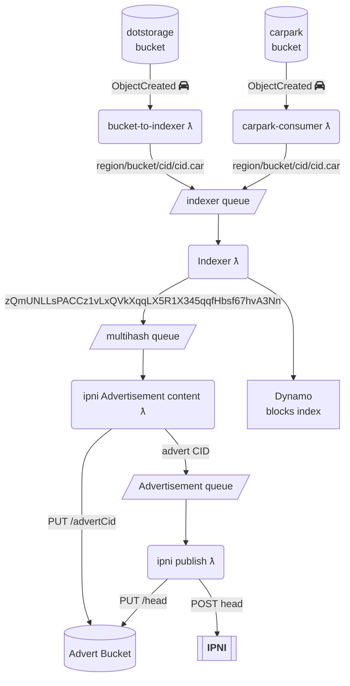
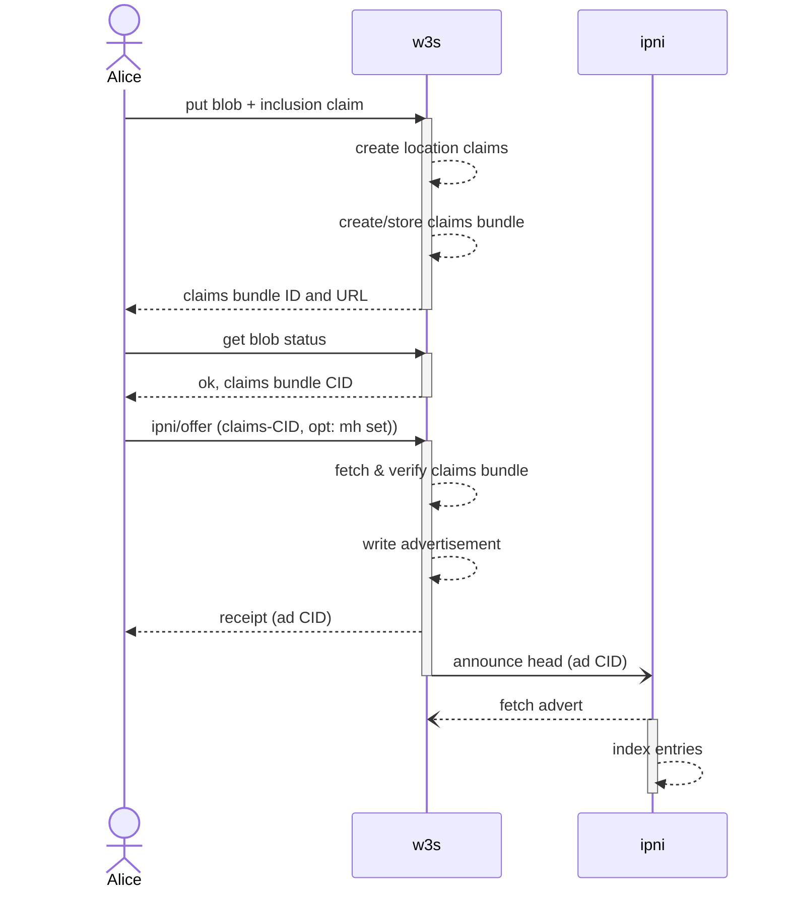
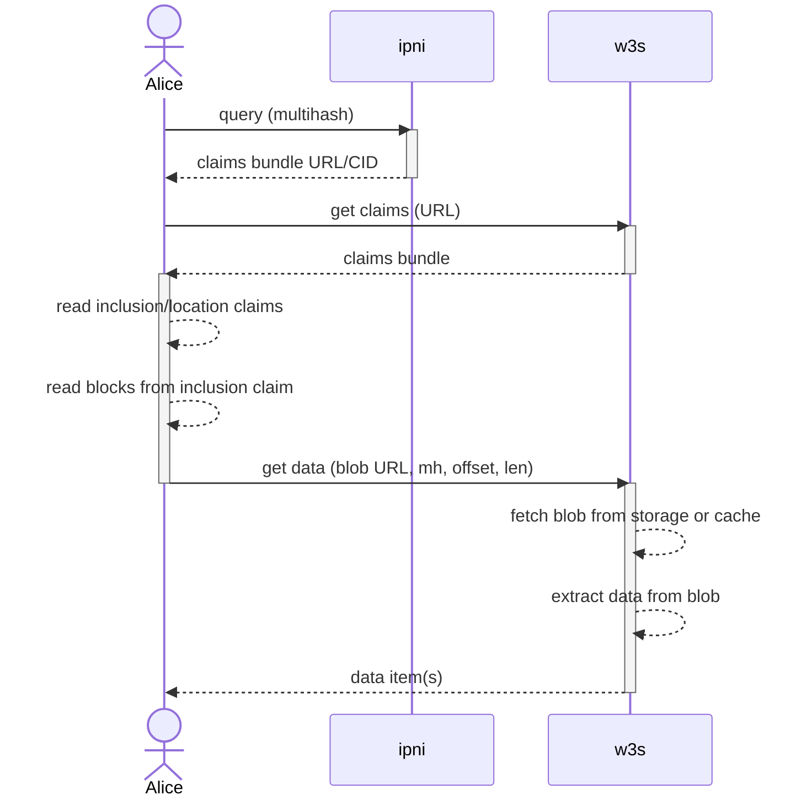

# W3 IPNI Indexing RFC

## Authors

- [gammazero]
- [gozala]
- [hannah]


## Goals

A user can use a multihash that identifies data stored on w3s to lookup the location where the data can be retrieved and content claims describing that data. w3s can update content claims if necessary without having to republish data multihashes.

This RFC describes how IPNI indexing can be used to lookup data locations and content claims for any piece of data, identified by a multihash, stored in w3c.

## Abstract

A user stores content as opaque blobs containing series of blocks addressed by multihashes. Currently, these blocks are collected into a CAR file for storage as one body of data. This will be generalized into a blob of data that does not require a CAR file.

The user creates an [inclusion claim] that contains the multihash of the data blob and an array of tuples of (multihash, offset, length) of any blocks within the blob that the user intends to make individually retrievable. This inclusion claim serves as an external index into the user's data blob that can be stored and retrieved separately from the user's data blob. The inclusion claim is also the user's assertion that their data blob contains the blocks represented by the set of multihashes in the inclusion claim.

After storing the data blob and the inclusion claim, w3s creates a [location claim](https://github.com/web3-storage/specs/blob/main/w3-blob.md#location-claim) for the blob and the inclusion claim (serialized to bytes). Each location claim maps blob's [multihash](https://github.com/multiformats/multihash) to a URL where the item can be read via HTTP [range request](https://developer.mozilla.org/en-US/docs/Web/HTTP/Range_requests)

w3s creates a Content Claims Bundle. This is a container that holds all content claims associated with some data. The location claims and inclusion claim are written to the claims bundle. The claims bundle is then stored in the user's storage space.

[IPNI](https://github.com/ipni/specs/blob/main/IPNI.md) will tell a client where/how to get the claims bundle when IPNI is queried using any of the multihashes from the inclusion claim. The client can fetch the claims bundle and read the location and inclusion claims from the bundle. The client then uses the information read from these claims to retrieve the desired pieces of data from the stored data blob.

Information is provided to IPNI in the form of [IPNI Advertisements](https://github.com/ipni/specs/blob/main/IPNI.md#advertisements) that are signed by w3s and published to IPNI by w3s. When a new advertisement is published, an [IPNI Announcement](https://github.com/ipni/specs/blob/main/IPNI.md#announcements) is sent to IPNI to trigger IPNI to fetch the new advertisement.

Each Advertisement is associated with a data blob, and allows IPNI to map all of the multihashes in the inclusion claim, including the multihash of the entire blob, to information needed to retrieve the claims bundle.

## Introduction

W3s publishes ad-hoc batches of multihashes to IPNI. This proposal aims to align our usage of IPNI with [content-claims], by publishing an advert per stored data blob. This is done so that any of the multihashes to chunks of data within the blob or the blob itself, can be used to look up the content claims bundle associated with the stored data, which in turn locates the data.

### Motivation

- Allow w3s to track where data is stored and what blocks it contains without the need for a centralized database
  - Content Claims Bundle has all information describing data
  - Not only located data, but delegated responsibility of asserting that data is at the specified location
  - Network becomes more distributed by eliminating central database
- Provide a way for a user to read a specific block stored within a blob, without needing to fetch the whole blob.
  - Enabled by inclusion claim with block index information
  - Lowers transfer delay and bandwidth cost where range-reads can be supported
  - Removed the need to search through data to find a specific piece.
- Align IPNI advertisement with data blob and content claims so that these multihashes can be queried to get a claims bundle containing all information needed for retrieving data from the blob.
  - Information looked up by multihashes can change by using contextID to update claims bundle ID
  - IPNI records can be deleted if the data is not longer available.
- Make IPNI data indexing optional and initiated by the user with an explicit UCAN invocation, rather than a side-effect of bucket events.
  - Removed the need to rely on S3 bucket events and lambdas
  - No need for buckets events allows write to anywhere.

### Quick IPNI primer

IPNI ingests and replicates billions of signed provider claims for where individual block CIDs can be retrieved from.

Users can query IPNI servers for any multihash, and it provides a set of provider addresses and transport info, along with a provider specific `ContextID` and optional metadata.

For example: <http://cid.contact> hosts an IPNI server that Protocol Labs maintains.

#### Query IPNI for a multihash taken from a CID
 
```bash
curl https://cid.contact/cid/bafybeicawc3qwtlecld6lmtvsndimoz3446xyaprgsxvhd3aapwa2twnc4 -sS | jq
```

```json
{
  "MultihashResults": [
    {
      "Multihash": "EiBAsLcLTWQSx+WydZNGhjs75z18AfE0r1OPYAPsDU7NFw==",
      "ProviderResults": [
        {
          "ContextID": "YmFndXFlZXJheTJ2ZWJsZGNhY2JjM3Z0em94bXBvM2NiYmFsNzV3d3R0aHRyamhuaDdvN2o2c2J0d2xmcQ==",
          "Metadata": "gBI=",
          "Provider": {
            "ID": "QmQzqxhK82kAmKvARFZSkUVS6fo9sySaiogAnx5EnZ6ZmC",
            "Addrs": [
              "/dns4/elastic.dag.house/tcp/443/wss"
            ]
          }
        },
        {
          "ContextID": "YmFndXFlZXJheTJ2ZWJsZGNhY2JjM3Z0em94bXBvM2NiYmFsNzV3d3R0aHRyamhuaDdvN2o2c2J0d2xmcQ==",
          "Metadata": "oBIA",
          "Provider": {
            "ID": "QmUA9D3H7HeCYsirB3KmPSvZh3dNXMZas6Lwgr4fv1HTTp",
            "Addrs": [
              "/dns4/dag.w3s.link/tcp/443/https"
            ]
          }
        }
]}]}
```

web3.storage will publish the blocks it can provide by encoding a batch of multihashes and information needed to retrieve tha data into an IPNI `Advertisement`. The advertisement is referred to by its CID.

An `Advertisement` includes `Provider` info which claims that the batch of multihashes are available via some protocol (e.g. bitswap or HTTP), and are signed by the provider's PeerID private key; Each advertisement advertises to IPNI that the stored data, specified by multihashes, is available from the provider.

Advertisements also include a CID-link to any previous advertisements from the same provider forming a hash linked list.

The latest `head` CID of the advert list can be broadcast over [gossipsub], to be replicated and indexed by all listeners, or sent via HTTP to specific IPNI servers as a notification to pull and index the latest ads from the publisher at IPNI's earliest convenience.

The advert `ContextID` allows providers to specify a custom grouping key for multiple adverts. You can update or remove multiple adverts by specifying the same `ContextID`. The value is an opaque byte array as far as IPNI is concerned, and is provided in the query response. The ContextID also serves as a key that refers to metadata and is used to update or delete that metadata. Updating metadata changes the metadata returned by IPNI lookups for all multihashes that were advertised with that context ID.

A `Metadata` field is also available for provider specific retrieval information, that a user should send to the provider when making a request for data. The metadata can be updated independently of all the multihashes indexes. In our case this field will contain the identifier of the claims bundle that is associated with the blob of stored data.

**Reader-Privacy**: IPNI provides optional reader privacy that prevents observers, including IPNI, from knowing what multihashes clients are querying and what provider information and metadata they lookup. This privacy is available to all clients querying IPNI, that implement the client side of [the privacy protocol](https://github.com/ipni/specs/blob/main/reader-privacy.md#reader-privacy-preservation).

### How web3.storage integrates IPNI today

web3.storage publishes IPNI advertisements as a side-effect of the E-IPFS car [indexer-lambda].

Each multihash in a CAR is sent to an SQS queue. The `publisher-lambda` takes batches from the queue, encodes and signs `Advertisement`s and writes them to a bucket as JSON.

The publisher lambda knows what was the previous head to link new advertisement by reading a head file, that it previously wrote to s3 for durability. This requires configuration the sqs consumer to only allow a single instance of the lambda to run at once.

The lambda makes an HTTP request to the IPNI server at `cid.contact` to inform it when the head CID of the Advertisement linked list changes.

This request contains CID of the new head, w3s writes files with the CID as the filename. There is also a pre-agreed `/head` file which IPNI servers can poll to see if the head has changed, and if we are still "up". If we stop responding to `/head` requests, then at some point the IPNI server may flag our content and drop it from search results and delete it from their DB.

The IPNI server [fetches](https://github.com/ipni/specs/blob/main/IPNI.md#advertisement-transfer) new head Advertisement from our bucket, and any others in the chain it hasn't read yet, and updates it's indexes.

Our `Advertisement`s contain arbitrary batches of multihashes defined by SQS queue batching config. The `ContextID` is set to opaque bytes (a custom hash of the hashes).

#### Diagram



## Proposal

Provide a ipni/offer invocation UCAN to request that w3 publish to IPNI an advertisement that indexes the multihashes in the user-created inclusion claims for looking up the content claims bundle. This data represented by these multihashes will then be discoverable via IPFS implementations and other IPNI consumers.

The ipni/offer is optional, and if not invoked, then the user's data is not indexed.

If opting-in to IPNI indexing, a request in to form of an invocation UCAN is created by the client and refers to the content claims bundle that was created when the client stored a data blob. The client may choose which multihashes they want indexed and specify this in the request. By default all multihashes in the inclusion claim are indexed if opting to index data.

### Indexing stored data



- User creates their data blob and inclusion claim, then uploads these to w3s to the pre-signed PUT URL.
  - The inclusion claim, that specifies sub-blocks within the blob, is created by the client whether or not they intend to have their data indexed. This is because these blocks may still be needed to find data within the blob, and to allow indexing to be done at a later point without having the re-read the entire blob.
  - W3s does not need to the verify inclusion claim, but it can do so at any time. Once verified it may also re-issue the inclusion claim under its own authority, effectively certifying it by signing.
- w3s creates the location claim for the blob after verifying the content was uploaded. Multiple location claims are created if the data is partitioned into multiple blobs or if the blob is stored in multiple locations.
  - The client receives a blob location claim from w3s for every data blob it uploads to w3s. Each location claim represents a commitment from w3s to serve the associated blob from a specific location. w3s is responsible for verifying that a location claim is issued for a data blob that matches the claimed multihash and size.
  - The client triggers w3s to create the blob location claim(s) when the client is done uploading the data blob(s) to the URLs issued by w3s. By creating the location claims, w3s is responsible for the location of the data, and should verify the data is present before creating the claims.
  - After triggering location claims creation following blob upload, the client can then send a request to w3s to have the blob indexed using IPNI. This request tells the w3s service to create an IPNI advertisement to tell IPNI what to index. The client can make such an indexing request once, anytime during the data's lifetime.

#### Inclusion and Location claims** example

```json
{
  "cmd": "assert/inclusion",
  "sub": "did:key:alice",
  "args": {
    "content" : blob-hash,
    "blocks" {
      "some-block-mh": [128, 32],
      "other-block-mh": [160, 30],
      "bafy...cat": [190, 100]
    }
  }
}
```
```json
{
  "cmd": "assert/location",
  "sub": "did:web:web3.storage",
  "args": {
    "content" : blob-hash,
    "url": https://w3s.link/blob-hash
    "headers": {}
    "range": [0,1280]
  }
}
```
```json
{
  "cmd": "assert/location",
  "sub": "did:web:web3.storage",
  "args": {
    "content" : blob-hash,
    "url": https://ipfs.io/foo
    "headers": {}
    "range": [0,1280]
  }
}
```
Above shows inclusion claim for blob identified by `blob-hash`, and two locations for that blob. This  blob is stored in multiple locations.

W3s eventually verifies blob is stored at location(s) given to use for storage and creates content claim(s)

If user wants to publish to IPNI, they invoke ipni/offer request:
- Get blob status to check data is stored and get claims bundle CID
- Invoke `ipni/offer` with the claims bundle CID associated with the stored data to index.
- User gets back a receipt that contains the advertisement ID
- Can be done once at anytime during stored data lifetime.

Note: In the [location claim](https://github.com/web3-storage/specs/blob/main/w3-blob.md#location-claim-capability-schema) we end allowing more than two numbers in the range because as it turns out [Range HTTP Header](https://developer.mozilla.org/en-US/docs/Web/HTTP/Headers/Range) supports that. Given that filecoin piece hashing alg does fr32 padding, leaving out padded bytes may be useful.

#### UCAN invocation example

```json
{
  "iss": "did:key:Alice",
  "aud": "did:web:web3.storage",
  "att": [{
    "cmd": "ipni/offer",
    "with": "did:key:space", // users space DID
    "nb": {
        "claims-bundle-cid": CID   // inclusion claim CID
    }
  }]
}
```

The w3s service fetches the claims bundle any reads the multihashes from the inclusion claim. The inclusion may or may not be verified at this point: [Verifying the blob inclusion claim](#verifying-blob-inclusion-claim).

The w3s service reads the blob multihash and blocks multihashes from the inclusion claim. These multihashes and the claims bundle CID are encode into an IPNI advertisement. The advertisement is added to the w3s advertisement chain and stored in the w3s-ipni-ad-repo.

Finally the w3s service sends an announcement to IPNI notifying that a new advertisement is available.

#### Verifying the Inclusion Claim

The w3s service must fetch the claims bundle and may verify that 1 or more multihashes from the inclusion claim exists at the specified offsets in the associated blob.

Note: we can adjust what w3s considers sufficiently verified, from "the size ads up" to "every multihash verified". This could even be tied to a customer service level.

The verifier should pick a set of multihashes at random from the inclusion claim and fetch the corresponding bytes from the blob and verify it's multihash. Random validation of a number of blocks allows us to detect invalid indexes and lets us tune how much work we are willing to do per car index.

Validation of every block is not recommended as it opens us up to performing unbounded work. _We have seen CAR files with millions of tiny blocks._

Once the inclusion claim is verified sufficiently, the w3s service replaces the user-created inclusion with a w3s-created claim. This asserts that w3s has sufficiently verified the inclusion claim's (multihash, offset, length) tuples are correct for the blob they are associated with.

#### Advertisement construction

The set of multihashes must be encoded as 1 [IPNI Advertisement], linking to 1 or more [Entries] per the IPLD Schema:

```ipldsch
type Advertisement struct {
    PreviousID optional Link
    Provider String
    Addresses [String]
    Signature Bytes
    Entries Link
    ContextID Bytes
    Metadata Bytes
    IsRm Bool
    ExtendedProvider optional ExtendedProvider
}

type EntryChunk struct {
    Entries [Bytes]
    Next optional Link
}
```

- `ProviderID` libp2p peer ID of w3s service that creates advertisements.
- `Addresses` the most recent value of this is returned with lookups for any CID in any advertisement. It will contain the multiaddr form of the claims service URL. This is where the the content claims bundle is retrieved from when presented with the bundle CID.
- `Signature` Signature over all advertisement data. Created using private key matching `ProviderID`.
- `ContextID` byte encoded form of the blob CID.
- `Entries` must be the CID of an `EntryChunk` for a subset (or all) of the multihashes in the blob.
- `Metadata` encodes the CID of the content claims bundle.
- `IsRm` is used when removing all advertisement(s) that have that context ID and deleting all associated multihash indexes from IPNI.

See: [Encoding the IPNI Advertisement](#encoding-the-ipni-advertisement)

The Advertisement should then be available for consumption by IPNI nodes per the [Advertisement Transfer](https://github.com/ipni/specs/blob/main/IPNI.md#advertisement-transfer) section of the IPNI spec.

The w3s service is responsible for creating advertisements. Having users publish the advertisements is not practical as that would require the user to maintain an advertisement chain and serve a network endpoint from which indexers can fetch the advertisements.

The `ContextID` is the blob CID, not the bundle CID. The reason for this is that the bundle CID, contained in the metadata, may change if the bundle is modified, but the bundle is still associated with the same blob. The `ContextID` is a key for the metadata, so the `ContextID` remains the same if the metadata is updated.

#### Encoding the IPNI Advertisement

The set of multihashes within one blob must be encoded as 1 Advertisement. If a blob is partitioned into multiple sub-blobs this still generates one advertisement as there is still one content claims bundle. See [Handling Partitioned Data](#handling-partitioned-data).

Each advertisement encodes the multihashes into 1 or more `EntryChunk` blocks. `EntryChunk` blocks are an array of multihashes with a link to a next block, if there is another block. The `EntryChunk` serves a similar purpose as [HTTP chunking](https://en.wikipedia.org/wiki/Chunked_transfer_encoding). A typical block will have 16k multihashes in it.

An inclusion claim encodes a set of multihashes. Mapping from an index to an `EntryChunk` requires the inclusion claim and encoding the multihashes it contains with the EntryChunk IPLD schema.

```ipldsch
type EntryChunk struct {
    Entries [Bytes]
    Next optional Link
}
```

Where the IPLD encoded size of an `EntryChunk` with the set of multihashes would exceed 4MiB (the upper limit for a block that can be transferred by libp2p) the set of multihashes must be split into multiple `EntryChunk` blocks.

All multihashes must be sorted in ascending order before being split into chunks. This is done to have deterministic output when creating entry chinks - the same set of multihashes should generate the same set of entry chunks.

### Finding and retrieving stored data


        
#### Content Claims Update

The w3s service may make a new content claim during the data's lifetime.
- If location of blob changes, or blob ads or removes replica locations
- If user-created inclusion claim is replaced by w3s verified inclusion claim

The new content claim will be stored and a new IPNI advertisement will be created to advertise the new metadata with the new claims bundle CID.

### Handling Partitioned Data

When data is too large to fit in a single blob, it is partitioned into multiple blobs. Each blob will have its own location claim and inclusion claim. A [partition claim] will specify all the blobs that make up the data.

```json
{
  cmd: assert/partition
  sub: did:key:alice
  args: {
    content: megablob..hash
    blocks: {
      "blob..hash": [0, 1280],
      "other...hash": [1280, 6008]
    }
  }
}
```
