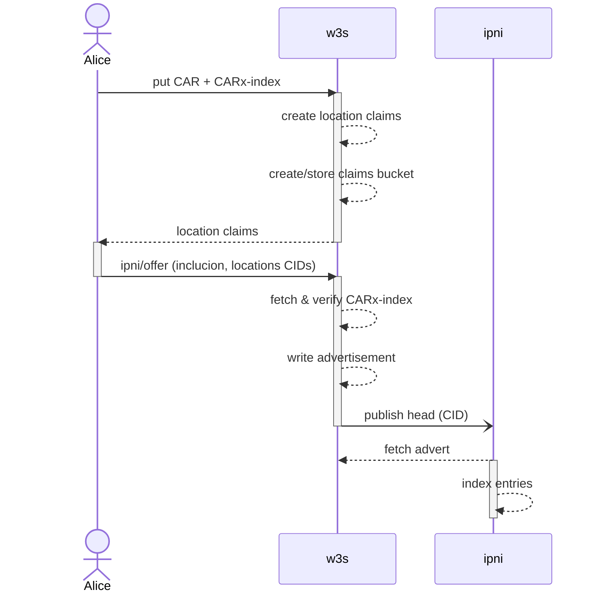
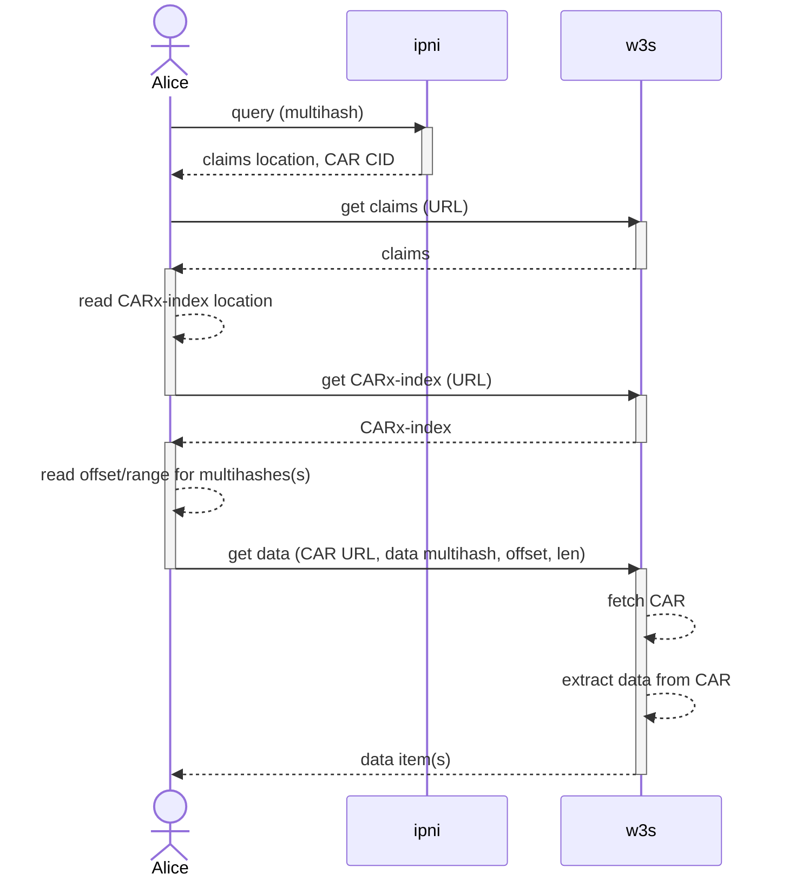

# W3 IPNI Indexing RFC

## Authors

- [gammazero], [olizilla]

## Goals

A user can use a multihash that identifies data stored on w3s to lookup the location where the data can be retrieved and content claims describing that data. w3s can update content claims if necessary without having to republish data multihashes.

This RFC describes how IPNI indexing can be used to lookup data locations and content claims for any CID within a CAR stored in w3c.

## Abstract

A user stores content as opaque blobs containing series of blocks addressed by multihashes. Currently, these blocks are collected into a CAR file for storage as one body of data.

The user creates an external CAR index [CARx-index](https://github.com/web3-storage/RFC/pull/9/files) that contains tuples of (multihash, offset, length) of any items the user intends to make individually retrievable from the car.

With an [inclusion claim](https://hackmd.io/@gozala/content-claims?utm_source=preview-mode&utm_medium=rec#Inclusion-Claims), the user who created the CAR asserts that CAR contains a given set of multihashes, transitively, via the CARx-index.

After storing the CAR and CARx-index, w3s creates a [location claim](https://hackmd.io/@gozala/content-claims?utm_source=preview-mode&utm_medium=rec#Location-Claims) for the CAR file and the CARx-index. Each location claim maps an item's CID to a URL where the item can be retrieved.

w3s creates a Content Claims Bucket. This is a container, stored on w3s network, that holds all content claims associated with the stored data. The location claims and inclusion claim are written to the claims bucket. The claims bucket is then stored.

[IPNI](https://github.com/ipni/specs/blob/main/IPNI.md) will allow a client to lookup any of the multihashes, that are in the CARx-index, to get information sufficient to recover the claims bucket. The location claims from the claims bucket can then be used to get the CARx-index and CAR data.

Information is provided to IPNI in the form of [IPNI Advertisements](https://github.com/ipni/specs/blob/main/IPNI.md#advertisements)
that are signed by w3s and published to IPNI by w3s. Each  Advertisement 

When a new advertisement is published, an [IPNI Announcement](https://github.com/ipni/specs/blob/main/IPNI.md#announcements) is sent to IPNI to trigger IPNI to fetch the new advertisement.

## Introduction

We publish ad-hoc batches of multihashes to IPNI. This proposal aims to align our usage of IPNI with [content-claims], by publishing an advert per [inclusion claim], and include the source claim in the IPNI Advertisement

### Motivation

- Align IPNI advertisement entries with CAR block sets, so that these multihashes can be queried to get the location of the CARx-index and CAR data.
  - This exposes our block-to-car indexes. Anyone could use IPNI to find which CAR a block is in.
  -   The context id bytes provide the CAR CID for any block look up. The CAR CID can then be used to find the CAR index via our content-claims API.
  - We could delete the IPNI records by CAR CID if the CAR is deleted.
- Make IPNI advertising an explicit UCAN capability that clients can invoke rather than a side-effect of bucket events
  - With this we are free to write CARs anywhere. The user's agent invokes a `ipni/offer` capability to ask us to publish an IPNI advertisement for the blocks of data stored.
  - w3s commits to user that it can serve data from a particular location, and user redelegates thst to IPNI to create advertsiement.
  - This empowers the user to opt-in or out as they need, and allows us to bill for the (small) cost of running that service.
- Provide a way to retrieve a CAR index, that has (multihash, offset, length) tuples, without retrieving the CAR file.
    - Eliminates the need to rely on the CARPark database. Block location information can now be stored on the w3s network.
    - Clients can request specific data item and only receive data for that item.
- Put the source inclusion claim in the IPNI advert metadata.
  - Identifies the source of the stored data, which is the client.


### Quick IPNI primer

IPNI ingests and replicates billions of signed provider claims for where individual block CIDs can be retrieved from.

Users can query IPNI servers for any multihash, and it provides a set of provider addresses and transport info, along with a provider specific `ContextID` and optional metadata.

For example: <http://cid.contact> hosts an IPNI server that Protocol Labs maintains.

#### Query IPNI for a cid
 
```bash
curl https://cid.contact/cid/bafybeicawc3qwtlecld6lmtvsndimoz3446xyaprgsxvhd3aapwa2twnc4 -sS | jq
```

```json
{
  "MultihashResults": [
    {
      "Multihash": "EiBAsLcLTWQSx+WydZNGhjs75z18AfE0r1OPYAPsDU7NFw==",
      "ProviderResults": [
        {
          "ContextID": "YmFndXFlZXJheTJ2ZWJsZGNhY2JjM3Z0em94bXBvM2NiYmFsNzV3d3R0aHRyamhuaDdvN2o2c2J0d2xmcQ==",
          "Metadata": "gBI=",
          "Provider": {
            "ID": "QmQzqxhK82kAmKvARFZSkUVS6fo9sySaiogAnx5EnZ6ZmC",
            "Addrs": [
              "/dns4/elastic.dag.house/tcp/443/wss"
            ]
          }
        },
        {
          "ContextID": "YmFndXFlZXJheTJ2ZWJsZGNhY2JjM3Z0em94bXBvM2NiYmFsNzV3d3R0aHRyamhuaDdvN2o2c2J0d2xmcQ==",
          "Metadata": "oBIA",
          "Provider": {
            "ID": "QmUA9D3H7HeCYsirB3KmPSvZh3dNXMZas6Lwgr4fv1HTTp",
            "Addrs": [
              "/dns4/dag.w3s.link/tcp/443/https"
            ]
          }
        }
]}]}
```

web3.storage publishes the blocks it can provide by encoding a batch of multihashes as an IPLD object and writing it to a bucket as an `Advertisement`, addressed by it's multihash.

An `Advertisement` includes `Provider` info which claims that the batch of multihashes are available via bitswap or HTTP, and are signed by the providers PeerID private key; Each advert is a claim that this peer will provide that batch of multihashes.

Advertisements also include a CID link to any previous ones from the same provider forming a hash linked list.

The latest `head` CID of the advert list can be broadcast over [gossipsub], to be replicated and indexed by all listeners, or sent via HTTP to specific IPNI servers as a notification to pull and index the latest ads from you at their earliest convenience.

The advert `ContextID` allows providers to specify a custom grouping key for multiple adverts. You can update or remove multiple adverts by specifying the same `ContextID`. The value is an opaque byte array as far as IPNI is concerned, and is provided in the query response. The ContextID also serves as a key that refers metadata, and is used to update or delete that metadata. Updating metadata changes the metadata returned by IPNI lookups for all multihashes that were advertised with that context ID.

A `Metadata` field is also available for provider specific retrieval hints, that a user should send to the provider when making a request for the block, but the mechanism here is unclear _(HTTP headers? bitswap?)_.

Regardless, it is a field we can use to include the location of the claims bucket. The provider has to sign the IPNI advert with the peerID key that should be used to secure the libp2p connection when retrieving the block.

**Reader-Privacy**: IPNI provides optional reader privacy that prevents observers, including IPNI, from knowing what multihashes clients are querying and what provider information and metadata they lookup. This privacy is available to all clients querying IPNI, that implement the client side of the privacy protocol.

### How web3.storage integrates IPNI today

web3.storage publishes IPNI advertisements as a side-effect of the E-IPFS car [indexer-lambda].

Each multihash in a CAR is sent to an SQS queue. The `publisher-lambda` takes batches from the queue, encodes and signs `Advertisement`s and writes them to a bucket as JSON.

The publisher lambda knows what was the previous head to link new advertisement by reading a head file, that it previously wrote to s3 for durability. This requires configuration the sqs consumer to only allow a single instance of the lambda to run at once.

The lambda makes an HTTP request to the IPNI server at `cid.contact` to inform it when the head CID of the Advertisement linked list changes.

This request contains CID of the new head, w3s writes files with the CID as the filename. There is also a pre agreed `/head` file which IPNI servers can poll to see if the head has changed, and if we are still "up". If we stop responding to `/head` requests, then at some point the IPNI server may flag our content and drop it from search results and delete it from their db.

The IPNI server [fetches](https://github.com/ipni/specs/blob/main/IPNI.md#advertisement-transfer) new head Advertisement from our bucket, and any others in the chain it hasn't read yet, and updates it's indexes.

Our `Advertisement`s contain arbitrary batches of multihashes defined by SQS queue batching config. The `ContextID` is set to opaque bytes (a custom hash of the hashes).

#### Diagram


## Proposal
Provide a ipni/offer UCAN ability to submit the location of a CAR and a CARx-index that a user has stored with w3s, to make the them discoverable via IPFS implementations and other IPNI consumers.

The ipni/offer is optional, and if not invoked, then the user's data is not indexed.

If opting-in to IPNI indexing, the CAR file and the CARx-index are created by the client. The client may choose which multihashes they want indexed and specify this in the ipni/offer request.

### Indexing stored data



- User uploads their CAR and CARx-index to w3s to the pre-signed PUT url.
- w3s creates the location claims for the CAR and CARx-index after fetching and verifying the content was uploaded
  - What triggers the claims creation, polling storage location?

**Location claims** example

```json
{
  "op": "assert/location",
  "rsc": "https://web3.storage",
  "input": {
    "content" : CID /* CAR CID */, 
    "location": "https://r2.cf/bag...car"
  }
}
```
```json
{
  "op": "assert/location",
  "rsc": "https://web3.storage",
  "input": {
    "content" : CID /* CARx-index CID */, 
    "location": "https://r2.cf/bag...carx"
  }
}
```

- User checks CAR status and gets UCAN delegation for `assert/location` where subject `with` field is a provider DID (did:web:web3.storage), issuer is a provider DID, and audience is space DID.
- User wants to publish to IPNI, so they invoke delegated assert/location capability.
- Invoke `ipni/offer` with the CID for an [inclusion claim] that associates a CAR CID with a CARx-index CID.

**UCAN invocation** example

```json
{
  "iss": "did:key:Alice",
  "aud": "did:web:web3.storage",
  "att": [{
    "can": "ipni/offer",
    "with": "did:key:space", // users space DID
    "nb": {
        "inclusion": CID   // inclusion claim CID
        "location:": CID   // location claim CID
    }
  }]
}
```

**Inclusion claim** example

```json
{
  "content": CID, // CAR CID
  "includes": CID // CARx-index Index CID
}
```

The w3s service fetches the CAR he CARx-index and parses the index to verify the multihashes are included in the CAR. see: [Verifying the CARv2 Index](#verifying-the-carv2-index). These files are likely cached locally from when the location claims were created.

After CAR verification, the w3s service creates the location claims for the CAR and the CARx-index.

The w3s service then creates a new claims bucket, writes the location claims into the claims bucket, and stores the claims bucket in the user's storage space.

Finally the w3s service creates a new IPNI advertisement and sends a announcement to IPNI.


Note:
- Authority over what the data is belongs to the client.
- Authouity over where the data is stored belongs to w3s.


Questions:
1. Is another claim needed to identify the CID of each location claim?
2. Will there be a content claims service where clients can lookup content claims using the CID of the CAR file or some key associated with the CAR file? This RFC assumes that the content claims bucket is accessible via URL which can either be a direct file reference or a be a service endpoint.


#### Verifying the CARx-index Index

The service must fetch the CARx-index and may verify 1 or more multihashes from the index exist at the specified offsets in the associated CAR.

The verifier should pick a set of multihashes at random and fetch the bytes from the CAR identified by the index entry and verify it's multihash. The invocation must return an error if any entry is found to be invalid.

Random validation of a number of blocks allows us to detect invalid indexes and lets us tune how much work we are willing to do per car index.

Full validation of every block is not recommended as it opens us up to performing unbounded work. _We have seen CAR files with millions of tiny blocks._
#### Advertisement construction

The set of multihashes must be encoded as 1 [IPNI Advertisement], linking to 1 or more [Entries] per the IPLD Schema:

```ipldsch
type Advertisement struct {
    PreviousID optional Link
    Provider String
    Addresses [String]
    Signature Bytes
    Entries Link
    ContextID Bytes
    Metadata Bytes
    IsRm Bool
    ExtendedProvider optional ExtendedProvider
}

type EntryChunk struct {
    Entries [Bytes]
    Next optional Link
}
```

- `ProviderID` libp2p peer ID of w3s service that creates advertisements.
- `Addresses` the most recent value of this is returned with lookups for any CID in any advertisement. It will contain the multiaddr form of the claims service URL. This is where the the content claims bucket is retrieved from when presented with the bucket CID.
- `Signature` Signature over all ad created using private key matching `ProviderID`.
- `ContextID` must be the byte encoded form of the CAR CID.
- `Entries` must be the CID of an `EntryChunk` for a subset (or all) of the multihashes in the CAR.
- `Metadata` encodes the CID of the content claims bucket. Possibly the CARx-index location claim as an optimization, to be added later. 
- `IsRm` is used when removing all advertisement(s) that have that context ID and deleting all associated multihash indexes from IPNI.

See: [Encoding the IPNI Advertisement](#encoding-the-ipni-advertisement)

The Advertisement should then be available for consumption by indexer nodes per the [Advertisement Transfer](https://github.com/ipni/specs/blob/main/IPNI.md#advertisement-transfer) section of the IPNI spec.

The w3s service is responsible for creating advertisements. Having users publish the advertisements is not practical as that would require the user to maintain an advertisement chain and serve a network endpoint from which indexers can fetch the advertisements.

#### Encoding the IPNI Advertisement

The set of multihashes within one CAR must be encoded as 1 Advertisement, having 1 or more `EntryChunk` blocks. `EntryChunk` blocks are an array of multihashes with a link to a next block, if there is one.

The `EntryChunk` serves a similar purpose as [HTTP chunking](https://en.wikipedia.org/wiki/Chunked_transfer_encoding). A typical block will have 16k multihashes in it.

A CARx-index encodes a set of multihashes. Mapping from an index to an `EntryChunk` requires parsing the index and encoding the multihashes it contains with the EntryChunk IPLD schema.

```ipldsch
type EntryChunk struct {
    Entries [Bytes]
    Next optional Link
}
```

Where the IPLD encoded size of an `EntryChunk` with the set of multihashes would exceed 4MiB (the upper limit for a block that can be transferred by libp2p) the set of multihashes must be split into multiple `EntryChunk` blocks.

All multihashes must be sorted in ascending order before being split into chunks. This is done to have deterministic output when creating entry chinks - the same set of multihashes should generate the same set of entry chunks.

### Finding and retrieving stored data


        
**Note**: One round trip can be avoided if the CARx-index location is in the IPNI response, instead of having to read it out of a location claim. This may not work if the CARx-index location claim is too big for the metadata (recommended size: 100 bytes, max size: 1024 bytes).

**Question**: 
Will the claims bucket be located at some arbitrary URL, or is it stored in a location known to w3s? If the latter then only the CID of the cliams bucket or CID of the CAR file is needed to fetch claims.

The above assumes that all claims are retrieved when fetching content claims. If a service is serving claims, as opposed to fetching a claims bucket file, then this could be changed to allow content claims to be filter by type, subject, or namespace.

#### Content Claims Update

A client making new content claims can submit a set of claims to a claims service. The client will identify the claims bucket and the namespace to store the claims in. The update should include an inclusion claim that proves that the claims being submitter were created by the namespace owner, or someone in a chain of authority tracable back to the namespace owner.

### Handling data split over multiple CAR files.

TBD - two options

1. Index each separately, and create index that contains has all multihashes for all CARs.
2. Index first CARs. Include partition claim that chains other CARs on.
