# Merkle References

## Abstract

Inter Planetary Linked Data (IPLD) is a fundamental building block of the IPFS. IPLD Links (a.k.a CIDs) are quintessential, yet their design has drawbacks that we call out and propose to address.

## Introduction

[Content identifiers (CIDs)][CID] claim to identify data not by _where it is stored_, but rather by the _content itself_. In our observation it instead changes addressing from "where content is stored" to "how content is stored", more specifically to how data is formatted / encoded. It is a significant improvement, but it is not addressing by "what content is".

Same data may be encoded differently depending on where it is stored, different yet when it is moved over the wire. It is also likely that encoding choices may evolve over time. Encoding choice affecting data identifier is a major drawback and counter to goal of addressing by "what content is".

Identifying data by how it is encoded has various problems and we will call out major ones to illustrate motivation for this proposal. Then we will define goals for the proposed identifiers and proceed with the proposal.

### Encoding Problem

Commonly programs operate on data structures without consideration of what processor architecture program is run or how data structures are represented in memory, all of that is abstracted away. We worry about data encoding when storing it on disk or sending over the wire. In fact, we have been able to negotiate content encoding over HTTP for decades.

In IPLD data encoding format affects its identifier. For example consider following data structure

```json
{
  "message": {
    "from": "@gozala",
    "to": "@mikeal",
    "payload": "Hi"
  }
}
```

It has a `baguqeeralquuhz37rcfn4ns3fqhqytzsg3otzzwiopefvjl3rdibl5oajj2a` content identifier in [DAG-JSON] encoding, however in [DAG-CBOR] encoding it is identified as `bafyreigxswzurrj5kprt4d4ew7qar4k6kiuiykgpq4zpefofpaq5qeb4me`. We do not really identify data by what data is, but rather identify some byte representation of it.

This is a problem because if we decide to change encoding all identifiers have to change. If we have data in [DAG-JSON] and someone asks for it in [DAG-CBOR] we won't even know we have it.

### Partitioning Problem

IPLD allow externalizing sub-structures through [IPLD Link]s. Unfortunately this also affects data identifier. In previous example if we have externalized `message` field data identifier would have been different, `baguqeera7mpc5etnxh7yi4bn7eojrmmbegkfv3czapdcxizyl33f23gszrea`.

This is a problem because data partitioned for todays constraints may fail to meet constraints of tomorrow. Depending on use cases may benefit from different partitioning strategy.

### Sizing Problem

Externalized sub-structures might be coming from untrusted machines over the network, so there is the risk that time and resources spend may be wasted on getting a data that does not match identifier requested. To mitigate this risk **block size limit** of around 2MiB is imposed, that way time and resources wasted is within reason, and you would not waste hours fetching data to discover that it does not match data identified in the request.

Implication is that produced data must fit the established size limit and producer needs to device some strategy to partition it. This tends to affect the data model, a lot of time and effort goes into optimizing specific read patterns.

Problem in disguise is that data producer must foresee how data will be consumed, which is not only difficult, but practically impossible because future is ofter full of surprises and shifting constraints.

### Problem amplified

As we have established encoding affects data identifier, and so does partitioning. Sizing constraint requires partitioning amplifying it further. There are multiple dimensions of variability that affecting data identifiers. Our example data could also have `baguqeera7mpc5etnxh7yi4bn7eojrmmbegkfv3czapdcxizyl33f23gszrea` identifier if outer structure was in [DAG-CBOR] and `message` was in [DAG-JSON].

This another level of complexity, if we store data in [DAG-CBOR] and you are asking me for it in [DAG-JSON] I may not even realize I have it. But even if I knew I had requested data and I encoded it in [DAG-JSON] links still would be in [DAG-CBOR] or I would have to traverse the whole DAG to re-encode it just to hand requested piece in desired encoding.

## Goals

Now that we have outlined problems, we can enumerate what is desired to improve upon and why:

1. Data structure SHOULD be identified by the same content identifier regardless of how parts its comprised of are stored. It SHOULD NOT matter if some parts are local and other parts external. This will get us flexibility to make choices about which parts to inline vs externalize without affecting data identifier. It will give us flexibility to make different choices based on storage constraints and possibly different choices during data transfer.

1. Data structure SHOULD be identified by the same content identifier regardless of the data encoding. This will give us flexibility to choose encoding based on storage constraint and ability to negotiate content encoding during data transfer.

## Approach

At the high level we propose to identify data structures by the root of the [reference tree], which is a binary merkle tree deterministically derived from the data structure itself.

### Data Types

[IPLD data model] offers same data types as pretty much every mainstream programming language. We use same set of data types except for the [IPLD Link], which is obsolete since every piece of data can be canonically identified.

### Reference Tree

Reference tree is a binary [merkle tree] deterministically derived from the data structure. It is derived according to the following algorithm:

1. [Abstract data format], list of two or more nodes, is derived from the data structure.
1. First node, an **operator**, denotes relation the rest of nodes, **operands** form. It is kept around for the final step.
1. Operands are [merkle fold]ed into an **operand** (sub)tree.
1. **Operator** node and **operand** (sub)tree are [merkle fold]ed into a tree that represents **reference tree** of the data.

### Merkle Fold

Merkle fold is a process of deriving [BAO] inspired binary [merkle tree] from the list of leaf nodes. Parent nodes in derived tree have exactly two children and the content of each parent node is the hash of its left child concatenated with the hash of its right child. When there's an odd number of nodes in a given level of the tree, the rightmost node is raised to the level above.

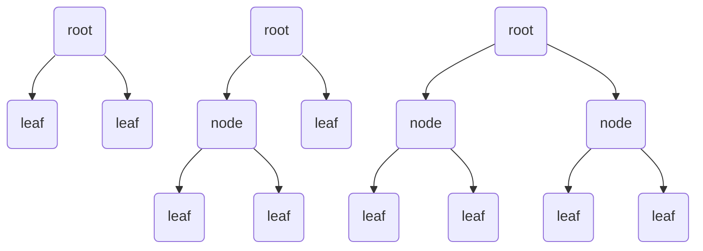

Merkle fold of a single leaf is a leaf itself

```mermaid
graph TB
only(leaf)
``````

Merkle fold of zero leaves is an empty hash (hash of zero bytes)

```mermaid
graph TB
_{ }
```

### Abstract Data Format

Abstract data format is a list of two or more nodes defined for each data type individually. Each node of the abstract data format is either:

- Leaf node represented by a byte array
- [Reference tree]

#### Scalars

| Type    | Format                                     |
|---------|--------------------------------------------|
| Null    | Empty byte array                           |
| Boolean | Single byte `0` for `false`, `1 for`true`  |
| Integer | [LEB128]                                   |
| Float   | [Double-precision floating-point format]   |
| String  | [UTF-8]                                    |
| Bytes   | Raw bytes                                  |

#### Null

Null is represented as a [merkle fold] of two leaf nodes. Left node is the cryptographic hash of the UTF-8 encoded string `merkle-structure:null` and describes binary encoding format of the right node. Right node is a byte array containing zero bytes.

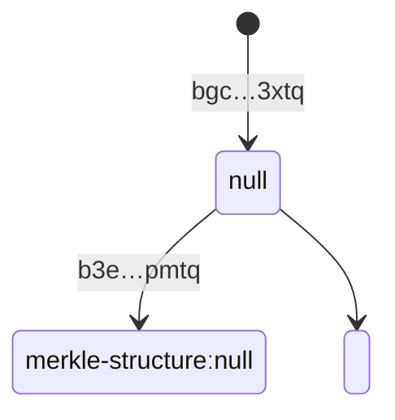

#### Boolean

Booleans is represented as a [merkle fold] two leaf nodes. Left node is the cryptographic hash of the UTF-8 encoded string `merkle-structure:boolean/byte` and describes binary encoding format of the right node. Right node is a byte array containing a single byte either `1` for `true` or `0` for false.

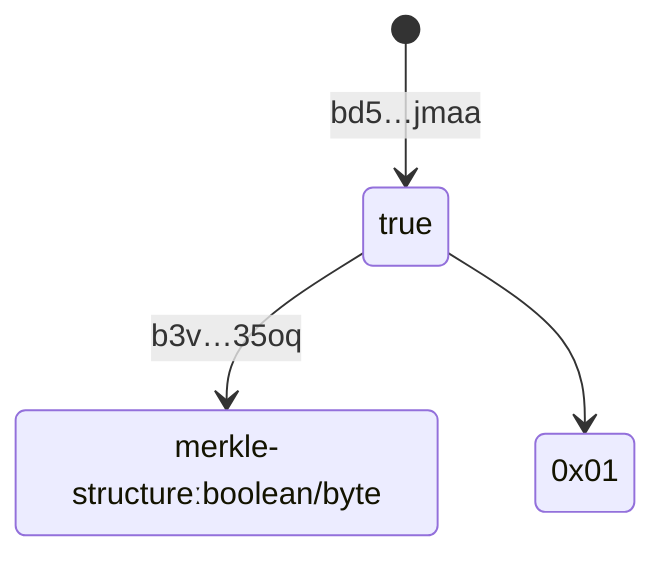

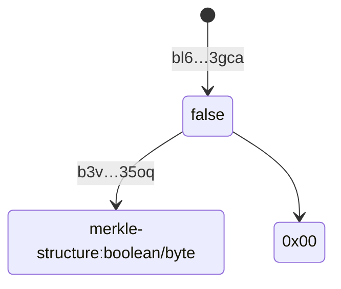

#### String

String is represented as a [merkle fold] of pair of leaf nodes. Left node is the cryptographic hash of the UTF-8 encoded string `merkle-structure:string/utf-8` and describes binary encoding format of the right node. Right node is string content encoded in UTF-8 encoding.


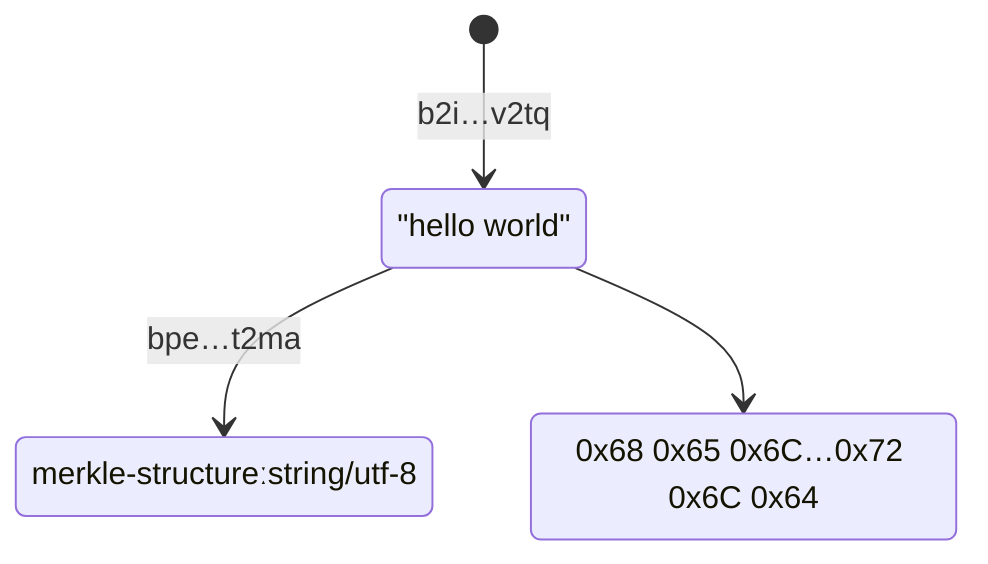

#### Integer

Integer is represented as a [merkle fold] of pair of leaf nodes. Left node is the cryptographic hash of the UTF-8 encoded string `merkle-structure:integer/leb128` and describes binary encoding format of the right node. Right node is [LEB128] encoded integer.

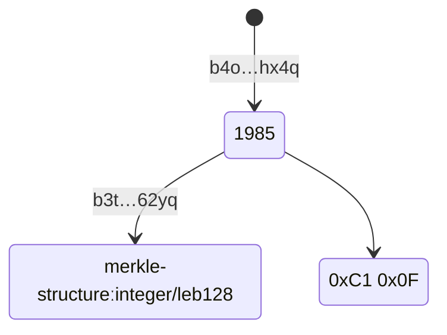

#### Float

Float is represented as a [merkle fold] of pair of leaf nodes. Left node is the cryptographic hash of the UTF-8 encoded string `merkle-structure:float/double-precision` and describes binary encoding format of the right node. Right node is a float encoded in [double-precision floating-point format].

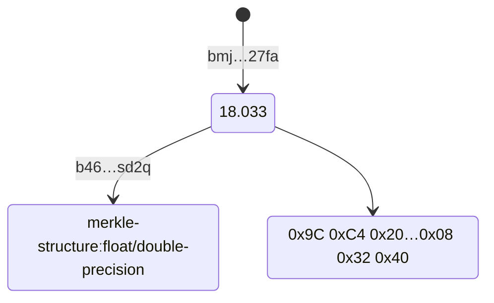

#### Bytes

Bytes is represented as a [merkle fold] of pair of leaf nodes. Left node is the cryptographic hash of the UTF-8 encoded string `merkle-structure:bytes/raw` and describes binary encoding format of the right node. Right node is a byte array of the bytes.

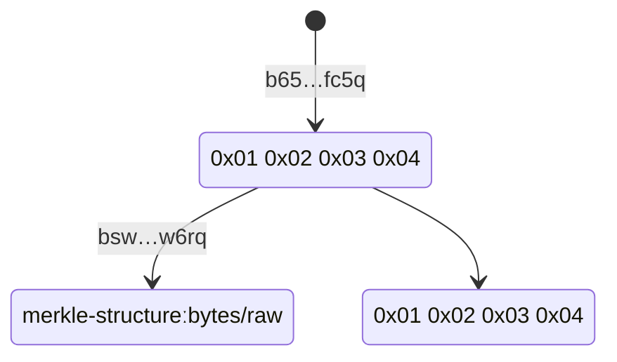

#### List

Lists are identified by a root of the binary merkle tree where left node is a hash of the list encoding format identifier and right node is a binary merkle tree built out of the list element identifiers.

List is represented as a [merkle fold] of pair of nodes. Left node is the cryptographic hash of the UTF-8 encoded string `merkle-structure:list/item/ref-tree` and describes format of the right node. Right node is a [merkle fold] of [reference tree]s derived from the list elements.

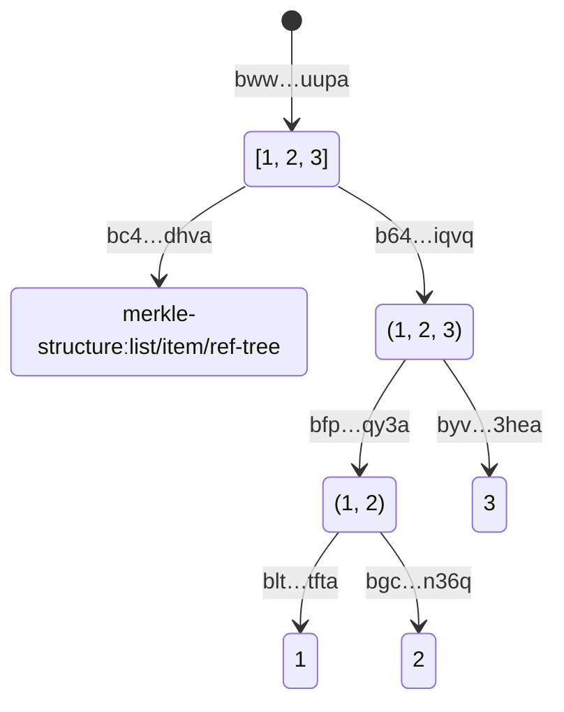

Right node of the empty list is [merkle-fold] of zero elements

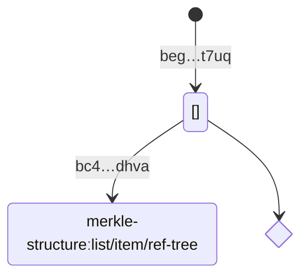

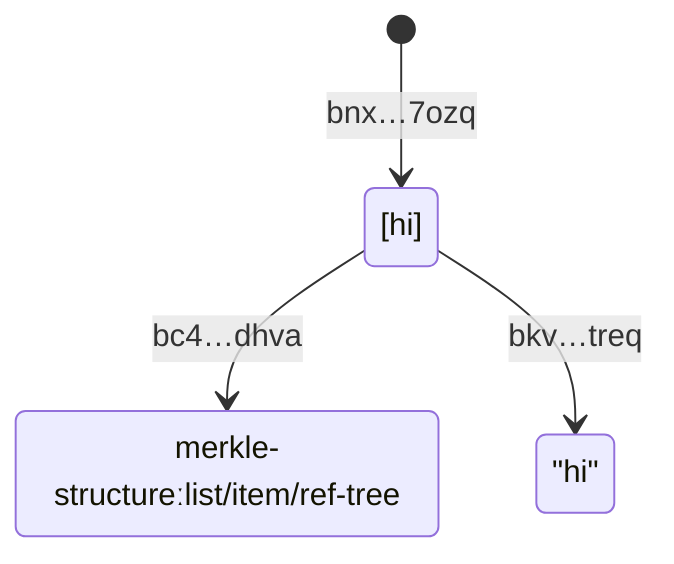

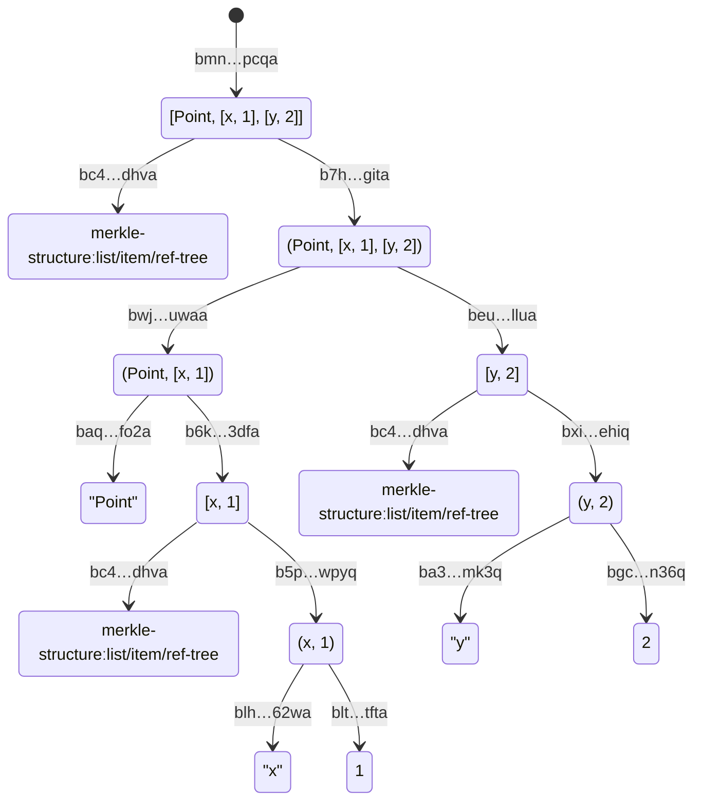

#### Map

Map is represented as a [merkle fold] of pair of nodes. Left node is the cryptographic hash of the UTF-8 encoded string `merkle-structure:map/k+v/ref-tree` and describes format of the right node. Right node is a [merkle fold] of attributes sorted by natural sort, where attribute is a [merkle fold] of the key [reference tree] and value [reference tree].

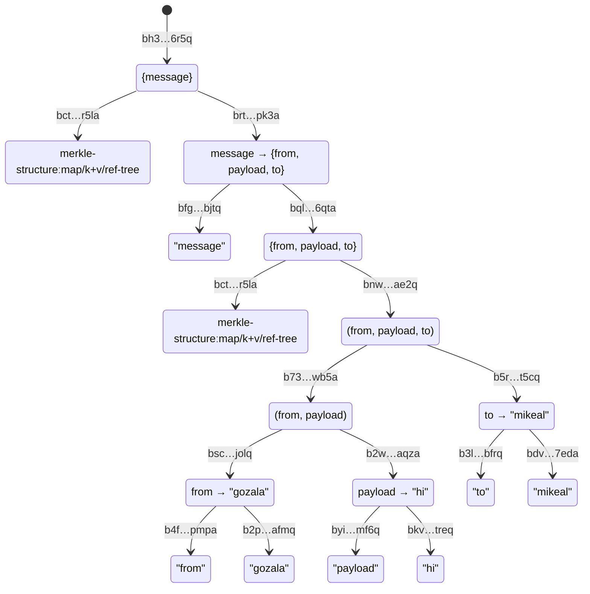

Note that maps keys can also be arbitrary data structures

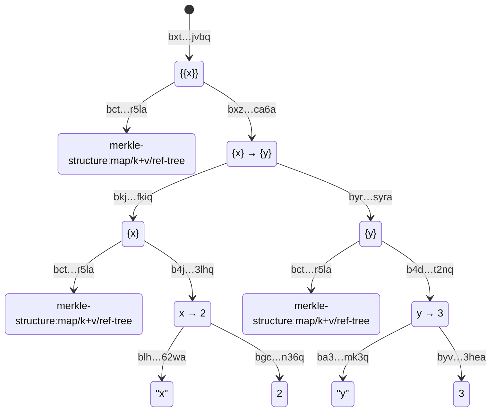

### Inclusion Proofs

In the example above if we want to proove that our structure `bec..bv4a` contains string `"Hi"` we share the addresses of the siblings leading to the root. In the illustration below hashes for blue nodes constitute the proof, if we combine green node and sibling from the proof we can derive pink node and so on reaching the root.

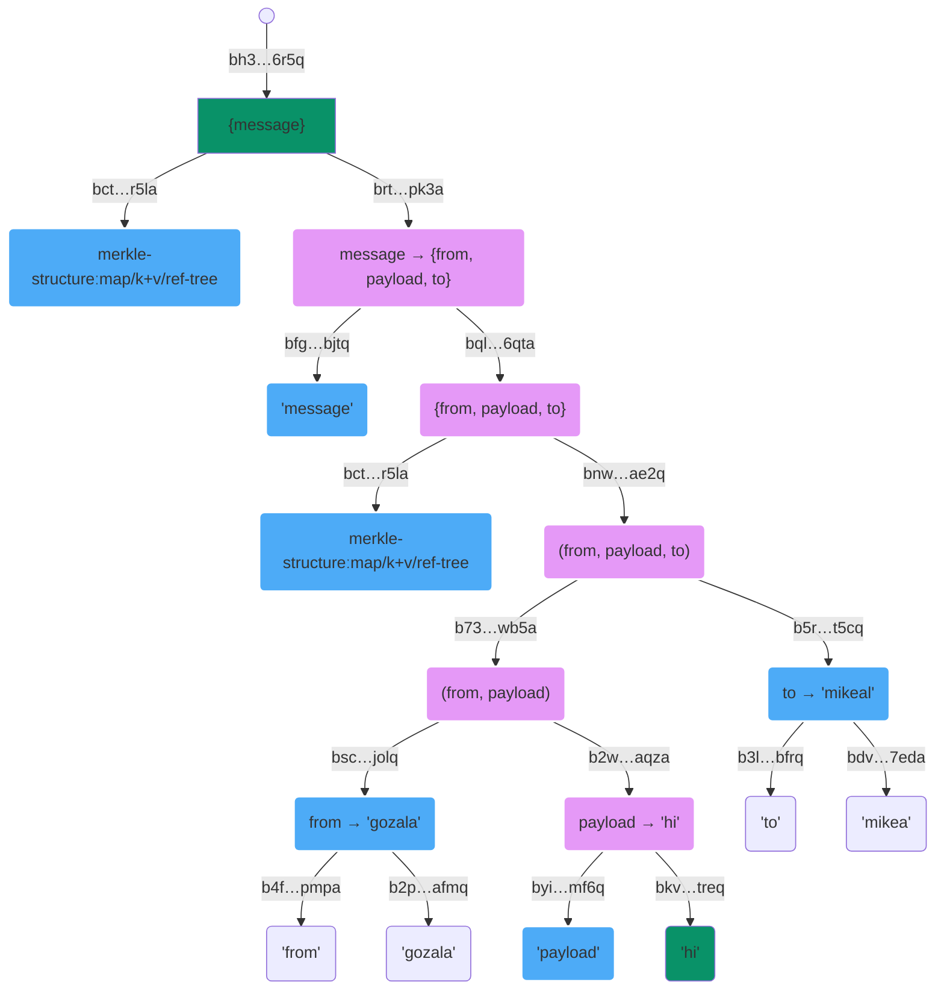

### Transport Flexibility

It is worth calling out that above merkle trees are just visualization of how address of the root is derived. Yet all other addresss are valid and data could be indexed by it if so desired. Put it differently granularity of the index is no longer baked it at the creation, instead it is a choice that varous actors can make when coming across the data.

We also gained flexibility in terms exchange packet sizes. Peer could ask to send around X `bytes` for `bec..bv4a`, sender can traverse the tree and pack substructures until desired packet size is met and send it over. Recepient is still able to verify that received data indeed corresponds to `bec..bv4a`.


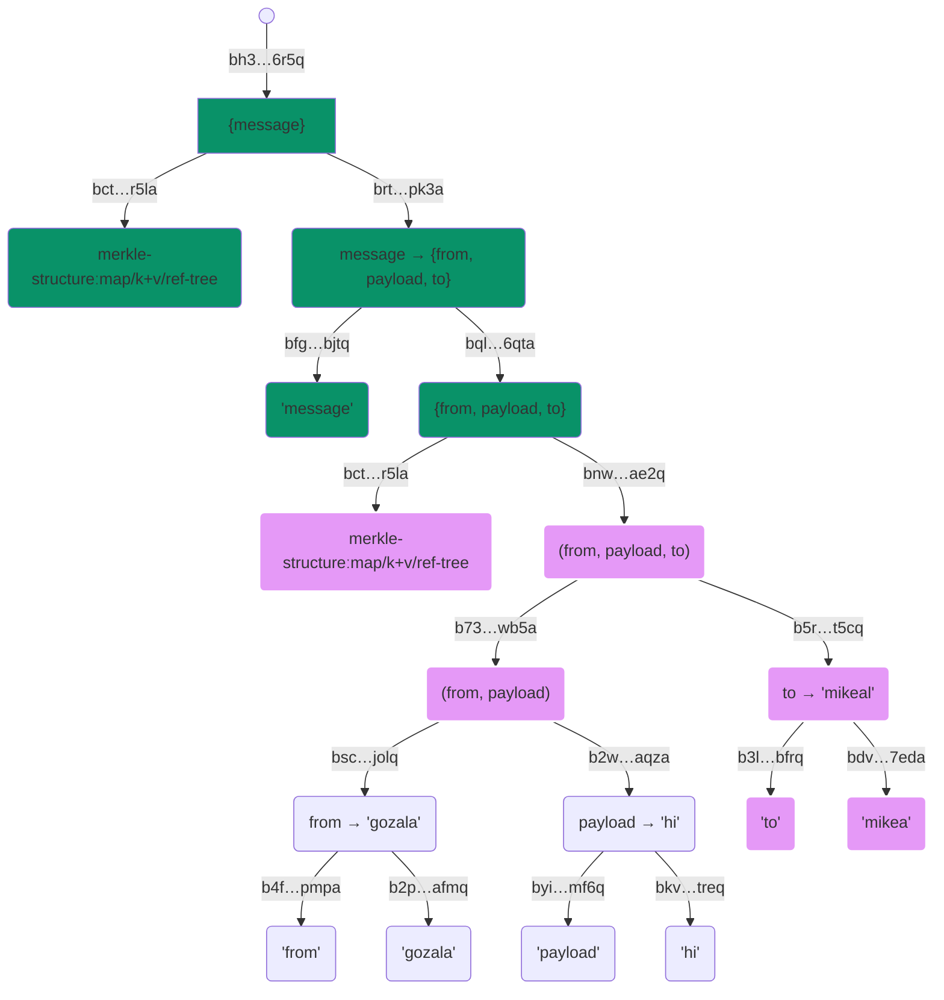

### Codec Flexibility

We have descried how addresses for data are computed not how data sholud be encoded for storage. One could choose to store data in CBOR format, in plain JSON or whatever else. In fact when peers connect they could negotiate encoding they wish to use for the session and encode data accordingly.

Note that most addresses are never stored, or send across the wire. They are simply derived from data. Only case where you want to send addresses is when you're doing a partial sync and want to reference  subtree without having to transmit it.

[abstract data format]:#abstract-data-format
[reference tree]:#reference-tree
[merkle fold]:#merkle-fold
[reference]:https://en.wikipedia.org/wiki/Reference_(computer_science)
[null pointer]:https://en.wikipedia.org/wiki/Null_pointer
[Double-precision floating-point format]:https://en.wikipedia.org/wiki/Double-precision_floating-point_format
[UTF-8]:https://en.wikipedia.org/wiki/UTF-8
[DAG-JSON]:https://ipld.io/specs/codecs/dag-json/spec
[DAG-CBOR]:https://ipld.io/specs/codecs/dag-cbor/spec/
[IPLD Data Model]:https://ipld.io/docs/data-model/kinds/
[LEB128]:https://en.wikipedia.org/wiki/LEB128
[BAO]:https://github.com/oconnor663/bao/blob/master/docs/spec.md
[billion dollar mistake]:https://www.infoq.com/presentations/Null-References-The-Billion-Dollar-Mistake-Tony-Hoare/
[tombstoning]:https://en.wikipedia.org/wiki/Tombstone_(data_store)
[Merkle tree]:https://en.wikipedia.org/wiki/Merkle_tree
[CID]:https://docs.ipfs.tech/concepts/content-addressing/
[IPLD Link]:https://ipld.io/docs/schemas/features/links/
[`Null`]:https://ipld.io/docs/data-model/kinds/#null-kind
