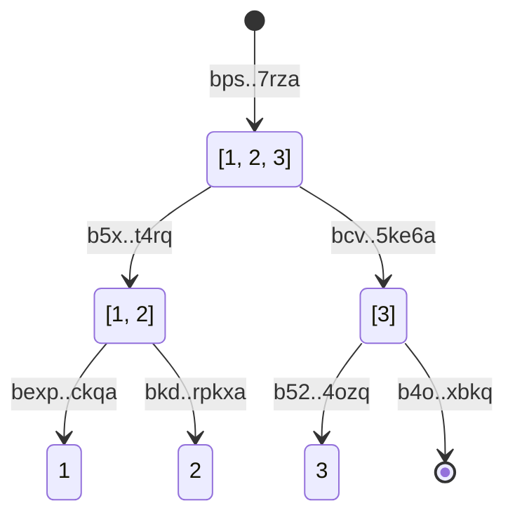
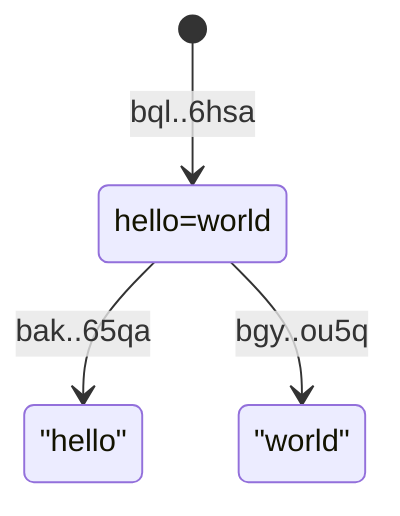
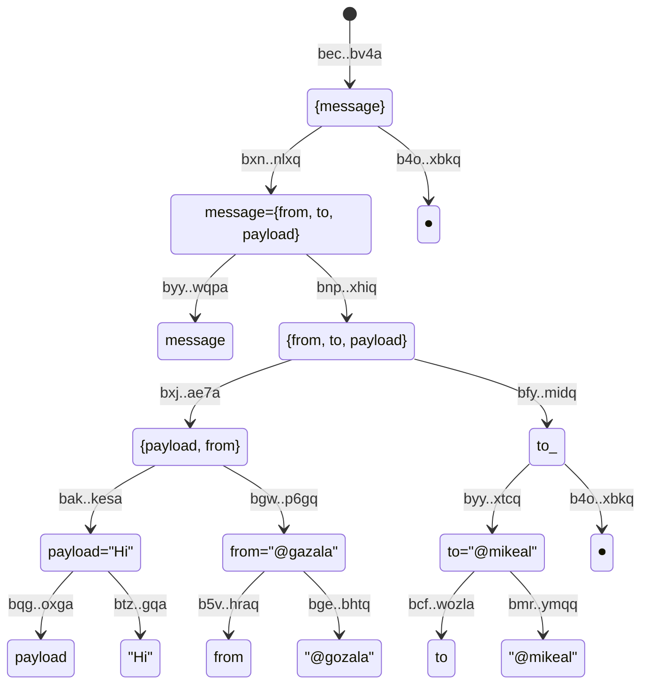
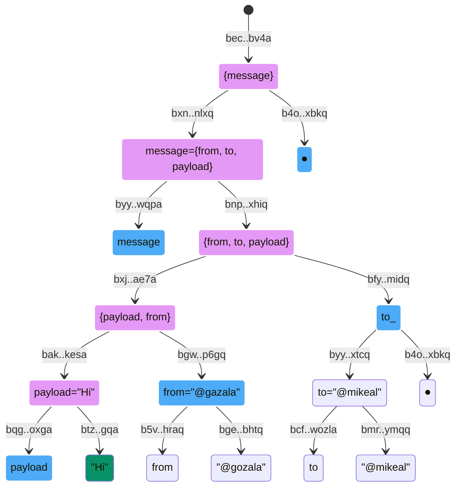

# Abstract

Inter Planetary Linked Data (IPLD) is a fundamental building block of the IPFS. IPLD Links (a.k.a CIDs) are quintessential, yet I'd argue a major design flaw (on par with null pointers ?)

## Problems

### Data Locality

In most programming languages we build data structures out of primitive data types and more complex structures by nesting them into one another through [reference]s. In languages with managed memory you do not worry about whether you can dereference sub-structure reference in itself is implies access to it. Languages where you do need to worry about dereferencing tend to suffer from [null pointer] problems.

Data structures in IPLD suffer from a similar set of problems as languages with
[null pointer]s. In case of IPLD it is a locality problem. Nested sub-structures can either be **local**, inlined into a parent structure, or **external** linked using an IPLD link. Local references can always be dereferenced, but external references may require read from a disk, or another machine. In worse cases even searching the network to find machine that has it. Possibility of errors is inconvenient, but what's worse is the impact on the data model, imposing constraints of data exchange (block size) which are almost never universal.

### Data Addressing

Another side effect of having both local and external references is that it affects data addressing. This is easier explained with an example so let us consider following structure with a nested substructure under name `message`:

```json
{
  "message": {
    "from": "@gazala",
    "to": "@mikeal",
    "payload": "Hi"
  }
}
```

We could link to the `message` e.g. by creating [DAG-JSON] in which case it will have an address `baguqeeraljex7usivynmla6e6h2ah5otegcrxgcc3kturfknn26j3wf6xsjq` and the outer data structure will have address `baguqeerade2eyspg52ffd26o2obbrhaa6ztrnszcgosutmeblrr7cbrjcpfa`. If `message` is not externalized however, data structure will end up with an address `baguqeerade2eyspg52ffd26o2obbrhaa6ztrnszcgosutmeblrr7cbrjcpfa`.

And this is just one dimension of variability, if we were to use [DAG-CBOR] encoding instead we would end up with `bafyreie7pbuqqem5fvmrh4wv4joy737tmgmoo5tn4q7qwocd2a52si2m6m` when `message` is externalized and with `bafyreie7pbuqqem5fvmrh4wv4joy737tmgmoo5tn4q7qwocd2a52si2m6m` otherwise.

And this is not the end, we could have a case where `message` is in [DAG-JSON] and rest is in [DAG-CBOR] in which case our data will be addressed `bafyreig5bmydxjpbq5j46hqs5cnay7xs4yef2nu4zts4rdmgxjzlsh4ume`.

ℹ️ IPLD shifted question from where content is to how is it encoded. It is better problem to have, but still a problem because how you want to encode it will depend on deployed system and undoubtedly will vary from case to case basis. It is also very likely that choice of encoding will change over time and change in addresses is a major drawback.

## Proposition

Now that we have outlined problems lets enumerate what would we desire instead:

1. Data structure to be addressed by its contents regardless of location, whether some parts are inlined (local) or external. This will give us flexibility to decide which parts to inline vs externalize when storing and decide differently when transferring it.
2. Data structure to be addressed by its content regardless of the encoding. This will give us flexibility to choose different encoding on disk from encoding on wire. In fact, we gain ability to negotiate content encoding per data exchange.

### Proposed Addressing

IPLD data model offers same data types as pretty much every mainstream programming language. We can discard link type due to issues it introduces. We also drop `null` because it is a bad idea and in most cases custom representation of "absence of value" is better choice.

### Addressing Scalar Data

We address scalars by a cryptographic hash of the corresponding `Tag` byte followed by the binary encoded data in format described by the following table.

> ℹ️ Please note that space efficiency is not goal here, in fact format does not matter at all we just need to pick one to derive hash.


| Type           | Tag     | Format                                   |
|----------------|---------|------------------------------------------|
| False          | 0       | None                                     |
| True           | 1       | None                                     |
| Integer        | 2       | [LEB 128]                                |
| Float          | 3       | [Double-precision floating-point format] |
| String         | 4       | [UTF-8]                                  |
| Bytes          | 5       |  N/A                                     |

#### Addressing Boolean

Booleans do not get binary encoded, we just hash the tag.

| Value   | Address                                                 |
|---------|---------------------------------------------------------|
| `true`  | `bjp2relzuivkmko66f25yzuvx4piwacwwghbyljoxztrdy54fiwna` |
| `false` | `bny2axhh7wn5jrhffittlw6akfr4jahj7wm3tq5ufcgrqmf5puaoq` |

#### Addressing Integer

Integers are encoded in [LEB128] format and tagged with `2`.

| Value   | Address                                                 |
|---------|---------------------------------------------------------|
| `0`     | `btg7f564iziqbhpmoj2ydl7kc2usfi2h6tl5hbwf2tqoedgsiytua` |
| `1`     | `bexp5fhajmf64zgcsfaoagds3ga32gofeoevefiq4sb7slhdeckqa` |
| `256`   | `bskmgiyoeuaccoji2qimqns7g5u7j7ucfvrpxjnoy56mkkgnrm7yq` |
| `-1`     | `bwdgoybc53reak7fbnpignhs4rsmjpv5eqrhbsy6cezjnnlwchxqa` |
| `-513`   | `bc4duwmz7vdcl6yuuai4snpjz2unny35isvumosfsj7skjezblj2a` |

#### Addressing Float

Floats are encoded in [Double-precision floating-point format] and tagged with `3`.

| Value         | Address                                                 |
|---------------|---------------------------------------------------------|
| `0.1`         | `bixjlmywz2sik5g4te5m4sefsnonioqdf3zra6swauorduzpeboga` |
| `1.304`       | `brmzhywazs3x5ynjtnk5icismafpvjyocxttizxihzcgyuieu5qsq` |
| `-1.17`       | `banjjdbtqjuuesi2zpke2rzbv2yed6xcy6cpptqhyvu3obdrf4zcq` |
| `0.033333333` | `btkyl6yra4jixuyzj4hafden6xmty7diqf3py6qtgqyym333yiwqa` |

#### Addressing String

Strings are encoded in [UTF-8] and tagged with `4`.

#### Addressing Bytes

Bytes are not encoded, just tagged with `5`.

### Addressing Composite Data

Composite data is constructed out of scalars or other composite data. We can view all composite data as a sequence of element addresses. We can derive perfectly balanced binary tree from sequence elements if we add some empty nodes to make number of leaves `n**2`.

By representing lists and maps as binary merkle trees we gain ability to create inclusion proofs for anything nested within the data structure no matter how deep. All on needs to do is show path from the root to the sibling of the target data.

#### Addressing Lists

Lists addresses are roots of the binary merkle tree assembled from the list element addresses. When number of elements is not `n**2` we count extra blank leaves to roundup to a next power of two.

Blank leaves are addressed by the hash of empty payload `b4oymiquy7qobjgx36tejs35zeqt24qpemsnzgtfeswmrw6csxbkq`

For example a following list

```json
[1, 2, 3]
```

We derive a following binary merkle tree



You may also observe another interesting property of this construction, if we were to derive address for `[1, 2]` and `[3]` those would be `b5x..t4rq` and `bcv..5ke6a` like those branches which implies that you can take addresses for same sized two lists and derive address for their concatenation without having to recompute it all.

> ⚠️ It however also implies that address of `[1, 2, 3]` and `[[1, 2], [3]]` is the same which may not be a good idea. It is fairly trivial to change this behavior by tagging nodes different from lists, but then we'll lose concatenation property.
>
> Making a right decesion requires some careful deliberation.

#### Addressing Attributes

Attributes represent key value relation and also have addresses that are computed by hashing tag `7` followed by the address of the `key`, followed by the address of the `value`.

For example consider following example:

```json
"hello": "world"
```



#### Addressing Maps

Map addresses are derived as an address of the sorted list of the map attributes. In other words we first derive attribute addresses, sort those addresses and compute address of that sorted attribute list.

So lets consider our original example

```json
{
  "message": {
    "from": "@gazala",
    "to": "@mikeal",
    "payload": "Hi"
  }
}
```



### Inclusion Proofs

In the example above if we want to proove that our structure `bec..bv4a` contains string `"Hi"` we share the addresses of the siblings leading to the root. In the illustration below hashes for blue nodes constitute the proof, if we combine green node and sibling from the proof we can derive pink node and so on reaching the root.



### Transport Flexibility

It is worth calling out that above merkle trees are just visualization of how address of the root is derived. Yet all other addresss are valid and data could be indexed by it if so desired. Put it differently granularity of the index is no longer baked it at the creation, instead it is a choice that varous actors can make when coming across the data.

We also gained flexibility in terms exchange packet sizes. Peer could ask to send around X `bytes` for `bec..bv4a`, sender can traverse the tree and pack substructures until desired packet size is met and send it over. Recepient is still able to verify that received data indeed corresponds to `bec..bv4a`. 

### Codec Flexibility

We have descried how addresses for data are computed not how data sholud be encoded for storage. One could choose to store data in CBOR format, in plain JSON or whatever else. In fact when peers connect they could negotiate encoding they wish to use for the session and encode data accordingly.

Note that most addresses are never stored, or send across the wire. They are simply derived from data. Only case where you want to send addresses is when you're doing a partial sync and want to reference  subtree without having to transmit it.


[data locality]:#data-locality
[Data Addressing]:#data-addressing
[reference]:https://en.wikipedia.org/wiki/Reference_(computer_science)
[null pointer]:https://en.wikipedia.org/wiki/Null_pointer
[Single-precision floating-point format]:https://en.wikipedia.org/wiki/Single-precision_floating-point_format#IEEE_754_single-precision_binary_floating-point_format:_binary32
[Double-precision floating-point format]:https://en.wikipedia.org/wiki/Double-precision_floating-point_format
[Variable Integer]:#
[multiformats]:https://multiformats.io/
[Unsigned Variable Integer]:https://github.com/multiformats/unsigned-varint
[LEB 128]:https://en.wikipedia.org/wiki/LEB128
[UTF-8]:https://en.wikipedia.org/wiki/UTF-8
