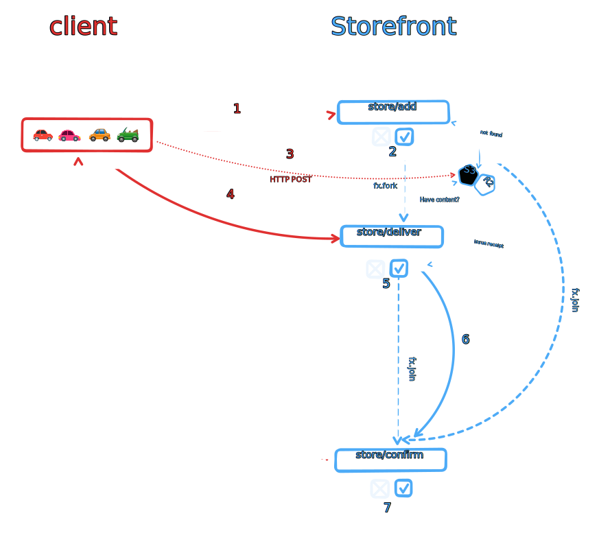
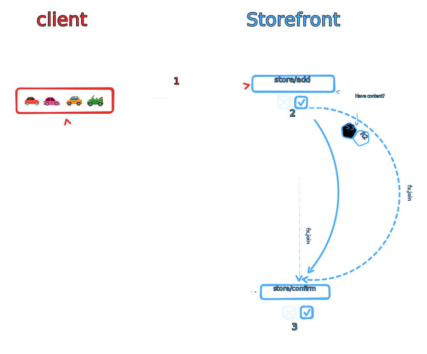
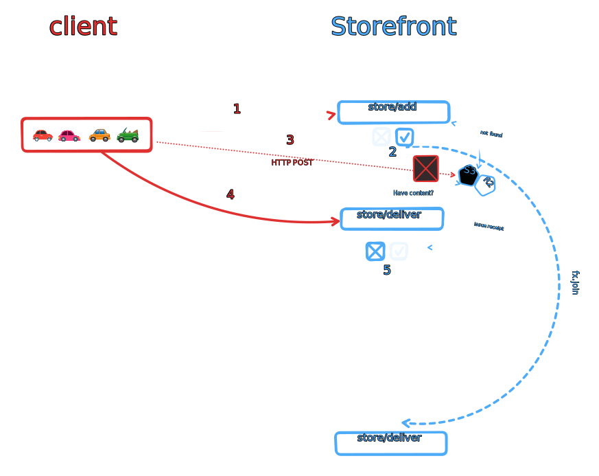

# extend store/* protocol with store/deliver 

## Authors

- [Vasco Santos], [Protocol Labs]

## Abstract

`store/*` protocol is missing verifiability for content actually uploaded to the provided presigned URL. This factor together with intention to create a proof of delivery makes critical the introduction of a new capability in the `store/*` namespace. In this RFC, we propose `store/deliver`.

## Introduction

When an agent wants to store some content, agent invokes `store/add` to declare this intention. The `store/add` invocation MUST include the CID of the content to be stored. An invocation example:

```json
{
  "can": "store/add",
  "with": "did:key:abc...",
  "nb": {
    "link": "bag...",
    "size": 1234
  }
}
```

If the service is receptive to store this data, a presigned URL is returned in the receipt of `store/add` invocation, so that the client can store this content. The presigned URL includes a hash derived from the content CID to guarantee the written bytes match that CID. A receipt example:

```json
{
  "ran": "bafy...storeAdd",
  "out": {
    "ok": {
      "status": "upload",
      "url": "https://...",
      "link": "bag...",
      "allocated": 1234
    }
  },
  "fx": {
    "join": null,
    "fork": []
  },
}
```

Note that content requested to store, may already be stored. If that is the case, the service may issue receipt with `"status": "done"`.

On their schedule, the agent can post the bytes using the presigned URL. However, both the agent and the service never sign a receipt stating that this content is now stored. This is where `store/deliver` can help.

While not relevant for verifiability, it is also important pointing out that the service MAY need to run some data computation, issue billing events or write indexes for retrievability. Today, web3.storage operated store service relies on "S3 Bucket events" to achieve this, but it should not be assumed that all stores web3.storage will rely on will provide such features.

## store/delivery capability

Aiming to introduce verifiability into content storing, as well as to pave the way for a future proof of delivery, `store/deliver` capability is proposed. It would also make services not tied with store put events to execute side effects.

To offer verifiability, `store/add` invocation should be associated with `store/deliver` via [effect]s. `store/deliver` would be invoked by the client to notify the service that content was stored, and the the service should also sign a confirmation that it is true.

### store/delivery of not previously stored content

Taking into account the above, we can look at the following flow walkthrough and diagram:

1. client invokes `store/add`

```json
{
  "can": "store/add",
  "with": "did:key:abc...",
  "nb": {
    "link": "bag...",
    "size": 1234
  }
}
```

2. service issues `store/add` receipt with presigned URL and effect for `store/deliver` that may be invoked in the future by the service

```json
{
  "ran": "bafy...storeAdd",
  "out": {
    "ok": {
      "status": "upload",
      "url": "https://...",
      "link": "bag...",
      "allocated": 1234
    }
  },
  "fx": {
    "join": { "/": "bafy...storeDeliverService" },
    "fork": []
  },
}
```

3. client posts the content to the provided presigned URL.

4. client invokes `store/deliver`

```json
{
  "can": "store/deliver",
  "with": "did:key:abc...",
  "nb": {
    "link": "bag...",
    "url": "https://..."
  }
}
```

5. service verifies if content was delivered by user, and queues a self invocation of `store/deliver` that is also provided as an effect.

```json
{
  "ran": "bafy...storeDeliver",
  "out": {
    "ok": {
      "link": "bag..."
    }
  },
  "fx": {
    "join": { "/": "bafy...storeDeliverService" },
    "fork": []
  },
}
```

6. service may perform some other work

7. service issues `store/deliver` receipt

```json
{
  "ran": "bafy...storeDeliverService",
  "out": {
    "ok": {
      "link": "bag..."
    }
  },
  "fx": {
    "join": null,
    "fork": []
  },
}
```



### store/delivery of previously stored content

The following flow walkthrough and diagram illustrate this case:

1. client invokes `store/add`

```json
{
  "can": "store/add",
  "with": "did:key:abc...",
  "nb": {
    "link": "bag...",
    "size": 1234
  }
}
```

2. service issues `store/add` receipt with done status and effect for `store/deliver` that may be invoked in the future by the service (or was already invoked)

```json
{
  "ran": "bafy...storeAdd",
  "out": {
    "ok": {
      "status": "done",
      "link": "bag..."
    }
  },
  "fx": {
    "join": { "/": "bafy...storeDeliverService" },
    "fork": []
  },
}
```

3. service issues `store/deliver` receipt (may have happened before 1-2, or after for a concurrent operation)

```json
{
  "ran": "bafy...storeDeliverService",
  "out": {
    "ok": {
      "link": "bag..."
    }
  },
  "fx": {
    "join": null,
    "fork": []
  },
}
```



### store/delivery of not stored content

The following flow walkthrough and diagram illustrate this case:

1. client invokes `store/add`

```json
{
  "can": "store/add",
  "with": "did:key:abc...",
  "nb": {
    "link": "bag...",
    "size": 1234
  }
}
```

2. service issues `store/add` receipt with presigned URL and effect for `store/deliver` that may be invoked in the future by the service

```json
{
  "ran": "bafy...storeAdd",
  "out": {
    "ok": {
      "status": "upload",
      "url": "https://...",
      "link": "bag...",
      "allocated": 1234
    }
  },
  "fx": {
    "join": { "/": "bafy...storeDeliverService" },
    "fork": []
  },
}
```

3. client **does not** post the content to the provided presigned URL (or request fails)

4. client invokes `store/deliver`

```json
{
  "can": "store/deliver",
  "with": "did:key:abc...",
  "nb": {
    "link": "bag...",
    "url": "https://..."
  }
}
```

5. service verifies if content was delivered by user, and issues receipt stating that content was not stored

```json
{
  "ran": "bafy...storeDeliver",
  "out": {
    "error": {
      "name": "ContentNotFoundError",
      "content": { "/": "bag..." }
    }
  }
}
```



## Other notes

This proposal also opens the possibility for bucket decentralization, so that we could even have Storefront to find a write target for the write. For instance, when storefront receives a `store/add` request, it could allocate it to a "Hot Storage" Saturn Node by requesting a Saturn Node for a presigned URL before returning to the client the presigned URL. Once it can get a presigned URL to write, the `store/add` receipt could also include a fork task from a task from "Hot Storage" Saturn Node, which will be performed when this node receives the content offered.

We assume this is a problem out of scope of this RFC, but worth ellaboring it. Given `store/add` may be a NOP pointing to a `store/deliver` receipt that was already handled (i.e. when client A tries to store content `bag...a` that was previously stored by client B), a `store/deliver` receipt will not be issued for each `store/add`, but only for the first one. In other words, store services will only run `store/deliver` one time per CID stored. As a result, if `store` wants to do computation in this data, or create some indexes, they will always output the same result. However, billing requirements may be different. Today, they are handled at `store/add` handler level, but we could also introduce a new capability to execute code that should also run when this is the first time a given client allocated store for given content (e.g. `store/allocate`, which would be also an effect of `store/add` and would be used to track billing, etc).

[Protocol Labs]: https://protocol.ai/
[Vasco Santos]: https://github.com/vasco-santos
[effect]:https://github.com/ucan-wg/invocation/#7-effect
