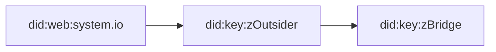
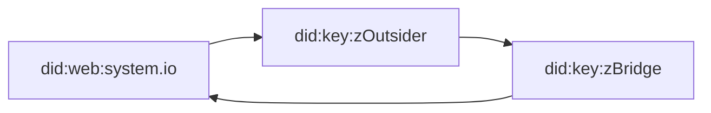

# Abstract

Services that have adopted UCANs are able to server requests to customers of their customers directly, reducing operational costs and complexity.

However integrating with systems that have not adopted ucans can be challenging and forces following trade-offs:

1. Privileged proxy services need to be introduced to allow requests from such actors.
2. It is impossible to provide provable trace of accountibility in [recieipts](https://github.com/ucan-wg/invocation#225-receipt).

In practice service is forced to introduce a less secure backdoor into the system.

Here we explore various ways interoperabality could be achived with UCAN disabled systems and tradeoffs.

## JWT Bridge

UCAN enabled system identified by `did:web:system.io` creates an intermidiery principal e.g. `did:key:ZBridge` for interoperability with UCAN disabled systems.

UCAN enabled system creates a principal `did:key:zOutsider` to represent UCAN disabled actor with-in UCAN system.

System grants access to set of capabilities to an outside system by creating UCAN delegation chain

UCAN is formatted as JWT Token and passed to outside system that it can use as an authorization bearer token.

Outside system attaches JWT Token to issued requests. The `did:key:zBridge` decodes request body and attached UCAN (JWT Token) and issues [UCAN Invocation](https://github.com/ucan-wg/invocation) forming following chain

> ℹ️ Note that `did:key:zBridge` does not require access to any outside state besides own private key.

The `did:key:zBridge` actor dispatches UCAN invocation to a UCAN enabled system `did:web:system.io` and responds with a UCAN Invocation Receipt back to the outside system.

### Modes

#### Session Token

JWT Token can be long-lived and shared with outside system out of bound ahead of time. In this mode everything works as conventional JWT.

⚠️ Downside of this mode is that it is impossible to narrow down authorization to concrete resources without knowing them ahead of time or some kind of heararchy.

#### Callback Token

When outside system is hired to do run some long-lived task it can be shared a "callback token" authorizing it to report updates of that concrete task.

⚠️ Downside of this mode is that such tokens are easier to leak as they are likely to be passed and stored along with task requests. On the other hand amount of damage they can do has far more limited surface.

### Tradeoffs

- 💔 Security hinges on the ability of the outside system to keep JWT safe and secure.
- 💔 Setup assumes trust in faceful operation of the `did:key:zBridge` actor.
- 💚 The `did:key:zBridge` actor could be operated by third party or even outside system itself.
- 💚 Outside system does not need to understand or worry about UCANs.
- 💔 Impossible to hold outsyde system accountable.
- 💔 No redelgation

## PKI Bridge

Just like in the JWT Bridge scenario here we also setup `did:key:zBridge` intermidiery, but unlike last scenario we do not need local principal to represent external system, instead we derive did:key `did:key:zOutsider` identifier for them from their public key.

System grants access to set of capabilities to an outside system by creating UCAN delegation chain

UCAN is formatted as JWT Token and passed to outside system so it can use it as an authorization bearer token.

Outside system attaches JWT Token to issued requests, signs request payloads with their private key.

The `did:key:zBridge` decodes attached UCAN (JWT Token), verifies that request had been sigend by public key corresponding to `did:key:zOutsider` and issues [UCAN Invocation](https://github.com/ucan-wg/invocation) forming following chain

Request body and signature are included in `fct` fields of the UCAN, providing verifable proof that request was initiated by `did:key:zOutsider`.

The `did:key:zBridge` actor dispatches UCAN invocation to a UCAN enabled system `did:web:system.io` and responds with a UCAN Invocation Receipt back to the outside system.

### Tradeoffs

- 💚 JWT tokens can be shared in public
- 💗 The `did:key:zBridge` can be hold accountable if it misbehaves.
- 💚 The `did:key:zBridge` actor could be operated by anyone.
- 💚 Outside system does not need to understand or worry about UCANs.
- 💚 Outside system can be held accountable thanks to captured signatures.
- 💔 Can not take advantage of redelgation

